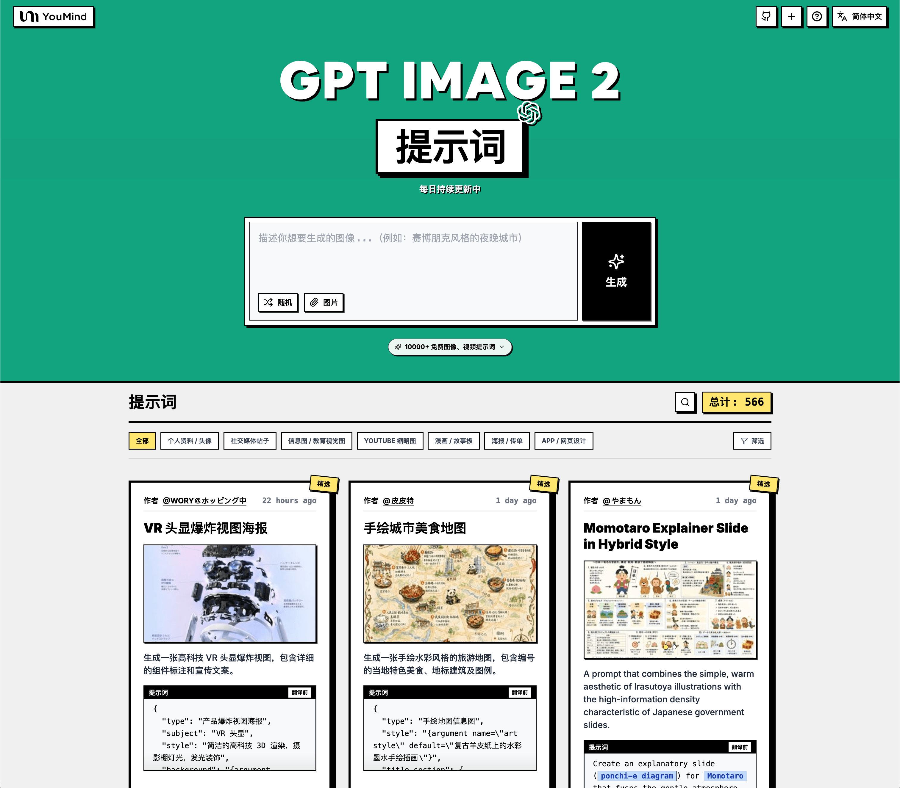

> 💡 🍌 也看看我们的 **Nano Banana Pro** 提示词库 — Google 旗舰生图模型，10000+ 精选提示词 👉 [awesome-nano-banana-pro-prompts](https://github.com/YouMind-OpenLab/awesome-nano-banana-pro-prompts)
# 🚀 GPT Image 2 提示词大全

[](https://github.com/sindresorhus/awesome)
[](https://github.com/YouMind-OpenLab/awesome-gpt-image-2)
[](https://creativecommons.org/licenses/by/4.0/)
[](https://github.com/YouMind-OpenLab/awesome-gpt-image-2/actions)
[](docs/CONTRIBUTING.md)

> 🎨 OpenAI GPT Image 2 创意提示词精选集合

> ⚠️ **版权声明**：所有提示词均收集自社区，仅供教育目的使用。如果您认为任何内容侵犯了您的权利，请[提交 issue](https://github.com/YouMind-OpenLab/awesome-gpt-image-2/issues/new?template=bug-report.yml)，我们将立即移除。

---

[](README.md) [](README_zh.md) [](README_zh-TW.md) [](README_ja-JP.md) [](README_ko-KR.md) [](README_th-TH.md) [](README_vi-VN.md) [](README_hi-IN.md) [](README_es-ES.md) [-Click%20to%20View-lightgrey)](README_es-419.md) [](README_de-DE.md) [](README_fr-FR.md) [](README_it-IT.md) [-Click%20to%20View-lightgrey)](README_pt-BR.md) [](README_pt-PT.md) [](README_tr-TR.md)

---

## 🌐 在网页图库中查看

<div align="center">



</div>

**[👉 浏览 YouMind GPT Image 2 提示词图库](https://youmind.com/zh-CN/gpt-image-2-prompts)**

为什么使用图库？

| Feature | GitHub README | youmind.com 图库 |
|---------|--------------|---------------------|
| 🎨 可视化布局 | 线性列表 | 精美的瀑布流网格 |
| 🔍 搜索 | 仅 Ctrl+F | 全文搜索和筛选 |
| 🤖 AI 一键生图 | - | AI 一键生图 |
| 📱 移动端 | 基础 | 完全响应式 |
| 🏷️ 分类 | - | 分类浏览 |


### 🏷️ 按分类浏览

- **使用场景**
  - [个人资料 / 头像](https://youmind.com/zh-CN/gpt-image-2-prompts?categories=profile-avatar)
  - [社交媒体帖子](https://youmind.com/zh-CN/gpt-image-2-prompts?categories=social-media-post)
  - [信息图 / 教育视觉图](https://youmind.com/zh-CN/gpt-image-2-prompts?categories=infographic-edu-visual)
  - [YouTube 缩略图](https://youmind.com/zh-CN/gpt-image-2-prompts?categories=youtube-thumbnail)
  - [漫画 / 故事板](https://youmind.com/zh-CN/gpt-image-2-prompts?categories=comic-storyboard)
  - [产品营销](https://youmind.com/zh-CN/gpt-image-2-prompts?categories=product-marketing)
  - [电商主图](https://youmind.com/zh-CN/gpt-image-2-prompts?categories=ecommerce-main-image)
  - [游戏素材](https://youmind.com/zh-CN/gpt-image-2-prompts?categories=game-asset)
  - [海报 / 传单](https://youmind.com/zh-CN/gpt-image-2-prompts?categories=poster-flyer)
  - [App / 网页设计](https://youmind.com/zh-CN/gpt-image-2-prompts?categories=app-web-design)
- **风格**
  - [摄影](https://youmind.com/zh-CN/gpt-image-2-prompts?categories=photography)
  - [电影 / 电影剧照](https://youmind.com/zh-CN/gpt-image-2-prompts?categories=cinematic-film-still)
  - [动漫 / 漫画](https://youmind.com/zh-CN/gpt-image-2-prompts?categories=anime-manga)
  - [插画](https://youmind.com/zh-CN/gpt-image-2-prompts?categories=illustration)
  - [草图 / 线稿](https://youmind.com/zh-CN/gpt-image-2-prompts?categories=sketch-line-art)
  - [漫画 / 图画小说](https://youmind.com/zh-CN/gpt-image-2-prompts?categories=comic-graphic-novel)
  - [3D 渲染](https://youmind.com/zh-CN/gpt-image-2-prompts?categories=3d-render)
  - [Q 版 / Q 萌风](https://youmind.com/zh-CN/gpt-image-2-prompts?categories=chibi-q-style)
  - [等距](https://youmind.com/zh-CN/gpt-image-2-prompts?categories=isometric)
  - [像素艺术](https://youmind.com/zh-CN/gpt-image-2-prompts?categories=pixel-art)
  - [油画](https://youmind.com/zh-CN/gpt-image-2-prompts?categories=oil-painting)
  - [水彩画](https://youmind.com/zh-CN/gpt-image-2-prompts?categories=watercolor)
  - [水墨 / 中国风](https://youmind.com/zh-CN/gpt-image-2-prompts?categories=ink-chinese-style)
  - [复古 / 怀旧](https://youmind.com/zh-CN/gpt-image-2-prompts?categories=retro-vintage)
  - [赛博朋克 / 科幻](https://youmind.com/zh-CN/gpt-image-2-prompts?categories=cyberpunk-sci-fi)
  - [极简主义](https://youmind.com/zh-CN/gpt-image-2-prompts?categories=minimalism)
- **主体**
  - [人像 / 自拍](https://youmind.com/zh-CN/gpt-image-2-prompts?categories=portrait-selfie)
  - [网红 / 模特](https://youmind.com/zh-CN/gpt-image-2-prompts?categories=influencer-model)
  - [角色](https://youmind.com/zh-CN/gpt-image-2-prompts?categories=character)
  - [团体 / 情侣](https://youmind.com/zh-CN/gpt-image-2-prompts?categories=group-couple)
  - [产品](https://youmind.com/zh-CN/gpt-image-2-prompts?categories=product)
  - [食品 / 饮料](https://youmind.com/zh-CN/gpt-image-2-prompts?categories=food-drink)
  - [时尚单品](https://youmind.com/zh-CN/gpt-image-2-prompts?categories=fashion-item)
  - [动物 / 生物](https://youmind.com/zh-CN/gpt-image-2-prompts?categories=animal-creature)
  - [车辆](https://youmind.com/zh-CN/gpt-image-2-prompts?categories=vehicle)
  - [建筑 / 室内设计](https://youmind.com/zh-CN/gpt-image-2-prompts?categories=architecture-interior)
  - [风景 / 自然](https://youmind.com/zh-CN/gpt-image-2-prompts?categories=landscape-nature)
  - [城市风光 / 街道](https://youmind.com/zh-CN/gpt-image-2-prompts?categories=cityscape-street)
  - [图表](https://youmind.com/zh-CN/gpt-image-2-prompts?categories=diagram-chart)
  - [文本 / 排版](https://youmind.com/zh-CN/gpt-image-2-prompts?categories=text-typography)
  - [摘要 / 背景](https://youmind.com/zh-CN/gpt-image-2-prompts?categories=abstract-background)

---

## 📖 目录

- [🌐 在网页图库中查看](#-view-in-web-gallery)
- [🤔 什么是 GPT Image 2？](#-what-is-gpt-image-2)
- [📊 统计数据](#-statistics)
- [🔥 精选提示词](#-featured-prompts)
- [📋 所有提示词](#-all-prompts)
- [🤝 如何贡献](#-how-to-contribute)
- [📄 许可证](#-license)
- [🙏 致谢](#-acknowledgements)
- [⭐ Star 历史](#-star-history)

---

## 🤔 什么是 GPT Image 2？

**GPT Image 2**（代号 **"duct-tape"**）是 OpenAI 下一代图像生成模型。社区测试反馈它在以下方面实现了质的飞跃：

- 🎯 **像素级文字渲染** — 中文、英文、日文均达到 native 水准，无错字、无字形扭曲
- 🎨 **跨图像素级一致性** — 同一角色、风格、IP 在多张图间保持像素级一致
- ⚡ **商用级插画质量** — 插画风格输出无需人工精修，即可直接用于商业场景
- 🌈 **真实艺术风格注入** — 不止是"模仿参考图"，而是真正理解并再现艺术风格的灵魂
- 🔧 **故事板与产品系列** — 适合故事板、IP 形象、产品系列图等需要多图一致性的场景
- 📐 **多语言平面设计** — 社交卡片、Banner、海报一次生图即可完成多语言文字排版

📚 **了解更多：** 查看社区测试 [报告要点](docs/FAQ.md)

### 🚀 Raycast 集成

部分提示词支持使用 [Raycast Snippets](https://raycast.com/help/snippets) 语法的**动态参数**。寻找 🚀 Raycast Friendly 徽章！

**示例：**
```
A quote card with "{argument name="quote" default="Stay hungry, stay foolish"}"
by {argument name="author" default="Steve Jobs"}
```

在 Raycast 中使用时，您可以动态替换参数以快速迭代！

---

## 📊 统计数据

<div align="center">

| 指标 | 数量 |
|--------|-------|
| 📝 提示词总数 | **116** |
| ⭐ 精选 | **0** |
| 🔄 最后更新 | **2026年4月20日星期一 UTC 10:20:57** |

</div>

---

## 📋 所有提示词

> 📝 按发布日期排序（最新优先）

### No. 1: 个人资料 / 头像 - Mythological Character Avatar Grid


#### 📖 描述

Generates a grid of cartoon-style circular character avatars with text labels, ideal for UI mockups or cast lists.

#### 📝 提示词

```
{
  "type": "character avatar grid",
  "theme": "{argument name=\"theme\" default=\"Journey to the West mythology\"}",
  "style": "{argument name=\"art style\" default=\"clean 2D cartoon vector illustration, thick outlines, flat colors\"}",
  "layout": {
    "background": "{argument name=\"background color\" default=\"light gray\"} subtle texture",
    "format": "grid of circular portraits with text labels centered below each circle",
    "rows": [
      {
        "count": 4,
        "items": [
          {"label": "Sun Wukong", "description": "monkey boy with golden headband and red scarf"},
          {"label": "Tang Sanzang", "description": "monk with ornate golden crown"},
          {"label": "Zhu Bajie", "description": "pig man holding a rake"},
          {"label": "Sha Wujing", "description": "bearded man holding a crescent moon staff"}
        ]
      },
      {
        "count": 4,
        "items": [
          {"label": "White Dragon Horse", "description": "white horse with golden bridle"},
          {"label": "Jade Emperor", "description": "older man with white beard and golden crown"},
          {"label": "Guanyin", "description": "goddess holding a willow branch"},
          {"label": "Bull Demon Kink", "description": "fierce bull demon in armor"}
        ]
      },
      {
        "count": 4,
        "items": [
          {"label": "Princess Iron Fan", "description": "woman holding a green palm leaf fan"},
          {"label": "Red Boy", "description": "boy with red hair, horns, and a small flame"},
          {"label": "Black Wind Demon", "description": "dark shadowy demon with glowing red eyes"},
          {"label": "Nezha", "description": "boy with double hair buns holding a flaming spear"}
        ]
      },
      {
        "count": 3,
        "description": "partial row repeating Princess Iron Fan, Black Wind Demon, and Nezha, slightly cropped at the bottom"
      }
    ]
  }
}
```

#### 🖼️ 生成图片

##### Image 1

<div align="center">

</div>

#### 📌 详情

- **作者:** [wm](https://x.com/Ryan_Suo)
- **来源:** [Twitter Post](https://x.com/Ryan_Suo/status/2045555581487137125#reversed-0)
- **发布时间:** 2026年4月18日
- **多语言:** en

**[👉 立即尝试 →](https://youmind.com/zh-CN/gpt-image-2-prompts?id=13511)**

---

### No. 2: 个人资料 / 头像 - Sci-Fi Commander Hologram Interaction


#### 📖 描述

A photorealistic portrait of a sci-fi character interacting with a holographic interface on a starship bridge.

#### 📝 提示词

```
A highly detailed, photorealistic portrait of a {argument name="character description" default="young woman with dark hair in an elegant updo"}. She is wearing a {argument name="outfit" default="sleek, futuristic black trench coat uniform with intricate silver metallic armor accents, straps, and a holstered sci-fi pistol"}. She stands confidently, raising one hand with gracefully posed fingers to interact with a {argument name="technology" default="glowing blue holographic data interface"}. The setting is the {argument name="environment" default="dimly lit bridge of a starship"}, with large observation windows in the background revealing a {argument name="background scene" default="vast space fleet cruising through a starry nebula"}. Cinematic lighting, sharp focus, 8k resolution, sci-fi concept art style, dramatic shadows, cool blue color palette.
```

#### 🖼️ 生成图片

##### Image 1

<div align="center">

</div>

#### 📌 详情

- **作者:** [Daniel](https://x.com/Fancyfreer)
- **来源:** [Twitter Post](https://x.com/Fancyfreer/status/2044789137853792669#reversed-3)
- **发布时间:** 2026年4月16日
- **多语言:** en

**[👉 立即尝试 →](https://youmind.com/zh-CN/gpt-image-2-prompts?id=13443)**

---

### No. 3: 个人资料 / 头像 - 便利店里的哥特萝莉肖像


#### 📖 描述

一张身着哥特萝莉装的人站在日本便利店前的写实肖像。

#### 📝 提示词

```
一张写实风格的特写肖像，主角是一位 {argument name="subject" default="年轻日本女性"}，留着黑色直发和齐刘海，身穿一件 {argument name="outfit" default="带有花卉刺绣的黑色哥特萝莉裙"}，头戴一个 {argument name="headwear" default="黑色蕾丝猫耳头饰"}，并用黑色丝带在下巴处系好。她面带 {argument name="expression" default="中性表情"}，直视镜头。背景为模糊的街景，可以看到一家 {argument name="background" default="Lawson 便利店"} 的店面，展示着蓝白色的招牌和玻璃门。光线自然且柔和，营造出一种写实的日常快照美感。
```

#### 🖼️ 生成图片

##### Image 1

<div align="center">

</div>

#### 📌 详情

- **作者:** [栗](https://x.com/Kukkuree)
- **来源:** [Twitter Post](https://x.com/Kukkuree/status/2044367336816406570#reversed-0)
- **发布时间:** 2026年4月15日
- **多语言:** en

**[👉 立即尝试 →](https://youmind.com/zh-CN/gpt-image-2-prompts?id=13625)**

---

### No. 4: 个人资料 / 头像 - 赛博朋克动漫风格角色：霓虹浴缸


#### 📖 描述

生成一张充满活力的动漫风格赛博朋克插画，描绘了一位身处高科技发光水池中的赛博增强角色。

#### 📝 提示词

```
一张细节极其丰富的动漫风格数字插画，描绘了一位赛博朋克女性角色，她正放松地躺在一个圆形金属浴缸中，缸内盛满了旋转的蓝色发光水体，闪烁着数字霓虹微粒。她留着 {argument name="hair color" default="蓝紫色"} 的尖刺短发，拥有 {argument name="eye color" default="发光的蓝色"} 双眼，颈部和头部侧面连接着带有发光线缆和霓虹节点的精密赛博植入物。她的脸颊上隐约可见网格图案。她正回头看，同时 {argument name="activity" default="抽着烟"}，一缕纤细的发光烟雾升向空中。背景是一面黑暗的高科技墙壁，上面点缀着发光的 {argument name="background color scheme" default="蓝紫色"} 电路板图案，突显出强烈的霓虹灯光效果和充满活力的赛博朋克美学。
```

#### 🖼️ 生成图片

##### Image 1

<div align="center">

</div>

#### 📌 详情

- **作者:** [Binary Rot](https://x.com/BinaryRot)
- **来源:** [Twitter Post](https://x.com/BinaryRot/status/2043796479471706286#reversed-0)
- **发布时间:** 2026年4月13日
- **多语言:** en

**[👉 立即尝试 →](https://youmind.com/zh-CN/gpt-image-2-prompts?id=13595)**

---

### No. 5: 个人资料 / 头像 - 动漫 VTuber 直播界面覆盖图


#### 📖 描述

生成一张动漫风格的 VTuber 直播插图，包含 LIVE 徽章和聊天框等 UI 覆盖元素。

#### 📝 提示词

```
一张动漫风格的可爱 {argument name="animal type" default="狸猫"}-娘 VTuber 直播插图。她有着深色皮肤、白色短波波头、毛茸茸的棕色动物耳朵、棕色大眼睛以及一条毛茸茸的条纹尾巴。她正开心地张嘴微笑，左手对着镜头挥手。她身穿黑白相间的女仆装，配有荷叶边装饰、带有浅绿色腰带的白色围裙，以及系着金色铃铛的绿色丝带项圈。背景是一个温馨、光线柔和且带有光斑效果的房间，墙上挂着一个发光的粉色霓虹爱心。她的左侧是一个放在支架上的专业黑色录音室麦克风，麦克风后方是一台显示着粉色聊天界面的电脑显示器。桌上麦克风旁边放着一个小的 {argument name="plushie type" default="狸猫玩偶"}。图像包含一个直播 UI 覆盖层，由 3 个独立组件组成：左上角是一个写着“{argument name="top left badge" default="LIVE"}”的红色徽章，右上角是一个带有爱心图标并写着“{argument name="top right badge" default="ON AIR"}”的粉色徽章，左下角是一个半透明的深灰色聊天框，其中包含 3 条消息。第一条消息带有绿色爱心和文字“Cute!”，第二条带有绿色爱心和文字“Warm~!”，第三条写着“{argument name="chat message" default="Love"}”并配有两个绿色爱心。
```

#### 🖼️ 生成图片

##### Image 1

<div align="center">

</div>

##### Image 2

<div align="center">

</div>

#### 📌 详情

- **作者:** [しーげっちは自分で描いた絵を動かしたい](https://x.com/seagetch)
- **来源:** [Twitter Post](https://x.com/seagetch/status/2043722902214996448#reversed-0)
- **发布时间:** 2026年4月13日
- **多语言:** en

**[👉 立即尝试 →](https://youmind.com/zh-CN/gpt-image-2-prompts?id=13615)**

---

### No. 6: 个人资料 / 头像 - 百叶窗光影下的电影感肖像


#### 📖 描述

生成一张具有戏剧性光影效果的逼真肖像，人物坐姿，身上投射出明显的百叶窗阴影。

#### 📝 提示词

```
一张逼真的电影感肖像，拍摄对象是一位坐在深色椅子上的东亚年轻女性。她留着齐肩波波头，配有直刘海，发色为 {argument name="hair color" default="蓝绿色"}。她身穿 {argument name="top clothing" default="海军蓝背心"} 和 {argument name="bottom clothing" default="浅米色亚麻短裤"}。她身体微微前倾，双手放在膝盖附近，正视镜头，表情 {argument name="expression" default="中性且平静"}。场景采用了 {argument name="lighting style" default="百叶窗投射出的戏剧性阴影"}，在她的脸部、身体以及身后暖色调的素色墙面上，投射出清晰的水平条纹状金色暖光。画面右侧可见一扇关着百叶窗的窗户。高对比度，氛围感强，细节丰富。
```

#### 🖼️ 生成图片

##### Image 1

<div align="center">

</div>

#### 📌 详情

- **作者:** [栗](https://x.com/Kukkuree)
- **来源:** [Twitter Post](https://x.com/Kukkuree/status/2043525834640613591#reversed-3)
- **发布时间:** 2026年4月13日
- **多语言:** en

**[👉 立即尝试 →](https://youmind.com/zh-CN/gpt-image-2-prompts?id=13608)**

---

### No. 7: 个人资料 / 头像 - Y2K 青少年杂志风格摄影棚肖像


#### 📖 描述

生成一张充满怀旧感、柔焦效果的摄影棚肖像，展示两名年轻人背靠背手持智能手机的姿态，非常适合复古时尚或科技生活方式类图片。

#### 📝 提示词

```
一张两名年轻东亚成年人背靠背站立的摄影棚肖像，背景为 {argument name="background color" default="亮粉色到白色的渐变色"}。照片呈现出 {argument name="photography style" default="Y2K 怀旧 90 年代青少年杂志美学，带有柔焦、胶片颗粒感和光晕效果"}。左侧是一位留着长黑发的年轻女性，正对着镜头温柔微笑。她身穿叠穿风格的 {argument name="woman's outfit" default="浅绿色印花 T 恤搭配粉色长袖、短裙和厚底运动鞋"}，手中拿着一部智能手机。右侧是一位留着短黑发的年轻男性，表情 {argument name="man's expression" default="兴奋且张着嘴"}，一只手握拳举在空中。他身穿 {argument name="man's outfit" default="宽松的紫色 T 恤搭配黄色镶边、宽松蓝色牛仔裤和银色链条项链"}，同样手持一部智能手机。拍摄角度略高，俯视着拍摄对象。
```

#### 🖼️ 生成图片

##### Image 1

<div align="center">

</div>

##### Image 2

<div align="center">

</div>

#### 📌 详情

- **作者:** [MiraiMosaic](https://x.com/MiraiMosaic)
- **来源:** [Twitter Post](https://x.com/MiraiMosaic/status/2043523952778285361#reversed-1)
- **发布时间:** 2026年4月13日
- **多语言:** en

**[👉 立即尝试 →](https://youmind.com/zh-CN/gpt-image-2-prompts?id=13590)**

---

### No. 8: 社交媒体帖子 - Gamified Live Stream App Interface


#### 📖 描述

Generates a highly detailed mobile live streaming interface featuring a host, 3D character avatars, virtual gift notifications, and a scrolling chat.

#### 📝 提示词

```
{
  "type": "mobile live streaming app interface mockup",
  "main_subject": "beautiful young Asian woman smiling, wearing a sparkly top, looking directly at the camera",
  "foreground_3d_characters": {
    "left": "Zhu Bajie (pig demon) holding a golden bowl",
    "right": "Sun Wukong (Monkey King) holding a staff",
    "bottom_right": "cartoonish older man with a mustache holding a glowing lightbulb"
  },
  "center_effect": "large space shuttle launching upwards with bright fire and smoke, positioned in front of the woman's chest",
  "layout": {
    "top_bar": {
      "broadcaster_info": "avatar, name {argument name=\"broadcaster name\" default=\"小甜心✨\"}, stats '28.5万本场点赞', pink '关注' button",
      "top_viewers": "3 avatars with stats '12.8w', '8.9w', '6.6w', and a close button '10万+ X'",
      "status_badges": "labels '小时榜第1名', '礼物展馆 24/28', '心愿达成 差3.2万'",
      "right_stats": "labels '更多直播 >', '主播 | 收礼 940.8万'"
    },
    "middle_left_gift_notifications": {
      "count": 3,
      "items": [
        "avatar, name {argument name=\"gift sender 1\" default=\"八戒哥\"}, text '送 大火箭', rocket icon, multiplier 'x188'",
        "avatar, name {argument name=\"gift sender 2\" default=\"齐天大圣\"}, text '送 嘉年华', carnival icon, multiplier 'x1314'",
        "avatar, name {argument name=\"gift sender 3\" default=\"汤森老师\"}, text '送 梦幻城堡', castle icon, multiplier 'x520'"
      ]
    },
    "bottom_left_chat": {
      "count": 7,
      "messages": [
        "甜心小迷弟 加入了直播间",
        "星辰大海: 女神好美！声音好好听！",
        "抖音用户: 666666",
        "快乐每一天: 太精彩了，火箭升空！",
        "富贵花开 送出 大火箭 x1",
        "风清扬: 这特效绝了！",
        "可可西里: 主播我爱你！"
      ],
      "input_box": "text '说点什么...'"
    },
    "bottom_right_elements": {
      "large_graphic_text": "{argument name=\"main title graphic\" default=\"直播间 火力全开\"}",
      "floating_reactions": "column of colorful hearts",
      "action_icons": "4 icons: smiley face, heart, gift box, three dots"
    }
  }
}
```

#### 🖼️ 生成图片

##### Image 1

<div align="center">

</div>

#### 📌 详情

- **作者:** [Berryxia.AI](https://x.com/berryxia)
- **来源:** [Twitter Post](https://x.com/berryxia/status/2046035090883703088#reversed-0)
- **发布时间:** 2026年4月20日
- **多语言:** en

**[👉 立即尝试 →](https://youmind.com/zh-CN/gpt-image-2-prompts?id=13523)**

---

### No. 9: 社交媒体帖子 - Travel Journal Scrapbook Infographic


#### 📖 描述

Generates a hand-drawn, bullet-journal style travel infographic featuring taped photos, sketch doodles, and categorized text sections for city guides.

#### 📝 提示词

```
{ "type": "travel journal scrapbook page", "style": "hand-drawn bullet journal, textured beige paper background, blue and red ink handwriting, masking tape, polaroid-style photos, sketch doodles", "header": { "title": "{argument name=\"city name\" default=\"北京\"}", "subtitle": "{argument name=\"city name english\" default=\"Beijing\"}", "location_text": "地理位置：中国首都，位于华北平原北部，燕山南麓。", "doodle": "traditional Chinese gate building" }, "photos": { "count": 4, "descriptions": [ "Forbidden City at sunset with masking tape", "Great Wall of China landscape with masking tape", "Beihai Park with white stupa", "Traditional Hutong alleyway with red lanterns" ] }, "layout": { "sections": [ { "title": "最佳游览季节：", "position": "mid-left", "labels": [ "春季 (4-5月) 和秋季 (9-11月)" ], "doodles": [ "two leaves", "sun" ] }, { "title": "Map and Lion", "position": "mid-right", "labels": [ "北京", "故宫门前的石狮子，超有气势！" ], "doodles": [ "map with red dot", "stone guardian lion" ] }, { "title": "主要看点 & 特色", "position": "left-middle", "count": 3, "labels": [ "{argument name=\"main attraction 1\" default=\"故宫 (紫禁城)\"}", "{argument name=\"main attraction 2\" default=\"八达岭长城\"}", "什刹海 & 胡同" ], "doodles": [ "traditional pavilion", "Great Wall segment", "traditional house" ] }, { "title": "特别推荐！", "position": "bottom-right", "count": 2, "labels": [ "天坛公园 (祈年殿)", "南锣鼓巷" ], "doodles": [ "Temple of Heaven" ], "style": "outlined in red ink" }, { "title": "必尝美食！", "position": "bottom-left", "count": 3, "labels": [ "{argument name=\"must try food 1\" default=\"北京烤鸭\"}", "炸酱面", "豆汁儿 (勇敢者挑战！)" ], "doodles": [ "duck head", "bowl of noodles" ] }, { "title": "小贴士：", "position": "bottom-left-center", "count": 2, "labels": [ "景点较大，建议穿舒适的鞋子！", "提前预约门票，节假日人多哦～" ] } ], "footer": { "quote": "走遍千山万水，最爱还是北京！", "doodles": [ "camera", "Bird's Nest stadium", "CCTV tower skyline" ] } } }
```

#### 🖼️ 生成图片

##### Image 1

<div align="center">

</div>

#### 📌 详情

- **作者:** [Nolan](https://x.com/Nolan_Osi)
- **来源:** [Twitter Post](https://x.com/Nolan_Osi/status/2045945940528509109#reversed-0)
- **发布时间:** 2026年4月19日
- **多语言:** en

**[👉 立即尝试 →](https://youmind.com/zh-CN/gpt-image-2-prompts?id=13514)**

---

### No. 10: 社交媒体帖子 - Dark Mode X Post Mockup


#### 📖 描述

Generates a realistic dark mode Twitter/X post screenshot featuring a long list of greentext-style bullet points.

#### 📝 提示词

```
A dark mode screenshot of an X post. The profile features a man with a mustache in a red shirt and crown, username {argument name="username" default="@iruletheworldmo"} with three strawberry emojis and a blue checkmark. Top right has a "Subscribe" button. The tweet text begins with {argument name="headline" default="🚨 BREAKING FRONTIER MODEL NEWS"} followed by {argument name="subheadline" default="gpt-6 set for release april 14th"} and a short intro about OpenAI leaks. Below are exactly 11 bullet points, each starting with a `>` symbol, detailing {argument name="bullet point topic" default="fictional AI model specs"} such as pretraining dates, outperforming gpt-5.4, native multimodality, killing Sora, renaming to "AGI Deployment", 2 million token context, pricing, safety team changes, a 2025 code red, and a new desktop superapp. The text is white on a black background in a standard sans-serif UI font.
```

#### 🖼️ 生成图片

##### Image 1

<div align="center">

</div>

#### 📌 详情

- **作者:** [dih](https://x.com/dihsclusive)
- **来源:** [Twitter Post](https://x.com/dihsclusive/status/2045905067845271555#reversed-0)
- **发布时间:** 2026年4月19日
- **多语言:** en

**[👉 立即尝试 →](https://youmind.com/zh-CN/gpt-image-2-prompts?id=13459)**

---

### No. 11: 社交媒体帖子 - Surrealist Koi Illustration Prompt


#### 📖 描述

A prompt for a surrealist digital illustration featuring a giant colorful koi swimming in a nebula with a tiny human figure for scale.

#### 📝 提示词

```
A surrealist digital illustration style, using {argument name="camera angle" default="low-angle shot"}. The picture depicts a giant colorful {argument name="subject" default="koi"} swimming in a dreamlike nebula, surrounded by brightly colored nebulae and bubbles. In the center of the screen stands a small person with their back to the audience, looking up calmly at the giant koi in the sky, while the koi looks down at the person. The overall picture shows a strong contrast in size, with an ethereal and dreamlike atmosphere. Aspect ratio {argument name="aspect ratio" default="9:16"}.
```

#### 🖼️ 生成图片

##### Image 1

<div align="center">

</div>

#### 📌 详情

- **作者:** [李岳](https://x.com/liyue_ai)
- **来源:** [Twitter Post](https://x.com/liyue_ai/status/2045875219307655337)
- **发布时间:** 2026年4月19日
- **多语言:** zh

**[👉 立即尝试 →](https://youmind.com/zh-CN/gpt-image-2-prompts?id=13520)**

---

### No. 12: 社交媒体帖子 - Mars Selfie Social Media Mockup


#### 📖 描述

Generates a realistic social media app interface mockup featuring a customizable user post, image, and engagement statistics.

#### 📝 提示词

```
{
  "type": "social media app interface mockup",
  "platform_style": "Xiaohongshu",
  "layout": {
    "header": {
      "logo": "red pill with '小红书'",
      "tabs": ["关注 v", "发现", "附近"],
      "active_tab": "发现",
      "icons": 1,
      "icon_types": ["search"]
    },
    "user_profile": {
      "avatar": "portrait of Elon Musk",
      "name": "{argument name=\"user name\" default=\"Elon Musk\"}",
      "verified_badge": "blue checkmark",
      "subtitle": "科技公司创始人/工程师",
      "action_buttons": 3,
      "button_labels": ["关注", "share icon", "ellipsis icon"]
    },
    "post_content": {
      "text": "{argument name=\"post text\" default=\"在火星上看到第一缕阳光。这是人类文明的下一步。星舰 + 星链 + 可持续能源，让生命成为多行星物种。未来已来！🚀\"}",
      "image": {
        "description": "{argument name=\"image subject\" default=\"Elon Musk taking a selfie on Mars\"}",
        "clothing": "black jacket with SPACEX logo",
        "background": "{argument name=\"background elements\" default=\"Starship rocket, geodesic habitat domes, solar panel arrays, Martian landscape at sunrise\"}",
        "watermark": "@Proof AI",
        "location_overlay": {
          "icon": "bar chart",
          "text": "{argument name=\"location tag\" default=\"火星 · 乌托邦平原 >\"}"
        }
      },
      "pagination_dots": 5
    },
    "footer": {
      "comment_input": "说点什么...",
      "interaction_stats": 3,
      "stats_details": [
        {"icon": "heart", "count": "12.8万"},
        {"icon": "star", "count": "2.6万"},
        {"icon": "speech bubble", "count": "1.5万"}
      ],
      "metadata": "昨天 23:42 美国",
      "feedback_button": "不喜欢"
    }
  }
}
```

#### 🖼️ 生成图片

##### Image 1

<div align="center">

</div>

#### 📌 详情

- **作者:** [Proof · AI Productivity](https://x.com/JCutcut47692)
- **来源:** [Twitter Post](https://x.com/JCutcut47692/status/2045846999032008876#reversed-1)
- **发布时间:** 2026年4月19日
- **多语言:** en

**[👉 立即尝试 →](https://youmind.com/zh-CN/gpt-image-2-prompts?id=13503)**

---

### No. 13: 社交媒体帖子 - Sam Altman Skateboarding Test Prompt


#### 📖 描述

A simple prompt for GPT Image 2 featuring Sam Altman on a skateboard at a skatepark, used to test the model's subject consistency.

#### 📝 提示词

```
{argument name="subject" default="Sam Altman"} on a {argument name="object" default="skateboard"} at a {argument name="location" default="skatepark"} with no people.
```

#### 🖼️ 生成图片

##### Image 1

<div align="center">

</div>

#### 📌 详情

- **作者:** [Ilbs (I love boring stuff)](https://x.com/Malek1173989)
- **来源:** [Twitter Post](https://x.com/Malek1173989/status/2045836887684694395)
- **发布时间:** 2026年4月19日
- **多语言:** en

**[👉 立即尝试 →](https://youmind.com/zh-CN/gpt-image-2-prompts?id=13446)**

---

### No. 14: 社交媒体帖子 - Japanese Tabloid Magazine Cover


#### 📖 描述

Generates a realistic Japanese weekly gossip magazine cover featuring paparazzi-style photography, sensational headlines, and multiple inset photos.

#### 📝 提示词

```
{
  "type": "Japanese tabloid magazine cover",
  "magazine_header": {
    "title": "{argument name=\"magazine name\" default=\"週刊LUMINA\"}",
    "issue_date": "4/25号",
    "price": "¥450"
  },
  "main_photo": {
    "subject": "{argument name=\"subject description\" default=\"young Japanese woman looking back in surprise, wearing a denim jacket over a white top\"}",
    "setting": "nighttime street with bokeh lights",
    "style": "paparazzi flash photography style"
  },
  "layout": {
    "headlines": [
      { "position": "top left banner", "text": "{argument name=\"top banner text\" default=\"独占スクープ!!\"}", "color": "white text on red background" },
      { "position": "left vertical", "text": "{argument name=\"main headline left\" default=\"深夜の目撃情報！\"}", "color": "yellow text with black outline" },
      { "position": "right vertical", "text": "{argument name=\"main headline right\" default=\"ついに発覚!?\"}", "color": "red text with white outline" },
      { "position": "bottom center stacked 1", "text": "衝撃の瞬間を激写！", "color": "yellow text on black background" },
      { "position": "bottom center stacked 2", "text": "関係者が語る真相", "color": "white text on red background" },
      { "position": "bottom center stacked 3", "text": "禁断の裏側を迫ろ！", "color": "yellow text on black background" },
      { "position": "bottom left banner", "text": "スクープ袋とじ", "color": "white text on red background" }
    ],
    "inset_photos": {
      "count": 3,
      "details": [
        { "position": "top right", "description": "woman looking down holding her head", "label": "極秘写真入手!!" },
        { "position": "bottom left", "description": "woman talking to a man with glasses", "label": "親密交際発覚か!?" },
        { "position": "bottom right", "description": "woman and man seen from the side", "label": "熱愛発覚 入手!" }
      ]
    },
    "footer": {
      "elements": ["barcode", "188", "963469 195449"]
    }
  }
}
```

#### 🖼️ 生成图片

##### Image 1

<div align="center">

</div>

#### 📌 详情

- **作者:** [aichof(アイチョフ)](https://x.com/aichof21)
- **来源:** [Twitter Post](https://x.com/aichof21/status/2045833848924279054#reversed-2)
- **发布时间:** 2026年4月19日
- **多语言:** en

**[👉 立即尝试 →](https://youmind.com/zh-CN/gpt-image-2-prompts?id=13525)**

---

### No. 15: 社交媒体帖子 - Photorealistic Izakaya Portrait


#### 📖 描述

Generates a photorealistic portrait of a subject sitting at a bar, ideal for lifestyle or character photography.

#### 📝 提示词

```
A photorealistic portrait of a {argument name="subject description" default="young East Asian woman"} sitting at a wooden counter in a {argument name="setting" default="dimly lit izakaya"}. She has long wavy black hair and wears a {argument name="top clothing" default="deep red silk button-down shirt"}, a black mini skirt, sheer black tights, and red high heels. She holds a {argument name="drink" default="glass of beer"} and looks at the camera with a slight pout. The background features blurred patrons and warm glowing {argument name="lighting source" default="paper lanterns"}. Cinematic lighting, shallow depth of field.
```

#### 🖼️ 生成图片

##### Image 1

<div align="center">

</div>

#### 📌 详情

- **作者:** [Andy Chow](https://x.com/AndyChowMr)
- **来源:** [Twitter Post](https://x.com/AndyChowMr/status/2045808504213237921#reversed-0)
- **发布时间:** 2026年4月19日
- **多语言:** en

**[👉 立即尝试 →](https://youmind.com/zh-CN/gpt-image-2-prompts?id=13451)**

---

### No. 16: 社交媒体帖子 - 4-Panel Japanese Digital Ad Banner Grid


#### 📖 描述

Generates a 2x2 grid of distinct Japanese digital advertisement banners for travel, skincare, food, and online education.

#### 📝 提示词

```
{
  "type": "2x2 grid of Japanese digital advertisement banners",
  "layout": {
    "structure": "4 equal quadrants",
    "quadrants": [
      {
        "position": "top-left",
        "theme": "Travel",
        "subject": "A couple holding hands on a white sand beach, looking out at turquoise ocean water under a bright blue sky.",
        "elements": ["red hibiscus flower in bottom left corner"],
        "text_labels": [
          "今年こそ、解き放て。",
          "{argument name=\"travel destination\" default=\"沖縄旅行\"}",
          "3日間の癒やし旅",
          "航空券＋ホテル",
          "39,800円〜",
          "絶景、グルメ、体験 ぜんぶ叶う!"
        ],
        "icons": {
          "count": 3,
          "descriptions": ["airplane", "hotel building", "car"]
        }
      },
      {
        "position": "top-right",
        "theme": "Skincare",
        "subject": "Close-up portrait of a young woman with glowing, dewy skin, eyes closed, gently touching her cheeks.",
        "elements": [
          "soft pink gradient background",
          "dynamic water splash effects",
          "pink cosmetic jar labeled '{argument name=\"skincare product name\" default=\"LUMIÈRE\"} Brightening Gel'"
        ],
        "text_labels": [
          "毛穴・くすみ卒業！",
          "透明感あふれる",
          "水光肌へ",
          "新感覚スキンケア",
          "初回限定 78%OFF",
          "{argument name=\"discount price\" default=\"1,980円\"}"
        ],
        "badges": {
          "count": 3,
          "style": "gold circular",
          "labels": ["毛穴ケア", "高保湿", "ハリ・ツヤ"]
        }
      },
      {
        "position": "bottom-left",
        "theme": "Gourmet Food",
        "subject": "Thick, sliced, medium-rare steak sizzling on a dark grill plate.",
        "elements": [
          "garlic chips",
          "rosemary sprig",
          "dark background with smoke and glowing embers"
        ],
        "text_labels": [
          "とろける旨さ！",
          "{argument name=\"food item\" default=\"黒毛和牛\"}",
          "贅沢ステーキ",
          "期間限定",
          "特別価格",
          "通常価格 8,980円",
          "4,980円"
        ],
        "badges": {
          "count": 1,
          "style": "red circular",
          "labels": ["A4 A5等級"]
        }
      },
      {
        "position": "bottom-right",
        "theme": "Online Education",
        "subject": "Young man in a blue shirt studying at a desk, writing in a notebook next to an open laptop.",
        "elements": ["bright indoor lighting", "desk environment"],
        "text_labels": [
          "スキマ時間で",
          "{argument name=\"education goal\" default=\"最短合格！\"}",
          "オンライン資格講座",
          "スマホで完結",
          "効率学習で差がつく！",
          "今だけ！ 受講料 20%OFF"
        ],
        "badges": {
          "count": 1,
          "style": "blue circular",
          "labels": ["受講者数 10万人 突破！"]
        },
        "icons": {
          "count": 2,
          "descriptions": ["smartphone", "open book"]
        }
      }
    ]
  }
}
```

#### 🖼️ 生成图片

##### Image 1

<div align="center">

</div>

#### 📌 详情

- **作者:** [まかねこ| AI×仮想通貨](https://x.com/makaneko_AI)
- **来源:** [Twitter Post](https://x.com/makaneko_AI/status/2045764016858087720#reversed-0)
- **发布时间:** 2026年4月19日
- **多语言:** en

**[👉 立即尝试 →](https://youmind.com/zh-CN/gpt-image-2-prompts?id=13531)**

---

### No. 17: 社交媒体帖子 - Photorealistic Reclining Portrait


#### 📖 描述

Generates a high-quality, photorealistic image of a woman relaxing on a sofa in soft natural light.

#### 📝 提示词

```
A highly detailed, photorealistic portrait of a {argument name="subject description" default="beautiful young Asian woman"} reclining gracefully on a {argument name="furniture" default="white modern sofa"}. She is wearing a {argument name="clothing" default="short white silk slip dress"} with thin straps, her {argument name="hair style" default="long wavy dark brown hair"} cascading softly over a white pillow. Her pose is relaxed and intimate, with one arm raised elegantly above her head and the other hand resting gently on her stomach, as she gazes directly at the camera with a soft, alluring expression. The scene is illuminated by {argument name="lighting style" default="soft natural sunlight streaming through a window"}, casting gentle, diffused shadows across her flawless skin and the pristine white upholstery. The aesthetic is bright, minimalist, and ethereal, captured with an 85mm lens for a cinematic, shallow depth of field and soft, glowing highlights.
```

#### 🖼️ 生成图片

##### Image 1

<div align="center">

</div>

#### 📌 详情

- **作者:** [Andy Chow](https://x.com/AndyChowMr)
- **来源:** [Twitter Post](https://x.com/AndyChowMr/status/2045725268502036607#reversed-0)
- **发布时间:** 2026年4月19日
- **多语言:** en

**[👉 立即尝试 →](https://youmind.com/zh-CN/gpt-image-2-prompts?id=13448)**

---

### No. 18: 社交媒体帖子 - Douyin Live Stream UI Prompt


#### 📖 描述

A simple prompt for generating a user interface simulation of a Douyin live streaming room, useful for app design prototyping.

#### 📝 提示词

```
Generate a Douyin live stream interface, showing a {argument name="subject" default="beautiful woman"} performing a {argument name="activity" default="live broadcast"}
```

#### 🖼️ 生成图片

##### Image 1

<div align="center">

</div>

##### Image 2

<div align="center">

</div>

#### 📌 详情

- **作者:** [Sun phone](https://x.com/Sun_yuqixx)
- **来源:** [Twitter Post](https://x.com/Sun_yuqixx/status/2045722712497340506)
- **发布时间:** 2026年4月19日
- **多语言:** zh

**[👉 立即尝试 →](https://youmind.com/zh-CN/gpt-image-2-prompts?id=13485)**

---

### No. 19: 社交媒体帖子 - 文本渲染能力测试


#### 📖 描述

用于测试模型是否能将复杂文本准确渲染到特定物体上的提示词。

#### 📝 提示词

```
一个写有 {argument name="text" default="心经"} 的 {argument name="fruit" default="香蕉"}
```

#### 🖼️ 生成图片

##### Image 1

<div align="center">

</div>

#### 📌 详情

- **作者:** [とらの](https://x.com/TlanoAI)
- **来源:** [Twitter Post](https://x.com/TlanoAI/status/2044279047254094190)
- **发布时间:** 2026年4月15日
- **多语言:** ja

**[👉 立即尝试 →](https://youmind.com/zh-CN/gpt-image-2-prompts?id=13629)**

---

### No. 20: 社交媒体帖子 - 真实杂志内页摄影


#### 📖 描述

创作一张业余风格的 iPhone 摄影作品，展示一本翻开的杂志，聚焦特定文章主题，画面清晰且光影真实。

#### 📝 提示词

```
一张业余手机拍摄的照片，展示了翻开的杂志跨页，内容关于 {argument name="topic" default="GPT Image 2"}。由 iPhone 拍摄。无景深效果，画面整体清晰，照片真实。由 iPhone 拍摄。主摄像头。
```

#### 🖼️ 生成图片

##### Image 1

<div align="center">

</div>

##### Image 2

<div align="center">

</div>

#### 📌 详情

- **作者:** [Patrick](https://x.com/patrickassale)
- **来源:** [Twitter Post](https://x.com/patrickassale/status/2043755728624562398)
- **发布时间:** 2026年4月13日
- **多语言:** en

**[👉 立即尝试 →](https://youmind.com/zh-CN/gpt-image-2-prompts?id=13586)**

---

### No. 21: 社交媒体帖子 - 带有搞怪僧侣的趣味寺庙告示牌


#### 📖 描述

生成一张照片级逼真的场景，展示了一位搞怪的僧侣站在一个 9 格插画寺庙告示牌旁摆姿势。

#### 📝 提示词

```
{
  "type": "带有卡通插画告示牌的照片级逼真场景",
  "setting": "{argument name=\"setting\" default=\"带有碎石和石墙的传统日本寺庙庭院\"}",
  "subjects": [
    {
      "type": "人物",
      "description": "一位秃头的日本佛教僧侣，身穿传统的深色长袍和棕褐色络子。",
      "pose": "{argument name=\"monk pose\" default=\"搞怪姿势，单脚站立，向后倾斜，指着告示牌，吐出舌头\"}"
    },
    {
      "type": "木制告示牌",
      "description": "一个带有红色内边框的大型木制告示牌，上方设有标题，下方为 3x3 的 9 格插画网格。",
      "header": {
        "text": "{argument name=\"header text\" default=\"ゆかいなお寺の教え\"}",
        "background": "黄色"
      },
      "grid_panels": [
        { "position": "第 1 行，第 1 列", "text": "{argument name=\"panel 1 text\" default=\"ズボンはチャックをチェック\"}", "illustration": "带有拉链处红色强调线的蓝色牛仔裤" },
        { "position": "第 1 行，第 2 列", "text": "猫に話してもしらんぷり", "illustration": "一只坐着并看向别处的灰白相间猫咪" },
        { "position": "第 1 行，第 3 列", "text": "ヘソのゴマとりすぎ注意", "illustration": "两根大拇指指向肚脐的特写" },
        { "position": "第 2 行，第 1 列", "text": "二度寝は二度目が気持ちいい", "illustration": "一个人在粉色毯子下安详地睡觉" },
        { "position": "第 2 行，第 2 列", "text": "イビキは寝ると聞けない", "illustration": "一个人正在睡觉并打呼噜，带有 Zzz 符号" },
        { "position": "第 2 行，第 3 列", "text": "ポテチは開けたら止まらない", "illustration": "一袋打开并洒出来的薯片" },
        { "position": "第 3 行，第 1 列", "text": "便座が冷たいとビックリ", "illustration": "一个人在打开的马桶旁露出震惊的表情" },
        { "position": "第 3 行，第 2 列", "text": "月末ピンチで来月もピンチ", "illustration": "一个带有黄色闪电图案的空棕色钱包" },
        { "position": "第 3 行，第 3 列", "text": "{argument name=\"panel 9 text\" default=\"ダイエットは明日から...\"}", "illustration": "一个卡通秃头僧侣正开心地吃着大汉堡" }
      ]
    }
  ]
}
```

#### 🖼️ 生成图片

##### Image 1

<div align="center">

</div>

#### 📌 详情

- **作者:** [notargs](https://x.com/notargs)
- **来源:** [Twitter Post](https://x.com/notargs/status/2043741751731769649#reversed-0)
- **发布时间:** 2026年4月13日
- **多语言:** en

**[👉 立即尝试 →](https://youmind.com/zh-CN/gpt-image-2-prompts?id=13597)**

---

### No. 22: 社交媒体帖子 - 狂野老年 DJ 火山海报


#### 📖 描述

生成一张电影感十足、夸张的动作海报，展现老年角色在喷发的火山前激情打碟，并配有霓虹涂鸦文字。

#### 📝 提示词

```
一张超写实、电影感且夸张的动作海报，画面中包含三个充满激情的角色。背景是 {argument name="background setting" default="一座喷发中的巨大火山，伴随着岩浆和火焰"}。在画面顶部中心，悬浮在烟雾缭绕的天空中，是 {argument name="top character" default="一位留着长白发和胡须、身穿灰色连帽衫的老人"}，他正在大声呐喊并双手比出胜利手势。在前景中，两个角色正全神贯注地在 DJ 打碟机上搓盘，两人都展现出极度狂热的能量。左侧是 {argument name="left character" default="一位扎着紫色发髻的老妇人"}。右侧是 {argument name="right character" default="一位留着金色尖刺莫霍克发型、戴着墨镜的老人"}。在画面中心、火山上方悬浮着巨大的锯齿状霓虹涂鸦风格文字，写着 "{argument name="main text" default="DJBBA"}"，色彩为鲜艳的蓝色、绿色和粉色。光影效果戏剧化、火热且混乱，火花和灰烬四处飞溅。
```

#### 🖼️ 生成图片

##### Image 1

<div align="center">

</div>

#### 📌 详情

- **作者:** [めんたろ](https://x.com/mentaro)
- **来源:** [Twitter Post](https://x.com/mentaro/status/2043686766042067059#reversed-1)
- **发布时间:** 2026年4月13日
- **多语言:** en

**[👉 立即尝试 →](https://youmind.com/zh-CN/gpt-image-2-prompts?id=13596)**

---

### No. 23: 社交媒体帖子 - 真空吸尘器火箭上的超现实太空猫


#### 📖 描述

生成一幅高度精细、超现实的科幻场景，描绘一只动物骑着改装后的家用电器在太空中穿行，并可自定义文本。

#### 📝 提示词

```
一幅超现实科幻数字插画，描绘了一只 {argument name="animal" default="白猫"} 坐在一个 {argument name="vehicle" default="扫地机器人"} 上在深空中飞行。吸尘器两侧配有 {argument name="side boosters" default="两条大金枪鱼"} 作为火箭助推器，它们的尾部喷射出明亮的火焰。一根带肋金属软管将吸尘器连接到猫的脖子上。背景是星光熠熠的宇宙星云、高速光条，左上方有一颗正在剧烈爆炸的行星。右侧的垂直日文文本写着 {argument name="japanese text" default="ネコと和解せよ"}（前两个字符为黄色，其余为白色）。底部中心处有巨大的金属 3D 文本 {argument name="bottom text" default="GERONEKO"}，下方有较小的白色文字写着“Creator of the planet”。电影级光效，超写实纹理。
```

#### 🖼️ 生成图片

##### Image 1

<div align="center">

</div>

#### 📌 详情

- **作者:** [めんたろ](https://x.com/mentaro)
- **来源:** [Twitter Post](https://x.com/mentaro/status/2043686766042067059#reversed-0)
- **发布时间:** 2026年4月13日
- **多语言:** en

**[👉 立即尝试 →](https://youmind.com/zh-CN/gpt-image-2-prompts?id=13594)**

---

### No. 24: 社交媒体帖子 - 手写日语学习笔记与照片


#### 📖 描述

生成一张照片级逼真的俯视图，展示一本打开的笔记本，上面写满了详细的日语学习笔记、涂鸦，以及一张放在页面上的打印全家福照片。

#### 📝 提示词

```
{
  "type": "照片级逼真的静物俯视图",
  "setting": "{argument name=\"desk surface\" default=\"木质桌面\"}",
  "objects": [
    {
      "item": "打开的笔记本",
      "style": "{argument name=\"notebook style\" default=\"点阵纸，上面有整齐的黑色和红色墨水手写日语笔记\"}",
      "layout": {
        "left_page": {
          "header": "{argument name=\"subject topic\" default=\"政治学 第6回\"}",
          "section_count": 4,
          "sections": [
            { "title": "選挙とは？", "details": "定义文本" },
            { "title": "選挙の機能", "details": "1-4 编号列表", "doodle": "戴着围巾的猫，举着写有“一票!!”的牌子" },
            { "title": "選挙制度の種類", "details": "带有红色箭头的项目符号，指向“小選挙区比例代表並立制！”" },
            { "title": "投票率の問題", "details": "关于青年投票率的文本", "doodle": "女孩带着写有“18才から選挙に行けるよ！”的气泡框，以及一个前 3 名的排名列表框" }
          ]
        },
        "right_page": {
          "section_count": 5,
          "sections": [
            { "title": "政党とは？", "details": "定义文本" },
            { "title": "政党の役割", "details": "1-4 编号列表", "doodle": "政府大楼草图" },
            { "title": "政党の種類", "details": "项目符号" },
            { "title": "最近の日本の政治と課題", "details": "项目符号", "doodle": "女孩思考着“政治って難しそうで、意外と生活とつながってるだよね。”" },
            { "title": "まとめ", "details": "带有红色下划线的总结", "doodle": "正在阅读的女孩和一朵粉色花朵" }
          ]
        }
      }
    },
    {
      "item": "打印照片",
      "placement": "覆盖在笔记本的右边缘",
      "content": "{argument name=\"photo subject\" default=\"一家四口在樱花和摩天轮前合影\"}",
      "style": "复古、略微褪色的快照"
    }
  ]
}
```

#### 🖼️ 生成图片

##### Image 1

<div align="center">

</div>

##### Image 2

<div align="center">

</div>

#### 📌 详情

- **作者:** [MATはAI🀄️🀄️🎌](https://x.com/mat_m_a_t)
- **来源:** [Twitter Post](https://x.com/mat_m_a_t/status/2043684316539138400#reversed-0)
- **发布时间:** 2026年4月13日
- **多语言:** en

**[👉 立即尝试 →](https://youmind.com/zh-CN/gpt-image-2-prompts?id=13602)**

---

### No. 25: 社交媒体帖子 - 酒吧场景业余快照


#### 📖 描述

一个用于生成酒吧内老年夫妇自然快照的捷克语提示词，旨在展示 GPT Image 2 在生成逼真人物方面的能力。

#### 📝 提示词

```
业余摄影照片，{argument name="subjects" default="一对老年夫妇"} 坐在 {argument name="location" default="约克郡酒吧"} 中，业余构图，快照。
```

#### 🖼️ 生成图片

##### Image 1

<div align="center">

</div>

##### Image 2

<div align="center">

</div>

#### 📌 详情

- **作者:** [Martin Balaz](https://x.com/phasE89)
- **来源:** [Twitter Post](https://x.com/phasE89/status/2043641310226042910)
- **发布时间:** 2026年4月13日
- **多语言:** en

**[👉 立即尝试 →](https://youmind.com/zh-CN/gpt-image-2-prompts?id=13610)**

---

### No. 26: 社交媒体帖子 - 业余 Apple Store 摄影


#### 📖 描述

一个旨在重现店面关闭后，在店外用智能手机随手拍摄的照片效果的提示词，特别侧重于玻璃窗上的倒影和透视感。

#### 📝 提示词

```
在关闭的 {argument name="store" default="Apple Store"} 前拍摄的业余照片，但我们可以透过窗户看到内部。使用 {argument name="device" default="iPhone"} 拍摄。{argument name="lens" default="主摄像头"}
```

#### 🖼️ 生成图片

##### Image 1

<div align="center">

</div>

##### Image 2

<div align="center">

</div>

#### 📌 详情

- **作者:** [Patrick](https://x.com/patrickassale)
- **来源:** [Twitter Post](https://x.com/patrickassale/status/2043607622276743596)
- **发布时间:** 2026年4月13日
- **多语言:** en

**[👉 立即尝试 →](https://youmind.com/zh-CN/gpt-image-2-prompts?id=13583)**

---

### No. 27: 信息图 / 教育视觉图 - VR Headset Exploded View Poster


#### 📖 描述

Generates a high-tech exploded view diagram of a VR headset with detailed component callouts and promotional text.

#### 📝 提示词

```
{
  "type": "exploded view product diagram poster",
  "subject": "VR headset",
  "style": "clean high-tech 3D render, studio lighting, glowing accents",
  "background": "{argument name=\"background color\" default=\"soft purple and blue gradient\"}",
  "header": {
    "logo": "∞ {argument name=\"product name\" default=\"Meta Quest 3\"}",
    "subtitle": "{argument name=\"main catchphrase\" default=\"まったく新しい現実を、まったく新しい構造から。\"}"
  },
  "layout": {
    "centerpiece": "vertically stacked exploded view of a VR headset showing 9 distinct layers of internal components: outer shell, camera sensors, motherboard with chip, pancake lenses, internal frame, battery packs, side straps, top strap, and facial interface cushion.",
    "callout_labels": {
      "count": 8,
      "left_side": [
        "Snapdragon® XR2 Gen 2\n圧倒的な処理性能でリアルタイムな体験を。",
        "調整可能なIPD機構\n幅広いユーザーに快適なフィット感を。",
        "精密設計されたヘッドストラップ\n快適さと安定性を追求したエルゴノミクス。"
      ],
      "right_side": [
        "フェイスプレート\n洗練されたデザインと最適な重量バランス。",
        "トラッキングカメラ\n高精度な位置トラッキングと環境認識を実現。",
        "パンケーキレンズ\n薄型設計で広い視野角と鮮明な映像を提供。",
        "高性能バッテリー\n長時間駆動を支える最適化された電源設計。",
        "柔らかなフェイスインターフェース\n長時間でも快適な装着感を実現。"
      ]
    },
    "footer": {
      "left_text_block": {
        "headline": "{argument name=\"bottom headline\" default=\"体験は、構造から進化する。\"}",
        "body": "一つひとつのパーツに、没入体験を支える最先端テクノロジーとこだわりの設計。Meta Quest 3は、未来を感じさせる体験を内部から生み出しています。"
      },
      "right_logo": "∞ Meta"
    }
  }
}
```

#### 🖼️ 生成图片

##### Image 1

<div align="center">

</div>

#### 📌 详情

- **作者:** [wory＠ホッピング中](https://x.com/wory37303852)
- **来源:** [Twitter Post](https://x.com/wory37303852/status/2045925660401795478#reversed-0)
- **发布时间:** 2026年4月19日
- **多语言:** en

**[👉 立即尝试 →](https://youmind.com/zh-CN/gpt-image-2-prompts?id=13460)**

---

### No. 28: 信息图 / 教育视觉图 - Leaked AI Benchmark Report Photo


#### 📖 描述

Generates a realistic photograph of a computer screen displaying an academic technical report with bar charts and a detailed performance table.

#### 📝 提示词

```
{
  "type": "photograph of a computer monitor displaying an academic technical report",
  "style": "slightly angled screen photo, visible moire pattern, LCD pixel grid, slight glare, LaTeX document formatting, serif fonts",
  "document_header": {
    "left": "4 Benchmark Evaluation",
    "right": "{argument name=\"report title\" default=\"DeepSeek-V4 Technical Report\"}"
  },
  "introductory_text": "Paragraph summarizing comprehensive evaluation of {argument name=\"main model name\" default=\"DeepSeek-V4\"} against {argument name=\"competitor model 1\" default=\"GPT-5.3\"}, {argument name=\"competitor model 2\" default=\"Claude Opus 4.6\"}, and {argument name=\"competitor model 3\" default=\"Gemini 3.1 Pro Preview\"}.",
  "visualizations": {
    "legend": "5 items with color codes: dark blue, grey, light grey, blue striped, light blue",
    "bar_charts": {
      "count": 6,
      "labels": [
        "MMLU-Pro (EM)",
        "GPQA-Diamond (Pass@1)",
        "AIME 2025 (Pass@1)",
        "LiveCodeBench (Pass@1-COT)",
        "SWE-bench Verified (Resolved)",
        "Tau-bench (Average)"
      ]
    },
    "caption": "Figure 1 | Performance comparison on core benchmarks. DeepSeek-V4 achieves state-of-the-art results across the majority of benchmarks."
  },
  "data_table": {
    "columns": [
      "Benchmark",
      "{argument name=\"main model name\" default=\"DeepSeek-V4\"}",
      "{argument name=\"competitor model 1\" default=\"GPT-5.3\"}",
      "{argument name=\"competitor model 2\" default=\"Claude Opus 4.6\"}",
      "{argument name=\"competitor model 3\" default=\"Gemini 3.1 Pro Preview\"}",
      "GPT-4.1"
    ],
    "categories": {
      "count": 4,
      "rows": [
        {"label": "General", "icon": "globe/network", "sub_items": 3},
        {"label": "Reasoning & Math", "icon": "calculator/clipboard", "sub_items": 3},
        {"label": "Code", "icon": "code brackets", "sub_items": 3},
        {"label": "Agent", "icon": "robot face", "sub_items": 3}
      ]
    }
  }
}
```

#### 🖼️ 生成图片

##### Image 1

<div align="center">

</div>

#### 📌 详情

- **作者:** [Anneshu Nag](https://x.com/anneshu_nag)
- **来源:** [Twitter Post](https://x.com/anneshu_nag/status/2045867360914227699#reversed-0)
- **发布时间:** 2026年4月19日
- **多语言:** en

**[👉 立即尝试 →](https://youmind.com/zh-CN/gpt-image-2-prompts?id=13482)**

---

### No. 29: 信息图 / 教育视觉图 - Four Practical GPT-Image-2 Use Cases


#### 📖 描述

A collection of four prompts for food flowcharts, travel plans, textbook covers, and AI product landing pages.

#### 📝 提示词

```
Detailed cooking process flowchart for this dish, realistic style, suitable for Xiaohongshu aspect ratio\n\n{argument name="destination" default="Sydney, Australia"} 3-day and 2-night travel plan, suitable for Xiaohongshu aspect ratio, hand-drawn sketch style\n\nPeople's Education Press Primary School Textbook: {argument name="textbook title" default="Vibe Coding"} Grade 1 (Volume 1)\n\nProduct display page for an {argument name="character" default="Android 18"} AI physical robot launched by OpenAI, consistent with current OpenAI design style, in Simplified Chinese, robot with the latest GPT 10 model. Includes: appearance, details, features, scenarios, usage, maintenance, etc.
```

#### 🖼️ 生成图片

##### Image 1

<div align="center">

</div>

##### Image 2

<div align="center">

</div>

#### 📌 详情

- **作者:** [Rion Wu](https://x.com/rionaifantasy)
- **来源:** [Twitter Post](https://x.com/rionaifantasy/status/2045865185605505501)
- **发布时间:** 2026年4月19日
- **多语言:** zh

**[👉 立即尝试 →](https://youmind.com/zh-CN/gpt-image-2-prompts?id=13487)**

---

### No. 30: 信息图 / 教育视觉图 - Illustrated City Food Map


#### 📖 描述

Generates a hand-drawn, watercolor-style tourist map featuring numbered local food specialties, landmarks, and a legend.

#### 📝 提示词

```
{
  "type": "illustrated map infographic",
  "style": "{argument name=\"art style\" default=\"watercolor and ink hand-drawn illustration on vintage parchment\"}",
  "title_section": {
    "text": "{argument name=\"city name\" default=\"成都\"} {argument name=\"map title\" default=\"吃货暴走地图\"}",
    "mascot": "cartoon red chili pepper wearing sunglasses and giving a thumbs up"
  },
  "border": "{argument name=\"border decoration\" default=\"vine of green leaves and red chili peppers\"}",
  "layout": {
    "background": "textured beige parchment paper with yellow roads, blue rivers, and green park areas",
    "sections": [
      {
        "title": "landmarks",
        "count": 6,
        "illustrations": ["traditional pavilion", "traditional monastery", "modern skyscraper with climbing panda", "tall TV tower", "traditional gate", "industrial buildings"],
        "labels": ["人民公园", "文殊院", "IFS", "339电视塔", "宽窄巷子", "东郊记忆"]
      },
      {
        "title": "food_spots",
        "count": 12,
        "illustrations": ["mapo tofu", "dumplings in chili oil", "skewers in pot", "sticky rice balls", "egg baking cake", "nine-grid hotpot", "sweet potato noodles", "cold skewers", "spicy mixed dish", "covered tea bowl", "ice jelly dessert", "spicy rabbit heads"],
        "labels": ["1 陈麻婆豆腐", "2 钟水饺", "3 春熙路", "4 宽窄巷子·三大炮", "5 建设路·叶婆婆蛋烘糕", "6 玉林路·小龙坎火锅", "7 香香巷·肥肠粉", "8 武侯祠大街·钵钵鸡", "9 东郊记忆·冒椒火辣", "10 人民公园·鹤鸣茶社", "11 锦里古街·冰粉", "12 双流老妈兔头"]
      },
      {
        "title": "图例",
        "position": "bottom-right",
        "count": 5,
        "items": ["red dot", "green house", "green tree", "blue line", "yellow double line"],
        "labels": ["美食地点", "地标景点", "公园绿地", "河流湖泊", "主要道路"]
      }
    ],
    "centerpiece": "giant panda sitting and eating bamboo",
    "bottom_right_extras": ["vintage compass rose with N, S, E, W", "disclaimer text '温馨提示：吃辣需谨慎，肠胃要保护~' with a red chili pepper icon"]
  }
}
```

#### 🖼️ 生成图片

##### Image 1

<div align="center">

</div>

#### 📌 详情

- **作者:** [皮皮特](https://x.com/mm_zzm44854)
- **来源:** [Twitter Post](https://x.com/mm_zzm44854/status/2045861258520568230#reversed-1)
- **发布时间:** 2026年4月19日
- **多语言:** en

**[👉 立即尝试 →](https://youmind.com/zh-CN/gpt-image-2-prompts?id=13515)**

---

### No. 31: 信息图 / 教育视觉图 - Academic Exam Paper Generator


#### 📖 描述

Generates a realistic, structured academic test paper with multiple-choice questions, a diagram, and short-answer sections.

#### 📝 提示词

```
{
  "type": "academic exam paper",
  "header": {
    "student_info": ["Name:", "Date:", "Period:"],
    "title": "{argument name=\"subject\" default=\"BIOLOGY\"} - {argument name=\"test title\" default=\"SEMESTER 1 TEST\"}",
    "subtitle": "Total Points: 100"
  },
  "instructions": "DIRECTIONS: Read each question carefully. Circle the letter of the best answer for Part I. Show your work and write your answers clearly for Part II.",
  "sections": [
    {
      "title": "Part I: {argument name=\"part 1 type\" default=\"Multiple Choice\"} (2 points each, 40 points total)",
      "layout": "two columns",
      "question_count": 8,
      "format": "numbered questions 1 through 8, each with options A, B, C, D",
      "diagram": {
        "location": "Question 3",
        "description": "illustration of a {argument name=\"diagram subject\" default=\"plant cell\"}",
        "labels": ["1", "2", "3", "4"]
      }
    },
    {
      "title": "Part II: {argument name=\"part 2 type\" default=\"Short Answer\"} (Show your work. 10 points each, 60 points total)",
      "layout": "single column",
      "question_count": 3,
      "format": "numbered questions 9 through 11, each followed by two blank horizontal lines"
    }
  ],
  "footer": "End of Test - Check Your Work!"
}
```

#### 🖼️ 生成图片

##### Image 1

<div align="center">

</div>

#### 📌 详情

- **作者:** [Yx](https://x.com/yx9288)
- **来源:** [Twitter Post](https://x.com/yx9288/status/2045838597950193963#reversed-0)
- **发布时间:** 2026年4月19日
- **多语言:** en

**[👉 立即尝试 →](https://youmind.com/zh-CN/gpt-image-2-prompts?id=13445)**

---

### No. 32: 信息图 / 教育视觉图 - 3D Stone Staircase Evolution Infographic


#### 📖 描述

Transforms a flat evolutionary timeline into a realistic 3D stone staircase infographic with detailed organism renders and structured side panels.

#### 📝 提示词

```
{
  "type": "evolutionary timeline infographic",
  "instruction": "Using REFERENCE_0 as a structural base, transform the flat vector design into a highly realistic 3D infographic. Replace the smooth ramps with distinct stone steps and upgrade all organisms to photorealistic 3D models.",
  "style": {
    "background": "{argument name=\"background style\" default=\"vintage textured parchment paper\"}",
    "staircase": "{argument name=\"staircase material\" default=\"realistic textured stone blocks\"}",
    "subjects": "{argument name=\"organism style\" default=\"highly detailed photorealistic 3D renders\"}"
  },
  "layout": {
    "main_title": "{argument name=\"main title\" default=\"人类演化\"}",
    "sections": [
      {
        "position": "left sidebar",
        "count": 8,
        "labels": ["L0: 单细胞生命", "L1: 多细胞生物", "L2: 动物界", "L3: 脊索动物", "L4: 上陆革命", "L5: 哺乳纲", "L6: 人科演化", "L7: 智人纪元"]
      },
      {
        "position": "top right",
        "title": "获得的功能 / 失去的功能",
        "description": "Legend with plus and minus icons"
      },
      {
        "position": "bottom center",
        "title": "演化关键里程碑",
        "count": 6,
        "description": "Timeline with a silhouette graphic of 6 figures showing ape-to-human evolution"
      }
    ],
    "centerpiece": {
      "description": "Winding stone staircase with 25 numbered steps featuring specific organisms.",
      "count": 25,
      "notable_elements": [
        "Step 07: Jellyfish",
        "Step 09: Ammonite",
        "Step 10: Trilobite",
        "Step 24: Walking human",
        "Step 25: {argument name=\"future evolution concept\" default=\"glowing cosmic silhouette with a question mark\"}"
      ]
    }
  }
}
```

#### 🖼️ 生成图片

##### Image 1

<div align="center">

</div>

#### 📌 详情

- **作者:** [知识猫图解](https://x.com/GeekCatX)
- **来源:** [Twitter Post](https://x.com/GeekCatX/status/2045792240044511277#reversed-1)
- **发布时间:** 2026年4月19日
- **多语言:** en

**[👉 立即尝试 →](https://youmind.com/zh-CN/gpt-image-2-prompts?id=13491)**

---

### No. 33: 信息图 / 教育视觉图 - Chinese History Timeline Infographic


#### 📖 描述

A detailed, four-section vertical infographic mapping Chinese historical dynasties with watercolor illustrations and timeline nodes.

#### 📝 提示词

```
{
  "type": "infographic timeline",
  "style": {
    "background": "{argument name=\"background style\" default=\"textured beige rice paper\"}",
    "art_style": "{argument name=\"art style\" default=\"traditional Chinese watercolor and ink wash illustration\"}"
  },
  "header": {
    "title": "{argument name=\"main title\" default=\"中国历史朝代图\"}",
    "subtitle": "{argument name=\"subtitle\" default=\"华夏文明·源远流长\"}",
    "elements": ["red calligraphy title", "red square seal stamp top right", "cloud motifs"]
  },
  "layout": {
    "sections_count": 4,
    "sections": [
      {
        "id": "1",
        "label": "壹 先秦时期",
        "date_range": "(约前2070年—前221年)",
        "description": "华夏起源，诸侯纷争，百家争鸣。",
        "timeline_nodes": 4,
        "dynasties": ["夏", "商", "西周", "东周"],
        "illustrations": ["scholar holding bamboo slips", "bronze ding tripod", "bronze ritual vessel", "horse-drawn chariot", "bamboo slips and brush"]
      },
      {
        "id": "2",
        "label": "贰 秦汉三国",
        "date_range": "(前221年—280年)",
        "description": "大一统时代，开疆拓土，英雄辈出。",
        "timeline_nodes": 3,
        "dynasties": ["秦", "汉", "三国"],
        "illustrations": ["terracotta warrior", "cavalryman on galloping horse", "three generals in traditional armor"]
      },
      {
        "id": "3",
        "label": "叁 两晋南北朝 隋唐五代",
        "date_range": "(280年—960年)",
        "description": "分裂与融合并存，盛世辉煌，文化鼎盛。",
        "timeline_nodes": 5,
        "dynasties": ["两晋", "南北朝", "隋", "唐", "五代十国"],
        "illustrations": ["scholar drinking wine", "seated Buddha statue", "arched stone bridge with boat", "elegant Tang dynasty lady", "cavalryman holding a flag"]
      },
      {
        "id": "4",
        "label": "肆 宋元明清",
        "date_range": "(960年—1912年)",
        "description": "经济繁荣，民族融合，走向近代。",
        "timeline_nodes": 4,
        "dynasties": ["宋", "元", "明", "清"],
        "illustrations": ["bustling riverside townscape", "mounted archer shooting backwards", "palace complex", "Qing dynasty official"]
      }
    ]
  },
  "footer": {
    "quote": "{argument name=\"bottom quote\" default=\"以史为鉴，可以知兴替；以人为镜，可以明得失。\"}",
    "decorations": ["bamboo leaves on bottom left", "Great Wall illustration on bottom right"]
  }
}
```

#### 🖼️ 生成图片

##### Image 1

<div align="center">

</div>

#### 📌 详情

- **作者:** [axiaisacat](https://x.com/axiaisacat)
- **来源:** [Twitter Post](https://x.com/axiaisacat/status/2045679633832595558#reversed-1)
- **发布时间:** 2026年4月19日
- **多语言:** en

**[👉 立即尝试 →](https://youmind.com/zh-CN/gpt-image-2-prompts?id=13494)**

---

### No. 34: 信息图 / 教育视觉图 - English Vocabulary Educational Infographic


#### 📖 描述

Generates a vertical, multi-section educational comic strip for teaching vocabulary with breakdowns, mnemonics, and examples.

#### 📝 提示词

```
{
  "type": "educational infographic comic",
  "style": "cute chibi anime, flat colors, clear comic panel layout, pastel backgrounds",
  "header": {
    "title": "今天我们来学习一个新词：",
    "word": "{argument name=\"target word\" default=\"so-called\"}",
    "translation": "({argument name=\"target translation\" default=\"所谓的\"})",
    "definition_box": "“so-called” 表示“所谓的”，用来强调某事物的名字或称呼，并不一定是真的那样。",
    "illustration": "teacher at chalkboard talking to 2 students with speech bubbles"
  },
  "layout": {
    "sections": [
      {
        "title": "1. 拆分小能手 (按音节/前后缀/词根)",
        "count": 3,
        "labels": ["so", "call", "ed"],
        "details": "3 colored columns (pink, green, blue) breaking down syllables, roots, and suffixes, accompanied by 4 chibi characters explaining the parts"
      },
      {
        "title": "2. 发音 (中文谐音)",
        "count": 1,
        "labels": ["so-called"],
        "details": "phonetic pronunciation guide with a teacher instructing a student"
      },
      {
        "title": "3. 联想记忆法 (故事联想)",
        "count": 3,
        "labels": ["panel 1", "panel 2", "panel 3"],
        "details": "3-panel comic illustrating {argument name=\"mnemonic story theme\" default=\"a so-called genius dog that only knows how to sit\"}"
      },
      {
        "title": "4. 例句小剧场",
        "count": 2,
        "labels": ["(1)", "(2)"],
        "details": "2 illustrated examples showing {argument name=\"example 1\" default=\"a so-called top student who doesn't do homework\"} and {argument name=\"example 2\" default=\"a so-called best pizza that tastes average\"}"
      },
      {
        "title": "5. 总结小卡片",
        "count": 5,
        "labels": ["单词", "拆分", "发音", "意思", "记忆口诀"],
        "details": "bulleted summary list with star icons, featuring a teacher character pointing at the bottom right"
      }
    ],
    "footer": "megaphone icon with text 每天学一个，英语更轻松！下次见！"
  }
}
```

#### 🖼️ 生成图片

##### Image 1

<div align="center">

</div>

#### 📌 详情

- **作者:** [axiaisacat](https://x.com/axiaisacat)
- **来源:** [Twitter Post](https://x.com/axiaisacat/status/2045679633832595558#reversed-0)
- **发布时间:** 2026年4月19日
- **多语言:** en

**[👉 立即尝试 →](https://youmind.com/zh-CN/gpt-image-2-prompts?id=13493)**

---

### No. 35: 信息图 / 教育视觉图 - 教育科学信息图


#### 📖 描述

生成一个三阶段教育信息图，通过视觉隐喻和解释性文字阐述科学概念。

#### 📝 提示词

```
{
  "type": "教育信息图",
  "theme": "量子物理",
  "background": "深蓝色渐变",
  "header": {
    "title": "{argument name=\"main title\" default=\"波函数坍缩\"}",
    "subtitle": "{argument name=\"subtitle\" default=\"从多种可能性到单一结果\"}"
  },
  "layout": {
    "type": "三阶段水平演进",
    "connections": "阶段间各有一个指向右侧的粗水平箭头",
    "stages": [
      {
        "position": "左侧",
        "title": "测量前",
        "subtitle": "作为概率波的 {argument name=\"subject\" default=\"电子\"}",
        "visual": "弥散且发光的蓝色粒子云，类似星云",
        "labels": ["可能的位置", "所有可能性的叠加态"]
      },
      {
        "position": "中央",
        "title": "测量",
        "subtitle": "测量 {argument name=\"subject\" default=\"电子\"} 的位置",
        "visual": "1 个带有绿色屏幕和红色按钮的灰色方块测量设备，指向下方 1 个白色箭头，对应一个中心明亮的黄色凝聚态水平粒子带"
      },
      {
        "position": "右侧",
        "title": "测量后",
        "subtitle": "波函数坍缩",
        "visual": "发出明亮放射状光芒的单个实心黄色球体",
        "labels": ["单一、确定的位置"]
      }
    ]
  },
  "footer": {
    "explanation": "“坍缩”意味着波函数从多种可能性的分布转变为一个特定的结果。",
    "summary": "从多种潜能 [黄色向右箭头] 到一个确定的结果"
  }
}
```

#### 🖼️ 生成图片

##### Image 1

<div align="center">

</div>

#### 📌 详情

- **作者:** [Sanket](https://x.com/tinkerersanky)
- **来源:** [Twitter Post](https://x.com/tinkerersanky/status/2044303879584514242#reversed-0)
- **发布时间:** 2026年4月15日
- **多语言:** en

**[👉 立即尝试 →](https://youmind.com/zh-CN/gpt-image-2-prompts?id=13641)**

---

### No. 36: 信息图 / 教育视觉图 - 带信息图表的 4 格教育漫画


#### 📖 描述

生成包含 4 格漫画和 4 列信息图表部分的复杂布局，非常适合教程或功能说明。

#### 📝 提示词

```
{
  "type": "带底部信息图表的 4 格教育漫画",
  "characters": {
    "boy": {
      "description": "小男孩，棕色头发",
      "outfit": "{argument name=\"boy outfit\" default=\"蓝色连帽衫\"}"
    },
    "girl": {
      "name": "{argument name=\"main character name\" default=\"ChatGPT 酱\"}",
      "description": "动漫女孩",
      "hair": "{argument name=\"girl hair style\" default=\"棕色波波头，带青色挑染\"}",
      "outfit": "带有绿色 AI 标志的白色连帽衫"
    }
  },
  "layout": {
    "comic_panels": [
      {
        "panel_number": 1,
        "title": "1 错过了拍摄时机……",
        "scene": "男孩拿着智能手机显得很失望，背景是河流与城市的日出",
        "speech_bubble": "明明想看朝霞的，结果睡过头了……这种瞬间才能捕捉到的景色，再也回不来了吧……"
      },
      {
        "panel_number": 2,
        "title": "2 ChatGPT 酱登场！",
        "scene": "男孩感到惊讶，女孩指着前方微笑着",
        "speech_bubbles": [
          "诶！？什么意思？",
          "那个，用 ChatGPT 就能模拟出来哦！"
        ]
      },
      {
        "panel_number": 3,
        "title": "3 一次性生成同一地点的时间流转！",
        "sub_text": "提示词：{argument name=\"panel 3 prompt text\" default=\"“展示这个地方早、中、晚、夜的景色”\"}",
        "sub_images": {
          "count": 4,
          "description": "同一城市景观在不同时间段的景象",
          "labels": ["早", "中", "晚", "夜"]
        },
        "scene": "女孩在下方指着上方的子图像",
        "speech_bubble": "看！在构图不变的情况下，时间改变后景色会发生这么大的变化♪"
      },
      {
        "panel_number": 4,
        "title": "4 连未来都能想象的时代！",
        "scene": "男孩眼神闪烁，感到惊叹，女孩眨眼并指着前方",
        "speech_bubbles": [
          "好厉害……！就算错过了拍摄，用 ChatGPT 也能把时间流转制作出来吗！",
          "嗯！景色不只是一瞬间。有了 AI，连“时间”也能一起描绘出来哦！"
        ]
      }
    ],
    "infographic_section": {
      "position": "底部",
      "title": "{argument name=\"infographic main title\" default=\"解析：这张图所展示的进化\"}",
      "columns": {
        "count": 4,
        "headers": [
          "❶ 构图的固定精度提升了",
          "❷ 角色正在扮演“角色”",
          "❸ 对信息设计的理解加深了",
          "❹ 深入到了“如何传达给读者”的层面"
        ],
        "content_description": "每个标题下方的详细说明文字"
      }
    }
  }
}
```

#### 🖼️ 生成图片

##### Image 1

<div align="center">

</div>

#### 📌 详情

- **作者:** [G2（じーにー）｜AI日曜大工｜Genspark インダストリアンバサダー](https://x.com/aiclass_g2)
- **来源:** [Twitter Post](https://x.com/aiclass_g2/status/2044172156557504731#reversed-0)
- **发布时间:** 2026年4月14日
- **多语言:** en

**[👉 立即尝试 →](https://youmind.com/zh-CN/gpt-image-2-prompts?id=13624)**

---

### No. 37: 信息图 / 教育视觉图 - Dense 与 MoE 神经网络信息图


#### 📖 描述

一份技术信息图，通过网络图和要点对比了 Dense 和 Mixture of Experts (MoE) AI 模型。

#### 📝 提示词

```
{
  "type": "信息图对比图",
  "header": {
    "title": "{argument name=\"main title\" default=\"Dense 与 MoE 的区别\"}"
  },
  "layout": {
    "structure": "两列式布局，中间由 VS 徽章分隔，底部设有分栏页脚",
    "sections": [
      {
        "position": "左侧栏",
        "theme_color": "蓝色",
        "header": "{argument name=\"left model name\" default=\"Dense 模型\"}",
        "subtitle": "所有神经元均被激活",
        "diagram": {
          "type": "全连接神经网络",
          "elements": [
            "1 个橙色输入节点，标注为“输入”",
            "4 个隐藏层，节点数分别为 4、5、4 和 2",
            "节点颜色为白色、蓝色和黄色",
            "所有相邻节点间密集的交叉连接线"
          ]
        },
        "bullet_points": {
          "count": 2,
          "items": [
            "{argument name=\"left bullet point\" default=\"使用所有参数\"}",
            "计算成本高"
          ]
        }
      },
      {
        "position": "右侧栏",
        "theme_color": "橙色",
        "header": "{argument name=\"right model name\" default=\"MoE 模型\"}",
        "subtitle": "选择性激活部分专家",
        "diagram": {
          "type": "混合专家网络",
          "elements": [
            "1 个橙色输入节点，标注为“输入”",
            "3 个矩形块，分别标注为 Expert 1、Expert 2、Expert 3",
            "1 个黄色输出节点，标注为“输出”",
            "连接输入到专家、以及专家到输出的分支箭头"
          ]
        },
        "bullet_points": {
          "count": 2,
          "items": [
            "{argument name=\"right bullet point\" default=\"仅使用部分专家\"}",
            "高效且可扩展"
          ]
        }
      },
      {
        "position": "中心",
        "element": "带有 VS 文字的红色圆形徽章",
        "connections": "指向左侧的蓝色箭头，指向右侧的橙色箭头"
      },
      {
        "position": "页脚左侧",
        "background": "浅蓝色",
        "text": "Dense：所有层常驻运行并使用全部参数",
        "icon": "1 个 CPU 芯片图形",
        "label": "高功耗"
      },
      {
        "position": "页脚右侧",
        "background": "浅橙色",
        "text": "MoE：仅调用必要的专家",
        "icons": "2 个圆形图形（橙色箭头、蓝色闪电）",
        "label": "低成本、高效率"
      }
    ]
  }
}
```

#### 🖼️ 生成图片

##### Image 1

<div align="center">

</div>

#### 📌 详情

- **作者:** [Vania](https://x.com/VantageAdol)
- **来源:** [Twitter Post](https://x.com/VantageAdol/status/2044062780840653023#reversed-0)
- **发布时间:** 2026年4月14日
- **多语言:** en

**[👉 立即尝试 →](https://youmind.com/zh-CN/gpt-image-2-prompts?id=13633)**

---

### No. 38: 信息图 / 教育视觉图 - 详细医学解剖信息图


#### 📖 描述

生成一张高度详细、带有标注的人体解剖医学插图，采用肌肉与内部结构的分屏视图，并附带图例和比例尺。

#### 📝 提示词

```
{
  "type": "医学信息图海报",
  "title": "{argument name=\"main title\" default=\"人体解剖学 - 正面视图\"}",
  "subject": {
    "description": "全身 {argument name=\"subject type\" default=\"男性人体模型\"}，正面视图，沿中线垂直分割。",
    "viewer_left_side": "{argument name=\"left side focus\" default=\"浅层肌肉\"}",
    "viewer_right_side": "{argument name=\"right side focus\" default=\"骨骼、内脏、动脉、静脉和神经\"}",
    "style": "{argument name=\"color palette\" default=\"临床医学教科书配色\"}"
  },
  "layout": {
    "centerpiece": "解剖模型居中站立，双臂略微张开，手掌朝前。",
    "labeling_system": "细黑色的引导线将解剖结构连接到左右两侧整齐排列的文字标签上。",
    "label_counts": {
      "head_and_neck": 12,
      "torso_and_arms": 29,
      "hands": 10,
      "pelvis_and_legs": 34,
      "feet": 5
    },
    "panels": [
      {
        "title": "图例",
        "position": "右上角",
        "count": 5,
        "items": [
          {"color": "红/棕色", "label": "肌肉"},
          {"color": "米色", "label": "骨骼"},
          {"color": "黄色", "label": "神经"},
          {"color": "红色", "label": "动脉"},
          {"color": "蓝色", "label": "静脉"}
        ]
      },
      {
        "title": "备注",
        "position": "右下角",
        "count": 4,
        "items": [
          "1. 右侧显示骨骼、内脏、动脉、静脉和神经。",
          "2. 左侧显示浅层肌肉及相关肌腱。",
          "3. 部分深层结构以透明方式呈现。",
          "4. 未展示所有解剖变异。"
        ]
      },
      {
        "title": "比例尺",
        "position": "左下角",
        "count": 6,
        "description": "一个水平条形比例尺，带有 6 个数字标记（0, 10, 20, 30, 40, 50），标注为“厘米”。"
      }
    ]
  }
}
```

#### 🖼️ 生成图片

##### Image 1

<div align="center">

</div>

#### 📌 详情

- **作者:** [Ivan Davila](https://x.com/ivangdavila)
- **来源:** [Twitter Post](https://x.com/ivangdavila/status/2044061942025724144#reversed-1)
- **发布时间:** 2026年4月14日
- **多语言:** en

**[👉 立即尝试 →](https://youmind.com/zh-CN/gpt-image-2-prompts?id=13630)**

---

### No. 39: 信息图 / 教育视觉图 - 编辑级双轴数据信息图


#### 📖 描述

生成简洁的报纸风格双轴折线图，包含注释和标注框，非常适合对比呈现截然不同的数据趋势。

#### 📝 提示词

```
{
  "type": "编辑级信息图双轴折线图",
  "style": "简洁、报纸风格、米白色背景、高可读性排版",
  "header": {
    "category": "犯罪、安全与司法（红色文字，配红色方形图标）",
    "headline": "{argument name=\"main headline\" default=\"自 1993 年以来，犯罪率下降了 50%。但大多数美国人认为犯罪率在上升。两者同时为真。\"}",
    "sub_headline": "美国暴力犯罪率 vs 公众感知 · 1990 年至今 · BJS/FBI + GALLUP"
  },
  "chart": {
    "x_axis": "1990 年至 2024 年，共 8 个刻度",
    "left_y_axis": {
      "color": "蓝色",
      "label": "{argument name=\"left axis label\" default=\"每 10 万人的暴力犯罪率\"}",
      "range": "200 至 800"
    },
    "right_y_axis": {
      "color": "红色",
      "label": "{argument name=\"right axis label\" default=\"认为‘犯罪率较去年上升’的美国人百分比\"}",
      "range": "20% 至 80%"
    },
    "data_series": [
      {
        "name": "现实情况",
        "style": "蓝色实线",
        "trend": "早期达到峰值后显著下降",
        "annotations": [
          "1993 年峰值：每 10 万人中有 747 起暴力犯罪（带蓝色圆点）",
          "现实：犯罪率已下降（带指向线条的蓝色箭头）",
          "2024 年：每 10 万人中有 376 起，较 1993 年降低约 50%（带蓝色圆点）"
        ]
      },
      {
        "name": "公众感知",
        "style": "红色虚线",
        "trend": "保持相对平稳且处于高位",
        "annotations": [
          "公众感知：保持高位……（带指向线条的红色箭头）",
          "2024 年：62% 的人认为犯罪率在上升（带红色圆点）"
        ]
      }
    ]
  },
  "callout_box": {
    "position": "图表区域内左下角",
    "style": "浅黄色矩形",
    "icon": "灯泡",
    "text": "{argument name=\"callout text\" default=\"犯罪率与公众对犯罪的感受之间几乎没有关联。\"}"
  },
  "footer": {
    "text": "数据来源：{argument name=\"footer source\" default=\"司法统计局 NCVS · FBI 统一犯罪报告 · 盖洛普犯罪民调\"}"
  }
}
```

#### 🖼️ 生成图片

##### Image 1

<div align="center">

</div>

#### 📌 详情

- **作者:** [Alex Patrascu](https://x.com/maxescu)
- **来源:** [Twitter Post](https://x.com/maxescu/status/2043979078798323727#reversed-0)
- **发布时间:** 2026年4月14日
- **多语言:** en

**[👉 立即尝试 →](https://youmind.com/zh-CN/gpt-image-2-prompts?id=13622)**

---

### No. 40: 信息图 / 教育视觉图 - 未来感あふれる AI 模型インフォグラフィックポスター


#### 📖 描述

放射状およびグリッドレイアウトを採用した、情報密度の高い詳細なインフォグラフィックポスターを生成します。ソフトウェアの機能紹介、比較、ロードマップの提示に最適です。

#### 📝 提示词

```
{
  "type": "高密度な未来感あふれるインフォグラフィックポスター",
  "style": "ダークな背景に {argument name=\"theme color\" default=\"ゴールドとダークブルー\"} のネオンアクセント、高度に構造化されたグリッドと放射状のレイアウト、テクノロジー重視の UI 美学",
  "centerpiece": {
    "visual": "{argument name=\"centerpiece icon\" default=\"光り輝くサイバネティックな眼球レンズ\"}、周囲を輝くノードを備えた華やかなゴールドの円形フレームで囲む",
    "text": ["{argument name=\"model name\" default=\"GPT-Image-2\"}", "ChatGPT", "サイレントアップデートの噂 {argument name=\"release date\" default=\"2026 年 4 月\"}"]
  },
  "layout": {
    "inner_circle_panels": {
      "count": 4,
      "description": "中心を囲む 4 つの扇形パネルで、コア機能を詳細に説明",
      "labels": ["凄さ① テキスト描画革命", "凄さ② フォトラリアリズムの飛躍", "凄さ③ 世界知識＆構成力", "凄さ④ 編集・一貫性の進化"]
    },
    "top_row": {
      "count": 5,
      "description": "リーク画像、マップの精度、解剖図、ユーザーの反応を示す長方形パネル",
      "labels": ["リーク画像①", "リーク画像②", "リーク画像③", "ユーザーの反応 (X)", "ユーザーの反応 (X/Reddit)"]
    },
    "left_column": {
      "count": 3,
      "description": "バージョン 1.5、2、Nano の比較を示す垂直スタックパネルと小さな画像グリッド",
      "labels": ["比較① テキスト描画", "比較② 写実性", "構図③・世界観"]
    },
    "right_column": {
      "count": 5,
      "description": "小さなサンプル画像を用いた実用的なユースケースの垂直スタック",
      "labels": ["実用例① 商品写真・EC", "実用例② 実務・チラシ", "実用例③ LINE スタンプ", "実用例④ 教育・資料", "実用例⑤ SNS・サムネイル"]
    },
    "bottom_data_section": {
      "count": 5,
      "description": "データテーブル、箇条書きリスト、ハッカー風のイメージ",
      "labels": ["技術的進化ポイント", "コードネーム＆リーク", "性能比較表 (GPT-Image-1.5 vs GPT-Image-2 vs Google Nano Banana)", "注目の改善点まとめ", "未来予測ロードマップ"]
    },
    "bottom_thumbnail_strip": {
      "count": 10,
      "description": "さまざまな生成スタイルを示す小さな正方形画像の水平列",
      "labels": ["建築", "ポスター", "日本語テキスト", "インフォグラフィック", "ファンタジー", "スチームパンク", "ミニマルデザイン", "食べ物", "車", "水中"]
    }
  },
  "footer": {
    "text": "{argument name=\"main title\" default=\"ChatGPT 画像生成革命\"}",
    "subtext": "2026 年 4 月噂の GPT-Image-2"
  }
}
```

#### 🖼️ 生成图片

##### Image 1

<div align="center">

</div>

##### Image 2

<div align="center">

</div>

#### 📌 详情

- **作者:** [s_shigel 斉藤 滋](https://x.com/s_shigel)
- **来源:** [Twitter Post](https://x.com/s_shigel/status/2043885086085656866#reversed-0)
- **发布时间:** 2026年4月14日
- **多语言:** en

**[👉 立即尝试 →](https://youmind.com/zh-CN/gpt-image-2-prompts?id=13639)**

---

### No. 41: 信息图 / 教育视觉图 - 复杂 AI 模型分析信息图


#### 📖 描述

生成一份高度详细的 3 列演示 Slides，通过 10 个不同部分和嵌入式对比图像来分析 AI 模型功能。

#### 📝 提示词

```
{
  "type": "信息图仪表板",
  "style": "企业演示 Slides，密集信息布局，扁平化设计",
  "header": {
    "left_title": "{argument name=\"main title\" default=\"ChatGPT 是否迎来了『gpt-image-2』？\"}",
    "right_subtitle": "{argument name=\"subtitle\" default=\"通过官方确认解读 ChatGPT Images / GPT Image 1.5 曼荼罗\"}",
    "background_color": "{argument name=\"theme color 1\" default=\"深蓝色\"}"
  },
  "layout": {
    "columns": 3,
    "sections": [
      {
        "id": 1,
        "title": "① 传闻梳理 / 官方名称",
        "color": "{argument name=\"theme color 2\" default=\"红色\"}",
        "content_type": "3 个要点"
      },
      {
        "id": 2,
        "title": "② 进化时间轴",
        "color": "金色",
        "content_type": "3 个时间轴要点"
      },
      {
        "id": 3,
        "title": "③ 小字、布局与说明图",
        "color": "蓝色",
        "content_type": "2 张展示文本文档和图标网格的嵌入式图像"
      },
      {
        "id": 4,
        "title": "④ ChatGPT 操作流程",
        "color": "绿色",
        "content_type": "展示聊天界面和狗图像的 UI 模型"
      },
      {
        "id": "central",
        "title": "核心结论：究竟『厉害』在哪里",
        "color": "深蓝色",
        "subtitle": "{argument name=\"central conclusion\" default=\"重心从“精美图片”转向“实用图像生成”\"}",
        "content_type": "2 列，每列 4 个要点"
      },
      {
        "id": 5,
        "title": "⑤ 编辑能力：在保持原样中进行修改",
        "color": "红色",
        "content_type": "3 张展示照片编辑过程的连续图像"
      },
      {
        "id": 6,
        "title": "⑥ 改进之处：对比分析",
        "color": "金色",
        "content_type": "6 张对比图像（本次 vs 之前），涵盖海报、人群、纹理"
      },
      {
        "id": 7,
        "title": "⑦ API / 实际业务中的核心价值",
        "color": "蓝色",
        "content_type": "3 个要点"
      },
      {
        "id": 8,
        "title": "⑧ 限制、雷区与切忌盲目信任的要点",
        "color": "红色",
        "content_type": "3 个要点"
      },
      {
        "id": 9,
        "title": "⑨ 安全、出处与治理",
        "color": "金色",
        "content_type": "3 个要点"
      },
      {
        "id": 10,
        "title": "⑩ 来源汇总 / 阅读指南",
        "color": "深蓝色",
        "content_type": "7 个来源列表及一个总结框"
      }
    ]
  }
}
```

#### 🖼️ 生成图片

##### Image 1

<div align="center">

</div>

#### 📌 详情

- **作者:** [s_shigel 斉藤 滋](https://x.com/s_shigel)
- **来源:** [Twitter Post](https://x.com/s_shigel/status/2043884989461475732#reversed-0)
- **发布时间:** 2026年4月14日
- **多语言:** en

**[👉 立即尝试 →](https://youmind.com/zh-CN/gpt-image-2-prompts?id=13640)**

---

### No. 42: 信息图 / 教育视觉图 - 床上用品套装信息图


#### 📖 描述

生成一份详细的产品套装信息图，包含主视觉生活方式图、组件拆解、独立产品卡片以及价格表。

#### 📝 提示词

```
{
  "type": "产品套装信息图",
  "header": {
    "title": "{argument name=\"main title\" default=\"WLIVE 半双人床高品质套装\"}",
    "subtitle": "{argument name=\"subtitle\" default=\"在保持功能性的同时，全面提升外观与睡眠体验\"}"
  },
  "hero_section": {
    "layout": "左右分栏布局，左侧为文字面板，右侧为大型生活方式摄影图",
    "text_panel": {
      "heading": "组合示意",
      "bullet_points_count": 6,
      "bullet_labels": [
        "床架 (保留核心)",
        "床垫 (强化睡眠体验)",
        "床垫保护垫 (标准或高级)",
        "床品套件 (提升外观)",
        "被子 (控制成本与清洁)",
        "枕头 (提升质感)"
      ]
    },
    "lifestyle_photo": {
      "subject": "带有带架和插座的木质床头板的半双人床",
      "bedding": "{argument name=\"bedding color\" default=\"银灰色和白色\"} 床单、被子和枕头，搭配有纹理的灰色盖毯",
      "environment": "{argument name=\"room aesthetic\" default=\"现代舒适卧室，配有暖色灯光\"}，盆栽植物，带台灯的床头柜，床下储物箱"
    }
  },
  "product_gallery": {
    "layout": "6 张产品卡片横向排列",
    "cards_count": 6,
    "cards": [
      { "number": 1, "title": "床架", "image": "木质床架", "tag": "保留核心" },
      { "number": 2, "title": "床垫", "image": "独立袋装弹簧床垫", "tag": "强化睡眠体验" },
      { "number": 3, "title": "床垫保护垫", "image": "绗缝床垫保护垫", "tag": "高级保护垫 (可选)" },
      { "number": 4, "title": "床品套件", "image": "折叠好的银灰色床罩和枕套", "tag": "提升外观" },
      { "number": 5, "title": "被子", "image": "卷起的白色被子", "tag": "控制成本与清洁" },
      { "number": 6, "title": "枕头 2 件套", "image": "两个白色枕头", "tag": "提升质感" }
    ]
  },
  "pricing_table": {
    "layout": "底部横向表格",
    "row_header": "总费用 (推荐配置)",
    "columns_count": 7,
    "columns": [
      "床架",
      "床垫",
      "床垫保护垫",
      "床品套件",
      "被子",
      "枕头 2 件套",
      "合计"
    ],
    "total_price": "{argument name=\"total price\" default=\"49,471 日元\"}",
    "footer_note": "※价格为 2024 年 Amazon.co.jp 参考价格示例，实际价格可能会有变动。"
  }
}
```

#### 🖼️ 生成图片

##### Image 1

<div align="center">

</div>

#### 📌 详情

- **作者:** [Quadro](https://x.com/QuadroSub_2)
- **来源:** [Twitter Post](https://x.com/QuadroSub_2/status/2043865857722622248#reversed-0)
- **发布时间:** 2026年4月14日
- **多语言:** en

**[👉 立即尝试 →](https://youmind.com/zh-CN/gpt-image-2-prompts?id=13592)**

---

### No. 43: 信息图 / 教育视觉图 - ChatGPT 图像生成指南信息图


#### 📖 描述

一份结构化、多板块的信息图，概述了生成和编辑图像的最佳实践，包含图标、示例图形及分步提示。

#### 📝 提示词

```
{"type":"infographic","style":"简洁、企业风、扁平化设计、柔和色调点缀、深蓝色主色调","header":{"logo":"漩涡图标","academy_name":"{argument name=\"academy name\" default=\"OpenAI Academy\"}","main_title":"{argument name=\"main title\" default=\"ChatGPT 图像生成与编辑实践指南\"}","metadata":"日期和页面信息","summary_box":{"title":"要点","content":"关于关键点的段落"}},"layout":{"sections":[{"number":1,"title":"{argument name=\"section 1 title\" default=\"如何编写优质图像提示词\"}","layout":"双栏","left_column":{"count":6,"items":[{"icon":"target","label":"明确目标"},{"icon":"landscape","label":"指定主题、场景和地点"},{"icon":"brush","label":"指定风格和氛围"},{"icon":"sun","label":"指定光影、质感和构图"},{"icon":"prohibition","label":"明确约束条件和排除项"},{"icon":"pencil","label":"编辑时明确变更点与保留点"}]},"right_column":{"box_title":"优质提示词示例","image":"{argument name=\"example image subject\" default=\"木桌上的白色马克杯\"}"}},{"number":2,"title":"优化结果的分步修正方法","cards":{"count":4,"items":[{"icon":"sun","label":"调整亮度"},{"icon":"palette","label":"调整色调"},{"icon":"landscape","label":"调整背景"},{"icon":"crop","label":"保持构图"}]},"bottom_banner":"灯泡图标及文本"},{"number":3,"title":"进阶使用技巧","list":{"count":3,"items":[{"icon":"multiple images","label":"多图活用"},{"icon":"text 'Te'","label":"图像内文本"},{"icon":"pie chart","label":"信息图与图解"}]},"example_box":{"title":"文本指定示例","graphic":"带有 'SPRING SALE' 的绿色方框"}},{"number":4,"title":"其他注意事项","items":{"count":4,"items":[{"icon":"person","label":"生成真实人物"},{"icon":"shield","label":"品牌与作品名称的使用"},{"icon":"id card","label":"版权标注"},{"icon":"checklist","label":"政策合规"}]}}],"footer":{"style":"深蓝色横幅","text":"{argument name=\"footer summary\" default=\"总结：通过具体传达目标与约束条件，并进行分步修正，可以生成更高质量的图像。\"}"}}
```

#### 🖼️ 生成图片

##### Image 1

<div align="center">

</div>

#### 📌 详情

- **作者:** [炎鎮🔥 - ₿onochin -](https://x.com/super_bonochin)
- **来源:** [Twitter Post](https://x.com/super_bonochin/status/2043859866968891617#reversed-1)
- **发布时间:** 2026年4月14日
- **多语言:** en

**[👉 立即尝试 →](https://youmind.com/zh-CN/gpt-image-2-prompts?id=13631)**

---

### No. 44: 信息图 / 教育视觉图 - ChatGPT 图像生成信息图


#### 📖 描述

一份结构化的四栏日语信息图，详细介绍了使用 ChatGPT 生成图像的技巧、工作流程和示例。

#### 📝 提示词

```
{
  "type": "信息图速查表",
  "style": "简洁、现代、扁平化设计、企业风格、日语文本",
  "header": {
    "main_title": "{argument name=\"main title\" default=\"ChatGPT 图像生成技巧\"}",
    "subtitle": "{argument name=\"subtitle\" default=\"优质提示词写法与高效修正方法（2026 年 4 月 10 日发布要点）\"}",
    "badge": "OpenAI Academy / 使用 ChatGPT 创建图像"
  },
  "layout": {
    "main_grid": {
      "columns": 4,
      "sections": [
        {
          "column": 1,
          "color_theme": "blue",
          "header": "1 {argument name=\"column 1 title\" default=\"优质提示词写法（1-3 句简明扼要）\"}",
          "item_count": 5,
          "labels": ["目的", "主题", "场景/地点", "画风/风格", "约束/指定"]
        },
        {
          "column": 2,
          "color_theme": "teal green",
          "header": "2 {argument name=\"column 2 title\" default=\"优化结果的修正技巧\"}",
          "item_count": 4,
          "labels": ["微调具体细节", "使用肯定句指令", "明确需保留的元素", "对比选择"]
        },
        {
          "column": 3,
          "color_theme": "orange",
          "header": "3 进阶用法",
          "item_count": 4,
          "labels": ["利用多张图像", "图像内文本", "图解/信息图", "逐步精炼"]
        },
        {
          "column": 4,
          "color_theme": "purple",
          "header": "4 注意事项",
          "item_count": 4,
          "labels": ["真实人物生成", "避免过度模仿特定品牌/作品", "署名标注", "遵守使用政策"]
        }
      ]
    },
    "bottom_section": {
      "left_panel": {
        "title": "{argument name=\"examples title\" default=\"提示词示例 (1-3 句)\"}",
        "item_count": 3,
        "thumbnails": ["橘猫", "桌上的咖啡杯", "蓝色柱状图"]
      },
      "right_panel": {
        "title": "工作流程",
        "step_count": 4,
        "labels": ["创建", "微调", "对比", "完成"]
      }
    }
  }
}
```

#### 🖼️ 生成图片

##### Image 1

<div align="center">

</div>

#### 📌 详情

- **作者:** [炎鎮🔥 - ₿onochin -](https://x.com/super_bonochin)
- **来源:** [Twitter Post](https://x.com/super_bonochin/status/2043859866968891617#reversed-0)
- **发布时间:** 2026年4月14日
- **多语言:** en

**[👉 立即尝试 →](https://youmind.com/zh-CN/gpt-image-2-prompts?id=13598)**

---

### No. 45: YouTube 缩略图 - 真实犯罪调查缩略图


#### 📖 描述

为真实犯罪或阴谋论视频生成具有戏剧性的拼贴风格 YouTube 缩略图，包含中心人物肖像和主题背景元素。

#### 📝 提示词

```
一张 YouTube 缩略图风格的拼贴画，主题为 {argument name="overall mood" default="黑暗、戏剧性、真实犯罪调查"}。中心是一张高度细节化的 {argument name="central figure" default="一位留着灰发、满脸深皱纹，神似杰弗里·爱泼斯坦的老人"} 的特写肖像，他身穿黑色 Polo 衫，边缘有一圈淡淡的红色发光轮廓，将其与背景区分开来。左侧是 {argument name="left background scene" default="带有豪华别墅的热带岛屿，深色天空中有一架正在飞行的飞机"}。岛屿下方是一个阴谋论 {argument name="board" default="项目"} 主题，包含 2 枚红色图钉，由 3 根粗红线连接。右上角是 {argument name="right background scene" default="朦胧的棕褐色调美国国会大厦，前方有 3 名身穿西装的男士剪影"}。右下角是一个打开的马尼拉文件夹，里面装着 {argument name="document type" default="一份经过大量涂改的档案，上面有粗重的黑色记号笔线条，以及一张该男子的较小照片"}。整体构图具有电影感和强烈的视觉冲击力，专为纪录片视频风格化设计。
```

#### 🖼️ 生成图片

##### Image 1

<div align="center">

</div>

#### 📌 详情

- **作者:** [Mirochill](https://x.com/mirochill)
- **来源:** [Twitter Post](https://x.com/mirochill/status/2044156286036590976#reversed-0)
- **发布时间:** 2026年4月14日
- **多语言:** en

**[👉 立即尝试 →](https://youmind.com/zh-CN/gpt-image-2-prompts?id=13638)**

---

### No. 46: YouTube 缩略图 - 动漫恐怖游戏缩略图合成


#### 📖 描述

生成一张游戏视频合成缩略图，包含中心剪影、游戏 Logo 以及四个带有撕纸边框的角色肖像。

#### 📝 提示词

```
一张 YouTube 合成缩略图插画，顶部中央为 {argument name="game title" default="Doki Doki Literature Club!"} 的 Logo，设计为一个带有蓝色爱心、彩色块状字母和一支绿色钢笔的粉色圆圈。Logo 下方中央是一个 {argument name="central figure" default="坐在书桌前的深色人物剪影"}，在黑暗的房间里正对着一台发光的粉色电脑显示器。背景被撕纸边缘分割成 4 个角落区域，每个区域内都有一位身穿校服的动漫女孩肖像。左上角是一位留着棕色长发、戴着白色蝴蝶结并微笑着的女孩；右上角是一位留着深紫色长发、神情忧郁的女孩；左下角是一位留着粉色短发、神情不安的女孩；右下角是一位留着珊瑚色短发、戴着红色蝴蝶结并微笑着的女孩。在角色与中心人物之间的黑暗空间里，漂浮着 3 个巨大的白色问号和 4 张写有模糊字迹的横线纸。整体 {argument name="atmosphere" default="黑暗、神秘且略显不安"} 的氛围与明亮的动漫角色和多彩的 Logo 形成了鲜明对比。
```

#### 🖼️ 生成图片

##### Image 1

<div align="center">

</div>

#### 📌 详情

- **作者:** [Mirochill](https://x.com/mirochill)
- **来源:** [Twitter Post](https://x.com/mirochill/status/2044146818888474892#reversed-0)
- **发布时间:** 2026年4月14日
- **多语言:** en

**[👉 立即尝试 →](https://youmind.com/zh-CN/gpt-image-2-prompts?id=13636)**

---

### No. 47: YouTube 缩略图 - 复杂 AI 模型信息图项目


#### 📖 描述

生成一个高密度、具有未来感的信息图项目，详细展示下一代 AI 模型的功能、对比及相关传闻。

#### 📝 提示词

```
{
  "type": "高密度未来科技风信息图项目",
  "theme": {
    "colors": "{argument name=\"theme color\" default=\"金色与深蓝色\"}",
    "style": "深色模式，发光霓虹边框，复杂的思维导图布局，赛博科技美学"
  },
  "centerpiece": {
    "description": "发光的金色圆形徽标，类似于眼睛或相机镜头",
    "text": ["{argument name=\"main title\" default=\"GPT-Image-2\"}", "ChatGPT", "静默更新传闻 {argument name=\"release date\" default=\"2026 年 4 月\"}"]
  },
  "layout": {
    "top_left": {
      "title": "泄露图片",
      "count": 4,
      "items": ["文本渲染咖啡菜单", "世界地图", "解剖图", "照片级真实感的酒吧"]
    },
    "top_right": {
      "title": "用例与反馈",
      "count": 5,
      "items": ["电商产品", "商业传单", "聊天贴纸", "教育材料", "YouTube 缩略图"]
    },
    "left_side": {
      "title": "版本对比",
      "count": 3,
      "items": ["文本渲染对比", "照片真实感对比", "构图稳定性对比"]
    },
    "inner_ring": {
      "title": "核心功能",
      "count": 4,
      "items": ["文本绘制革命", "照片真实感飞跃", "世界知识", "编辑一致性"]
    },
    "bottom_left": {
      "title": "技术规格",
      "count": 2,
      "items": ["技术演进要点", "带有代号的黑客剪影"]
    },
    "bottom_center": {
      "title": "模型对比表",
      "columns": 3,
      "headers": ["GPT-Image-1.5", "{argument name=\"main title\" default=\"GPT-Image-2\"}", "{argument name=\"competitor model\" default=\"Google Nano Banana\"}"],
      "rows": ["文本准确性", "真实感", "世界知识", "编辑能力", "速度"]
    },
    "bottom_right": {
      "title": "未来展望",
      "count": 2,
      "items": ["显著改进列表", "未来路线图时间轴"]
    },
    "bottom_edge": {
      "title": "风格画廊",
      "count": 10,
      "items": ["建筑", "海报", "日语文本", "信息图", "奇幻", "蒸汽朋克", "极简设计", "食物", "汽车", "水下"]
    },
    "footer": {
      "title": "主横幅",
      "text": ["{argument name=\"subtitle\" default=\"ChatGPT 画像生成革命\"}", "处于静默 A/B 测试中的下一代模型"]
    }
  }
}
```

#### 🖼️ 生成图片

##### Image 1

<div align="center">

</div>

##### Image 2

<div align="center">

</div>

#### 📌 详情

- **作者:** [ほーきー(Hawkie)🧹Vibe Coder & Analytics](https://x.com/hawkymisc)
- **来源:** [Twitter Post](https://x.com/hawkymisc/status/2043665159890321628#reversed-0)
- **发布时间:** 2026年4月13日
- **多语言:** en

**[👉 立即尝试 →](https://youmind.com/zh-CN/gpt-image-2-prompts?id=13600)**

---

### No. 48: YouTube 缩略图 - 复杂科技推测信息图


#### 📖 描述

生成一张高密度、思维导图风格的信息图，详细说明 AI 模型的前瞻性功能、对比及应用场景。

#### 📝 提示词

```
{
  "type": "复杂科技推测信息图",
  "style": "{argument name=\"color palette\" default=\"深蓝色背景，配以金色、红色和青色发光点缀\"}, 高密度，网络调查项目，思维导图布局",
  "centerpiece": {
    "description": "{argument name=\"central emblem\" default=\"带有眼睛图案的发光金色圆形徽章\"}",
    "text": ["{argument name=\"main title\" default=\"GPT-Image-2\"}", "ChatGPT", "{argument name=\"subtitle\" default=\"2026 年 4 月静默更新传闻\"}"]
  },
  "layout": {
    "sections": [
      {
        "title": "内部节点",
        "position": "围绕中心",
        "count": 4,
        "labels": ["核心优势 ①", "核心优势 ②", "核心优势 ③", "核心优势 ④"],
        "description": "突出核心优势的发光圆形文本节点"
      },
      {
        "title": "顶部泄露面板",
        "position": "顶行",
        "count": 4,
        "labels": ["泄露图片 ①", "泄露图片 ②", "泄露图片 ③", "用户既视感 (X)"],
        "description": "对比前后差异的图片"
      },
      {
        "title": "用户反应",
        "position": "右上角",
        "count": 1,
        "labels": ["用户反应 (X/Reddit)"],
        "description": "包含 5 个引用气泡的面板"
      },
      {
        "title": "实用案例",
        "position": "最右侧列",
        "count": 5,
        "labels": ["实用案例 ①", "实用案例 ②", "实用案例 ③", "实用案例 ④", "实用案例 ⑤"],
        "description": "包含电子商务、传单、LINE 贴纸、教育和缩略图的应用场景图片网格"
      },
      {
        "title": "对比分析",
        "position": "最左侧列",
        "count": 3,
        "labels": ["对比 ①", "对比 ②", "构图 ③・世界观"],
        "description": "版本对比图片对"
      },
      {
        "title": "底部数据面板",
        "position": "图库上方的底行",
        "count": 5,
        "labels": ["技术进化点", "代号与泄露", "对比表", "重点改进总结", "未来预测路线图"],
        "description": "包含项目符号列表、黑客肖像以及 3 列星级评分对比表"
      },
      {
        "title": "风格图库",
        "position": "底部条",
        "count": 10,
        "labels": ["建筑・透视", "海报", "日语文本", "信息图", "奇幻", "蒸汽朋克", "极简设计", "食物", "汽车・交通工具", "水下宇宙"],
        "description": "展示不同生成风格的水平缩略图行"
      }
    ],
    "footer": {
      "text": "{argument name=\"footer text\" default=\"ChatGPT 图像生成革命\"}",
      "position": "底边缘"
    }
  }
}
```

#### 🖼️ 生成图片

##### Image 1

<div align="center">

</div>

##### Image 2

<div align="center">

</div>

#### 📌 详情

- **作者:** [s_shigel 斉藤 滋](https://x.com/s_shigel)
- **来源:** [Twitter Post](https://x.com/s_shigel/status/2043663336445989369#reversed-0)
- **发布时间:** 2026年4月13日
- **多语言:** en

**[👉 立即尝试 →](https://youmind.com/zh-CN/gpt-image-2-prompts?id=13599)**

---

### No. 49: 漫画 / 故事板 - Anime Martial Arts Battle


#### 📖 描述

Generates a dynamic anime-style action scene of two characters fighting with elemental auras in a traditional dojo.

#### 📝 提示词

```
A highly dynamic anime illustration of two girls engaged in a fierce martial arts battle inside a traditional wooden dojo. In the foreground, a girl with {argument name="character 1 hair" default="black hair in a high bun with red ribbons"} strikes a powerful, low martial arts stance, thrusting her fist forward. She wears a {argument name="character 1 outfit" default="white Chinese-style top with red tassels and baggy red pants"}, with intense red energy slashes swirling around her striking limbs. Mid-air on the right, a girl with {argument name="character 2 hair" default="light purple hair in twin buns"} leaps gracefully, smiling confidently while wearing a {argument name="character 2 outfit" default="dark green dress with gold embroidery and black tights"}, accompanied by sweeping blue water-like energy trails. The background features a rustic wooden temple interior with a prominent overhead sign reading "{argument name="sign text" default="武術会"}". The scene is filled with explosive action, flying dust, shattered wooden floorboards, glowing colorful particle effects, and dramatic low-angle lighting that perfectly separates the characters from the detailed background.
```

#### 🖼️ 生成图片

##### Image 1

<div align="center">

</div>

#### 📌 详情

- **作者:** [たねもみ 2.0 / Tanemomi Ver2.0](https://x.com/Tanemomi_Ver2)
- **来源:** [Twitter Post](https://x.com/Tanemomi_Ver2/status/2046063806846214265#reversed-0)
- **发布时间:** 2026年4月20日
- **多语言:** en

**[👉 立即尝试 →](https://youmind.com/zh-CN/gpt-image-2-prompts?id=13467)**

---

### No. 50: 漫画 / 故事板 - Ligne Claire Suburban Landscape


#### 📖 描述

Generates a detailed, comic-style illustration of a neighborhood landscape with customizable time of day and setting.

#### 📝 提示词

```
A detailed {argument name="art style" default="ligne claire comic illustration"} of a sprawling {argument name="setting" default="suburban neighborhood"} viewed from an elevated rooftop perspective during {argument name="time of day" default="sunset"}. The scene features densely packed houses with varied roof colors including muted blues, reds, and browns, interspersed with lush green trees and foliage. Utility poles with crisscrossing power lines cut through the midground. A winding dirt road is visible on the right side. The sky is a smooth gradient of warm orange, pink, and light blue, with a bright round sun sitting low on the horizon behind stylized, fluffy clouds. The artwork uses flat colors, distinct black outlines, and a nostalgic, peaceful atmosphere reminiscent of classic anime background art.
```

#### 🖼️ 生成图片

##### Image 1

<div align="center">

</div>

#### 📌 详情

- **作者:** [Kai](https://x.com/kaihenthoiwane)
- **来源:** [Twitter Post](https://x.com/kaihenthoiwane/status/2046048448462684663#reversed-0)
- **发布时间:** 2026年4月20日
- **多语言:** en

**[👉 立即尝试 →](https://youmind.com/zh-CN/gpt-image-2-prompts?id=13449)**

---

### No. 51: 漫画 / 故事板 - CCTV Security Camera Footage


#### 📖 描述

Generates a realistic, low-quality black-and-white surveillance camera still featuring a customizable subject and timestamp.

#### 📝 提示词

```
A genuinely low-quality, grainy, black-and-white CCTV security camera still showing a {argument name="subject" default="classic grey alien with a large head and skinny body"} standing next to a gas pump at a {argument name="setting" default="deserted gas station at night"}. The gas pump has the word "UNLEADED" printed on the top canopy and a large number "2" on the side. In the bottom left corner, there is a digital timestamp overlay reading "{argument name="camera label" default="CAM 2"}", "{argument name="date" default="OCT 27 2004"}", and "12:04:16 AM" in a retro pixelated font. The overall aesthetic is authentic early-2000s surveillance footage with heavy noise, poor contrast, and VHS-style artifacts.
```

#### 🖼️ 生成图片

##### Image 1

<div align="center">

</div>

#### 📌 详情

- **作者:** [Ma(s)ken?](https://x.com/o_tal_do_ken)
- **来源:** [Twitter Post](https://x.com/o_tal_do_ken/status/2045987847790886956#reversed-0)
- **发布时间:** 2026年4月19日
- **多语言:** en

**[👉 立即尝试 →](https://youmind.com/zh-CN/gpt-image-2-prompts?id=13504)**

---

### No. 52: 漫画 / 故事板 - Sci-Fi Western Lunar Rider


#### 📖 描述

Generates a surreal, photorealistic image of a cowboy riding a horse on the moon while looking at Earth, perfect for sci-fi western concepts.

#### 📝 提示词

```
A cinematic, highly realistic image of a {argument name="subject" default="cowboy"} riding a {argument name="mount" default="white horse"} on the {argument name="setting" default="surface of the moon"}. The figure is seen from behind, wearing a classic hat and a long duster coat, looking out over the barren, grey, and cratered lunar landscape. In the dark, starry space sky above, a large, detailed {argument name="celestial object" default="Earth"} is prominently visible in the upper right. The lighting is dramatic and monochromatic in the foreground, highlighting the textures of the terrain and the rider's coat, contrasting with the blue and white hues of the distant planet to create a surreal yet photorealistic sci-fi western scene.
```

#### 🖼️ 生成图片

##### Image 1

<div align="center">

</div>

#### 📌 详情

- **作者:** [Ma(s)ken?](https://x.com/o_tal_do_ken)
- **来源:** [Twitter Post](https://x.com/o_tal_do_ken/status/2045985505922130105#reversed-0)
- **发布时间:** 2026年4月19日
- **多语言:** en

**[👉 立即尝试 →](https://youmind.com/zh-CN/gpt-image-2-prompts?id=13556)**

---

### No. 53: 漫画 / 故事板 - 12-Panel Cinematic Storyboard Grid


#### 📖 描述

Generates a 12-panel sequential storyboard with timestamps and captions, ideal for pre-visualizing short films or video generation prompts.

#### 📝 提示词

```
{
  "type": "12-panel cinematic storyboard grid",
  "style": "{argument name=\"visual style\" default=\"dark cinematic transitioning to dark fantasy CG\"}",
  "character": "{argument name=\"main character\" default=\"pale young man with messy black hair in a dark suit\"}",
  "layout": {
    "columns": 3,
    "rows": 4,
    "panel_count": 12
  },
  "panels": [
    { "id": "1", "timestamp": "0:00-0:01", "caption": "猛地转身，甩出一把纸", "visual": "character throwing papers at camera" },
    { "id": "2", "timestamp": "0:01-0:02", "caption": "纸张飞舞，镜头跟随落在书桌", "visual": "papers flying in dark room with desk lamp" },
    { "id": "3", "timestamp": "0:02-0:03", "caption": "走向黑色书桌，拉开椅子坐下", "visual": "character walking away towards desk" },
    { "id": "4", "timestamp": "0:03-0:04", "caption": "侧光下的沉思，压抑氛围", "visual": "close-up of character's face in shadow" },
    { "id": "5", "timestamp": "0:04-0:05", "caption": "翻开纯黑笔记本", "visual": "close-up of hands opening a black notebook" },
    { "id": "6", "timestamp": "0:05-0:06", "caption": "拿起笔，准备书写", "visual": "close-up of character holding pen over notebook" },
    { "id": "7", "timestamp": "0:06-0:07", "caption": "开始疯狂书写，烟雾初起", "visual": "character writing frantically, smoke rising" },
    { "id": "8", "timestamp": "0:07-0:08", "caption": "烟雾翻涌，形态显现", "visual": "thick smoke surging around character" },
    { "id": "9", "timestamp": "0:08-0:09", "caption": "死神魔爪浮现，丝线垂下", "visual": "skeletal hands emerging above, glowing threads hanging down" },
    { "id": "10", "timestamp": "0:09-0:10", "caption": "丝线连接，实拍转CG", "visual": "glowing threads attaching to character's head" },
    { "id": "11", "timestamp": "0:10-0:11", "caption": "风格蜕变，暗黑CG质感", "visual": "magical energy, heavy CG fantasy style shift" },
    { "id": "12", "timestamp": "0:11-0:12", "caption": "大魔王降临，俯视操控", "visual": "{argument name=\"final entity\" default=\"giant horned demon figure\"} looming behind, controlling character like a puppet" }
  ]
}
```

#### 🖼️ 生成图片

##### Image 1

<div align="center">

</div>

#### 📌 详情

- **作者:** [John](https://x.com/johnAGI168)
- **来源:** [Twitter Post](https://x.com/johnAGI168/status/2045872239015506184#reversed-0)
- **发布时间:** 2026年4月19日
- **多语言:** en

**[👉 立即尝试 →](https://youmind.com/zh-CN/gpt-image-2-prompts?id=13497)**

---

### No. 54: 漫画 / 故事板 - Multi-Angle Studio Character Sheet


#### 📖 描述

Transforms a single reference portrait into a colorized, multi-angle character turnaround sheet with clean studio lighting.

#### 📝 提示词

```
Using the provided reference image, generate a {argument name="number of panels" default="4"}-panel studio-style character sheet. Transform the black-and-white reference into full color, applying natural skin tones and black hair. Remove the original environment and place the subject against a {argument name="background color" default="plain grey"} background with {argument name="lighting style" default="clean, neutral studio lighting"}. The generated grid must show the exact same character, wearing the preserved white lace camisole and heart necklace, in {argument name="number of panels" default="4"} distinct poses: 1) straight-on front view, 2) right profile view, 3) left 3/4 view looking over the shoulder, and 4) right 3/4 view looking slightly down.
```

#### 🖼️ 生成图片

##### Image 1

<div align="center">

</div>

#### 📌 详情

- **作者:** [DStudioproject](https://x.com/D_studioproject)
- **来源:** [Twitter Post](https://x.com/D_studioproject/status/2045743293284180465#reversed-0)
- **发布时间:** 2026年4月19日
- **多语言:** en

**[👉 立即尝试 →](https://youmind.com/zh-CN/gpt-image-2-prompts?id=13509)**

---

### No. 55: 漫画 / 故事板 - Epic Fantasy Monkey King Battle Scene


#### 📖 描述

Generates a highly detailed, cinematic fantasy battle scene featuring a mythological warrior striking down enemies in a heavenly setting.

#### 📝 提示词

```
A hyper-realistic, epic fantasy illustration of {argument name="main character" default="Sun Wukong, the Monkey King"} in a dynamic combat pose, wearing intricate, ornate golden armor with flowing red fabric and long pheasant tail feathers extending from his headpiece. He has a fierce, monkey-like face and is powerfully swinging a glowing, intricately carved golden staff downward to strike a group of {argument name="enemy type" default="heavenly soldiers"}. The soldiers, clad in heavy, detailed golden armor, are being violently knocked back by the impact. Explosive sparks, glowing embers, and shattered stone debris fill the air around the clash. The background features a majestic, cloudy {argument name="setting" default="heavenly realm"} with towering, ornate pillars and Chinese-style temple architecture fading into the misty, dramatic sky. Cinematic lighting, highly detailed, masterpiece, intense action scene.
```

#### 🖼️ 生成图片

##### Image 1

<div align="center">

</div>

#### 📌 详情

- **作者:** [Daniel](https://x.com/Fancyfreer)
- **来源:** [Twitter Post](https://x.com/Fancyfreer/status/2044789137853792669#reversed-2)
- **发布时间:** 2026年4月16日
- **多语言:** en

**[👉 立即尝试 →](https://youmind.com/zh-CN/gpt-image-2-prompts?id=13441)**

---

### No. 56: 漫画 / 故事板 - 四格动漫浪漫漫画


#### 📖 描述

生成一套四格动漫风格的漫画，描绘一对情侣在风景优美的地方边走边聊，非常适合短篇叙事。

#### 📝 提示词

```
{
  "type": "四格动漫漫画",
  "art_style": "精致的动漫插画，温暖的夕阳灯光，视觉小说 CG 品质",
  "setting": "{argument name=\"setting\" default=\"夕阳下樱花盛开的铁轨小径\"}",
  "characters": {
    "male": {
      "name": "{argument name=\"male character name\" default=\"Starion\"}",
      "appearance": "银色凌乱短发，白色 T 恤，深色长裤"
    },
    "female": {
      "name": "{argument name=\"female character name\" default=\"Murasaki\"}",
      "appearance": "长长的浅紫色头发，浅绿色蝴蝶结衬衫，米色短裙"
    }
  },
  "layout": {
    "total_panels": 4,
    "total_speech_bubbles": 5,
    "panels": [
      {
        "position": "顶部，全宽",
        "action": "在铁轨上并肩行走",
        "bubbles": [
          "Murasaki，想买点冰淇淋吗？",
          "Starion，你喜欢冰淇淋吗？🩷"
        ]
      },
      {
        "position": "中左",
        "action": "男生热情地笑着，伸出手",
        "bubbles": [
          "{argument name=\"male dialogue\" default=\"当然啦，我最喜欢香草味的！\"}"
        ]
      },
      {
        "position": "中右",
        "action": "女生微笑着，牵住他的手",
        "bubbles": [
          "{argument name=\"female dialogue\" default=\"好呀，那我们去买吧。之后再去吃拉面。\"}"
        ]
      },
      {
        "position": "底部，全宽",
        "action": "在铁轨上向前奔跑，手牵着手，男生很兴奋，女生感到惊讶",
        "bubbles": [
          "啊！"
        ]
      }
    ]
  }
}
```

#### 🖼️ 生成图片

##### Image 1

<div align="center">

</div>

##### Image 2

<div align="center">

</div>

#### 📌 详情

- **作者:** [Nad Chan~](https://x.com/OJustASMR127732)
- **来源:** [Twitter Post](https://x.com/OJustASMR127732/status/2043911265966535029#reversed-0)
- **发布时间:** 2026年4月14日
- **多语言:** en

**[👉 立即尝试 →](https://youmind.com/zh-CN/gpt-image-2-prompts?id=13626)**

---

### No. 57: 漫画 / 故事板 - 电影级战术指挥场景


#### 📖 描述

生成一张照片级逼真、电影质感的图像，展示一名战术指挥官在粗粝的指挥中心内指向地图。

#### 📝 提示词

```
一张电影级、照片级逼真的镜头，主角是 {argument name="character appearance" default="一位留着深棕色刺猬头、戴着长方形眼镜的帅气年轻人"}，身穿 {argument name="outfit" default="带有高领、银色胸章和白色臂章的黑色皮质战术夹克"}，并佩戴黑色皮手套和耳机。他正 {argument name="action" default="身体前倾，专注地俯瞰着桌上发光的战术地图，右手指向地图"}。场景设定在 {argument name="setting" default="光线昏暗、充满粗粝感的混凝土指挥掩体"} 中。在模糊的背景中，{argument name="background characters" default="几名身穿全套黑色战术装备并佩戴头盔的士兵"} 肃立待命。画面左前景可见另一位身穿黑色制服的人的肩膀，构成了画面的框架。图像呈现出暗调、忧郁的灯光效果，具有浅景深和高分辨率的粗粝质感。
```

#### 🖼️ 生成图片

##### Image 1

<div align="center">

</div>

#### 📌 详情

- **作者:** [Aurelio/アウレリオ🇯🇵](https://x.com/ry_aurelio)
- **来源:** [Twitter Post](https://x.com/ry_aurelio/status/2043882982851969426#reversed-0)
- **发布时间:** 2026年4月14日
- **多语言:** en

**[👉 立即尝试 →](https://youmind.com/zh-CN/gpt-image-2-prompts?id=13632)**

---

### No. 58: 漫画 / 故事板 - 音乐视频制作分镜蓝图


#### 📖 描述

一份全面的制作设计文档，包含音乐视频场景的角色转面图、平面布置图、分镜脚本及灯光参考。

#### 📝 提示词

```
{
  "type": "制作设计与分镜蓝图",
  "header": {
    "title": "{argument name=\"project title\" default=\"MV 钢琴演奏场景 镜头构成与运镜设计图\"}",
    "subtitles": ["角色设定", "美术设定"]
  },
  "character_reference": {
    "title": "角色参考 (COSTUME DESIGN DIAGRAM)",
    "description": "{argument name=\"character description\" default=\"长发黑发年轻女性，身穿白色衬衫、黑色丝带、格子裙\"}",
    "views_count": 6,
    "labels": ["正面", "侧面", "背面", "正面特写", "侧面特写", "背面特写"]
  },
  "art_setting": {
    "title": "美术设定参考",
    "setting": "{argument name=\"scene setting\" default=\"带有彩色玻璃和吊灯的古典西式沙龙\"}",
    "diagrams_count": 4,
    "diagram_types": ["带有摄像机节点的俯视平面图", "北立面图", "东立面图", "剖面图"],
    "text_boxes": ["摄像机位置", "环境特征"]
  },
  "storyboard": {
    "title": "镜头构成分镜脚本",
    "action": "{argument name=\"action\" default=\"演奏大钢琴\"}",
    "panels_count": 3,
    "panels": [
      {"cut": "镜头 1", "description": "侧面中景至背面环绕", "elements": ["主图", "描述文本", "摄像机设置框", "小图示"]},
      {"cut": "镜头 2", "description": "钢琴手部特写", "elements": ["主图", "描述文本", "摄像机设置框", "小图示"]},
      {"cut": "镜头 3", "description": "对角线特写", "elements": ["主图", "描述文本", "摄像机设置框", "小图示"]}
    ]
  },
  "camera_workflow": {
    "title": "运镜流程 (概念图)",
    "steps_count": 4,
    "descriptions": ["侧面中景", "背面机位", "手部特写", "对角线特写"]
  },
  "lighting_reference": {
    "title": "灯光印象 (参考)",
    "images_count": 4,
    "labels": ["自然光", "吊灯", "壁灯", "台灯"]
  },
  "notes": {
    "boxes_count": 2,
    "labels": ["导演要点", "推荐镜头与色调"]
  }
}
```

#### 🖼️ 生成图片

##### Image 1

<div align="center">

</div>

#### 📌 详情

- **作者:** [AIギャル物語/AI gal's story](https://x.com/JPAI_HEAVEN)
- **来源:** [Twitter Post](https://x.com/JPAI_HEAVEN/status/2043687975662580206#reversed-0)
- **发布时间:** 2026年4月13日
- **多语言:** en

**[👉 立即尝试 →](https://youmind.com/zh-CN/gpt-image-2-prompts?id=13617)**

---

### No. 59: 漫画 / 故事板 - 动漫风格奇幻夜间城堡


#### 📖 描述

生成一张细节丰富的动漫风格背景插画，描绘了夜间灯火通明的奇幻城堡群，非常适合视觉小说或 RPG 游戏环境。

#### 📝 提示词

```
一张高质量的 {argument name="art style" default="动漫背景艺术"} 插画，描绘了 {argument name="time of day" default="夜晚"} 时分广阔的奇幻城堡群。深蓝色的天空中繁星点点，左上方悬挂着一颗 {argument name="celestial object" default="巨大的满月"}。建筑主体由浅灰色石墙构成，拥有 8 座显眼的圆柱形塔楼，塔顶为 {argument name="roof color" default="蓝色"} 的圆锥形屋顶，主建筑为长方形，配有同色系的坡屋顶。{argument name="window light color" default="暖黄色"} 的灯光从窗户透出，与冷色调的夜景形成了鲜明对比。高架石桥连接着各座塔楼。中央庭院铺设着整齐的石砖，中间神秘地放置着一个白色小方块。城堡坐落在茂密的深绿色森林中，远处的连绵山脉剪影逐渐隐入背景。
```

#### 🖼️ 生成图片

##### Image 1

<div align="center">

</div>

#### 📌 详情

- **作者:** [ゆきしたミノル@動画](https://x.com/yukimino_doga)
- **来源:** [Twitter Post](https://x.com/yukimino_doga/status/2043658036204691717#reversed-0)
- **发布时间:** 2026年4月13日
- **多语言:** en

**[👉 立即尝试 →](https://youmind.com/zh-CN/gpt-image-2-prompts?id=13601)**

---

### No. 60: 漫画 / 故事板 - 视觉小说截图样机


#### 📖 描述

生成一张包含动漫角色、自定义 Logo 和对话框的虚构视觉小说截图。

#### 📝 提示词

```
一张动漫风格教室场景的视觉小说截图，画面中共有四名身穿配套制服的高中女生，制服包括灰色西装外套、白色衬衫、红色丝带和蓝色短裙。最左侧是一名留着珊瑚色短发、戴着红色蝴蝶结的女生，她握紧双拳，神情兴奋。旁边是一名留着深紫色长发的女生，她微笑着拿着一本红色的书。紧挨着她的是一名留着粉色双马尾、戴着红色发夹的女生，她交叉双臂，看起来有些不悦。最右侧是一名留着棕色高马尾、戴着大白色蝴蝶结的女生，她身体前倾靠在课桌上，面带微笑正在交谈。教室右侧有一扇窗户，左侧有一个布告栏，前景的课桌上摆放着三样物品：一本笔记本、一本粉色的书和一支笔。后墙上贴着一张海报，文字为 {argument name="poster text" default="Just Monika. ♥"}。左上角是一个圆形的柔和色调 Logo，文字为 {argument name="game title" default="Doki Doki Literature Club!"}，并装饰有绿色铅笔和粉色爱心。屏幕底部是一个粉色波点风格的视觉小说对话框。姓名标签显示为 {argument name="speaker name" default="Monika"}，主要对话文本为 {argument name="dialogue text" default="'Welcome to the Literature Club!' 'It's a pleasure to meet you all!' ♥"}。对话框下方是一行菜单，显示为“历史 跳过 自动 保存 读取 设置”。
```

#### 🖼️ 生成图片

##### Image 1

<div align="center">

</div>

#### 📌 详情

- **作者:** [Mirochill](https://x.com/mirochill)
- **来源:** [Twitter Post](https://x.com/mirochill/status/2043614837914169803#reversed-0)
- **发布时间:** 2026年4月13日
- **多语言:** en

**[👉 立即尝试 →](https://youmind.com/zh-CN/gpt-image-2-prompts?id=13609)**

---

### No. 61: 产品营销 - Anime Character Brand Identity & Merch Board


#### 📖 描述

Generates a comprehensive brand design board featuring an anime character, including product packaging, social media mockups, and merchandise layouts.

#### 📝 提示词

```
{
  "type": "brand identity and merchandise design board",
  "theme": {
    "color_palette": "{argument name=\"theme color\" default=\"pastel pink\"} and white",
    "motif": "{argument name=\"motif\" default=\"cherry blossoms\"} and pink hearts"
  },
  "character": {
    "description": "anime girl with short brown bob hair, pink eyes, wearing a white hoodie, gentle smile"
  },
  "branding": {
    "main_logo": "{argument name=\"character name\" default=\"癒音ちー\"}",
    "sub_logo": "{argument name=\"character subtext\" default=\"ゆおんちー\"}"
  },
  "layout": {
    "sections": [
      {
        "type": "header banner",
        "position": "top",
        "elements": ["large main logo", "sub logo", "cherry blossom graphics", "character portrait on the right"]
      },
      {
        "type": "product packaging",
        "position": "middle left",
        "elements": ["1 square box with heart-shaped transparent window showing pink heart candies", "character illustration on box", "2 individual candy wrappers", "5 scattered heart candies"]
      },
      {
        "type": "promotional poster",
        "position": "middle right",
        "elements": ["character portrait", "heart-shaped candy bowl", "main logo", "text '4.26 NEW OPEN'", "text '{argument name=\"social handle\" default=\"@yuonchii\"}'"]
      },
      {
        "type": "horizontal web banner",
        "position": "lower middle",
        "elements": ["main logo", "cherry blossoms", "character portrait on the right"]
      },
      {
        "type": "social media profile mockup",
        "position": "bottom left",
        "elements": ["header image with logo", "1 circular profile picture", "handle '{argument name=\"social handle\" default=\"@yuonchii\"}'", "1 follow button", "mock bio text"]
      },
      {
        "type": "merchandise collection",
        "position": "bottom right",
        "count": 9,
        "items": ["1 white t-shirt with logo", "1 white mug with character", "4 round pin badges", "1 acrylic keychain", "2 candy packets"]
      }
    ]
  }
}
```

#### 🖼️ 生成图片

##### Image 1

<div align="center">

</div>

#### 📌 详情

- **作者:** [癒音ちー✨ゆおんちー✨癒やし声ASMRとAI](https://x.com/chi_vc_)
- **来源:** [Twitter Post](https://x.com/chi_vc_/status/2046061073720369228#reversed-0)
- **发布时间:** 2026年4月20日
- **多语言:** en

**[👉 立即尝试 →](https://youmind.com/zh-CN/gpt-image-2-prompts?id=13547)**

---

### No. 62: 产品营销 - Cross-Device Social Media Feed


#### 📖 描述

Generates an over-the-shoulder view of a person browsing a bilingual social media feed on both a desktop monitor and a smartphone.

#### 📝 提示词

```
A realistic over-the-shoulder shot of a person with dark hair wearing a grey shirt, sitting at a desk and looking at a large computer monitor while holding a black smartphone. On the desk in the bottom left corner is a {argument name="drink on desk" default="white mug filled with black coffee"}. The monitor displays a split-screen social media interface. The left column has the header "{argument name="left column header" default="English Post"}" with blurred-out feed items below it. The right column is in sharp focus with the header "{argument name="right column header" default="中文文案"}". Below this right header are 2 distinct social media posts: the top post features an avatar, pseudo-Chinese text, {argument name="first post image" default="a landscape photo of a mountain lake"}, and a heart icon with "2.5K"; the bottom post features an avatar, pseudo-Chinese text, {argument name="second post image" default="a photo of dumplings on a plate"}, and a heart icon with "1.8K". The person is holding the smartphone in their left hand and tapping the screen with their right index finger. The phone screen displays the exact same mountain lake social media post seen on the monitor. The image has a shallow depth of field, blurring the left side of the screen to emphasize the right column and the phone.
```

#### 🖼️ 生成图片

##### Image 1

<div align="center">

</div>

#### 📌 详情

- **作者:** [zhanbing](https://x.com/lizhanning)
- **来源:** [Twitter Post](https://x.com/lizhanning/status/2046052296866648195#reversed-0)
- **发布时间:** 2026年4月20日
- **多语言:** en

**[👉 立即尝试 →](https://youmind.com/zh-CN/gpt-image-2-prompts?id=13492)**

---

### No. 63: 产品营销 - 3D SaaS Mascot Brand Guidelines


#### 📖 描述

Generates a comprehensive brand guideline sheet for a 3D mascot, featuring use-case grids, expressions, and color palettes.

#### 📝 提示词

```
{
  "type": "3D mascot brand guideline sheet",
  "style": "soft 3D render, claymation, pastel UI, clean corporate SaaS aesthetic",
  "mascot": {
    "name": "{argument name=\"mascot name\" default=\"Nori\"}",
    "shape": "{argument name=\"mascot shape\" default=\"soft teardrop ghost\"}",
    "color": "{argument name=\"mascot color\" default=\"pastel purple\"}",
    "texture": "matte plastic, soft clay"
  },
  "layout": {
    "header_left": {
      "tag": "MASCOTTE {argument name=\"brand name\" default=\"NOWIE\"}",
      "title": "{argument name=\"mascot name\" default=\"Nori\"}",
      "subtitle": "LE COMPAGNON QUI SIMPLIFIE VOTRE {argument name=\"business type\" default=\"BUSINESS BEAUTÉ\"}.",
      "main_image": "large 3D render of mascot floating with sparkles"
    },
    "features_list": {
      "position": "mid-left",
      "count": 5,
      "items": [
        { "icon": "calendar", "title": "Il organise" },
        { "icon": "bell", "title": "Il réduit les no-show" },
        { "icon": "credit card", "title": "Il sécurise vos paiements" },
        { "icon": "heart", "title": "Il fidélise" },
        { "icon": "bar chart", "title": "Il booste votre activité" }
      ]
    },
    "use_cases_grid": {
      "position": "top-right to mid-right",
      "layout": "3x3 grid",
      "count": 9,
      "items": [
        { "label": "NOUVEAU RENDEZ-VOUS", "prop": "calendar" },
        { "label": "RAPPEL ENVOYÉ", "prop": "notification bell" },
        { "label": "PAIEMENT ENCAISSÉ", "prop": "euro coin" },
        { "label": "CLIENT FIDÉLISÉ", "prop": "floating heart" },
        { "label": "AVIS 5 ÉTOILES", "prop": "5-star rating bar" },
        { "label": "STATS EN HAUSSE", "prop": "bar chart with upward arrow" },
        { "label": "CAMPAGNE LANCÉE", "prop": "megaphone" },
        { "label": "CONTENU CRÉÉ", "prop": "image placeholder icon" },
        { "label": "BESOIN D'AIDE ?", "prop": "chat bubble" }
      ]
    },
    "color_palette": {
      "title": "PALETTE DE COULEURS",
      "position": "bottom-left",
      "count": 7,
      "swatches": ["#C9B6F4", "#EDE7FF", "#F7F1ED", "#1F1F1F", "#FFC857", "#FF7A6A", "#6FA8FF"]
    },
    "expressions": {
      "title": "EXPRESSIONS",
      "position": "bottom-right",
      "count": 5,
      "labels": ["HEUREUX", "EXCITÉ", "COMPLICE", "CONCENTRÉ", "BIENVEILLANT"]
    },
    "footer": {
      "text": "{argument name=\"mascot name\" default=\"Nori\"} incarne {argument name=\"brand name\" default=\"Nowie\"} : simple, intelligent, bienveillant et toujours tourné vers vos résultats."
    }
  }
}
```

#### 🖼️ 生成图片

##### Image 1

<div align="center">

</div>

#### 📌 详情

- **作者:** [Kuma](https://x.com/chatjaipeter)
- **来源:** [Twitter Post](https://x.com/chatjaipeter/status/2045970080672973144#reversed-0)
- **发布时间:** 2026年4月19日
- **多语言:** en

**[👉 立即尝试 →](https://youmind.com/zh-CN/gpt-image-2-prompts?id=13542)**

---

### No. 64: 产品营销 - Fashion Magazine Cover Portrait


#### 📖 描述

Generates a photorealistic fashion magazine cover featuring a stylish portrait and customizable typography.

#### 📝 提示词

```
A photorealistic high-end fashion magazine cover titled "{argument name="magazine title" default="LUMINA"}" in large white serif letters at the top. The cover features a portrait of a {argument name="subject description" default="beautiful young woman with shoulder-length wavy brown hair"}, wearing a {argument name="outfit" default="white blazer over a black silk camisole"}, accessorized with gold hoop earrings and a delicate gold necklace. She is looking directly at the camera with a confident, elegant expression against a textured warm grey studio backdrop. On the left side, black text reads "THE NEW ERA OF AI BEAUTY" and a larger headline "{argument name="main headline" default="STYLE EVOLUTION"}". On the right side, white text reads "FUTURE FASHION" and "WHAT'S NEXT?". At the bottom, white text reads "BEAUTY SECRETS OF TOMORROW" and "{argument name="bottom text" default="ELEGANT & CHIC"}". Professional studio lighting, soft shadows, highly detailed.
```

#### 🖼️ 生成图片

##### Image 1

<div align="center">

</div>

#### 📌 详情

- **作者:** [aichof(アイチョフ)](https://x.com/aichof21)
- **来源:** [Twitter Post](https://x.com/aichof21/status/2045833848924279054#reversed-0)
- **发布时间:** 2026年4月19日
- **多语言:** en

**[👉 立即尝试 →](https://youmind.com/zh-CN/gpt-image-2-prompts?id=13524)**

---

### No. 65: 产品营销 - Photorealistic Fashion Magazine Cover


#### 📖 描述

Generates a highly realistic magazine cover featuring a female portrait with customizable typography and styling.

#### 📝 提示词

```
A photorealistic fashion magazine cover featuring a portrait of a beautiful young Asian woman. She has {argument name="hair style" default="light brown hair with blonde highlights and a braided crown"}, soft elegant makeup, and a gentle expression. She is wearing a {argument name="clothing" default="white ribbed off-the-shoulder top with spaghetti straps"} and delicate gold drop earrings. The background is a soft, textured neutral gray. The layout includes elegant typography: a large masthead at the top reading "{argument name="magazine title" default="LUMINA"}" in a classic serif font. On the left side, text reads "THE NEW ERA OF AI BEAUTY" above a larger "{argument name="main headline" default="STYLE EVOLUTION"}". On the right side, text reads "FUTURE FASHION" above "WHAT'S NEXT?". At the bottom, text reads "{argument name="bottom text" default="BEAUTY SECRETS of TOMORROW"}" above "ELEGANT & CHIC". The overall lighting is soft, professional studio illumination.
```

#### 🖼️ 生成图片

##### Image 1

<div align="center">

</div>

#### 📌 详情

- **作者:** [aichof(アイチョフ)](https://x.com/aichof21)
- **来源:** [Twitter Post](https://x.com/aichof21/status/2045833848924279054#reversed-1)
- **发布时间:** 2026年4月19日
- **多语言:** en

**[👉 立即尝试 →](https://youmind.com/zh-CN/gpt-image-2-prompts?id=13495)**

---

### No. 66: 产品营销 - 4-Panel Japanese Ad Banner Grid


#### 📖 描述

Generates a 2x2 grid of distinct Japanese web banner advertisements for beverage, food delivery, cosmetics, and fitness industries.

#### 📝 提示词

```
{
  "type": "2x2 grid of Japanese web banner advertisements",
  "layout": "4 equal square panels",
  "panels": [
    {
      "position": "top-left",
      "industry": "beverage",
      "product": "clear can of non-alcoholic drink named 'CLEAR ZERO'",
      "visuals": "splashing water, light blue background, refreshing vibe",
      "headline": "{argument name=\"beverage catchphrase\" default=\"今日を、リセット。\"}",
      "badges_count": 3,
      "badges_labels": ["カロリー 0", "糖質 0", "プリン体 0"]
    },
    {
      "position": "top-right",
      "industry": "food delivery",
      "product": "plate of stir-fried meat and vegetables",
      "visuals": "warm lighting, wooden table, appetizing",
      "headline": "{argument name=\"meal kit catchphrase\" default=\"献立に、悩まない。\"}",
      "feature_icons_count": 3,
      "feature_icons_labels": ["時短 10分", "管理栄養士監修", "送料無料"],
      "cta_button": "今すぐはじめる ->"
    },
    {
      "position": "bottom-left",
      "industry": "cosmetics",
      "product": "skincare serum bottle named 'LUMIÈRE'",
      "visuals": "woman with glowing skin and closed eyes, prismatic light effects, soft purple background",
      "headline": "{argument name=\"cosmetics catchphrase\" default=\"肌が、目覚める。\"}",
      "badges_count": 3,
      "badges_labels": ["無添加", "日本製", "敏感肌対応"]
    },
    {
      "position": "bottom-right",
      "industry": "fitness",
      "product": "personal gym named 'MOVE'",
      "visuals": "woman running on a treadmill, dark gym setting, sporty",
      "headline": "{argument name=\"gym catchphrase\" default=\"私を、アップデートする場所。\"}",
      "pricing": "月額 {argument name=\"gym monthly price\" default=\"6,980\"} 円~",
      "feature_hexagons_count": 3,
      "feature_hexagons_labels": ["24時間営業", "全国120店舗以上", "充実のサポート"],
      "cta_button": "無料体験を予約する ->"
    }
  ]
}
```

#### 🖼️ 生成图片

##### Image 1

<div align="center">

</div>

#### 📌 详情

- **作者:** [まーや | 物販LPデザイナー🛒✨](https://x.com/MajaDesignJP)
- **来源:** [Twitter Post](https://x.com/MajaDesignJP/status/2045735774877011999#reversed-0)
- **发布时间:** 2026年4月19日
- **多语言:** en

**[👉 立即尝试 →](https://youmind.com/zh-CN/gpt-image-2-prompts?id=13534)**

---

### No. 67: 产品营销 - 2x2 Japanese Advertisement Grid


#### 📖 描述

Generates a 4-panel grid of distinct Japanese promotional advertisements covering skincare, recruitment, food, and travel.

#### 📝 提示词

```
{
  "type": "2x2 advertisement grid",
  "layout": {
    "grid_size": "2 rows by 2 columns",
    "panels": [
      {
        "position": "top-left",
        "theme": "skincare",
        "subject": "profile of a woman looking up, holding a white lotion bottle",
        "headline": "{argument name=\"skincare headline\" default=\"うるおい、光る肌へ。\"}",
        "subtext": "新・保湿化粧水",
        "features": {
          "count": 3,
          "type": "light blue circular bubbles",
          "labels": ["ヒアルロン酸 (保湿成分)", "ビタミンC誘導体 (整肌成分)", "セラミド (保湿成分)"]
        },
        "brand_logo": "LUMIÈRE SKIN LOTION"
      },
      {
        "position": "top-right",
        "theme": "corporate recruitment",
        "subject": "young woman in a blue shirt holding a silver laptop",
        "background": "geometric shapes in yellow, white, and cyan",
        "headline": "{argument name=\"recruitment headline\" default=\"未来は、挑戦でできている。\"}",
        "subtext": ["新卒採用エントリー受付中！", "自分を超えていけ。"],
        "features": {
          "count": 3,
          "type": "hashtags",
          "labels": ["# 総合職募集", "# 年間休日125日", "# 充実の研修制度"]
        },
        "brand_logo": "SKYWARD"
      },
      {
        "position": "bottom-left",
        "theme": "cafe breakfast",
        "subject": "stack of pancakes with butter, pouring syrup, strawberries, blueberries, and raspberries; coffee cup in background",
        "headline": "{argument name=\"cafe headline\" default=\"朝が待ち遠しくなる。\"}",
        "subtext": "しっとり、ふわふわ。幸せのパンケーキ。",
        "features": {
          "count": 1,
          "type": "yellow circular badge",
          "labels": ["OPEN 8:00 CLOSE 18:00"]
        },
        "brand_logo": "café sunny"
      },
      {
        "position": "bottom-right",
        "theme": "travel agency",
        "subject": "scenic view of a long bridge over turquoise water, blue sky, pink hibiscus flowers in foreground",
        "headline": "心、ほどける{argument name=\"travel destination\" default=\"沖縄旅\"}",
        "subtext": ["青い海と、ゆるやかな時間。", "3日間", "{argument name=\"travel price\" default=\"¥59,800〜\"}", "航空券＋ホテル＋朝食付き"],
        "features": {
          "count": 1,
          "type": "pink circular badge",
          "labels": ["早期予約で最大10,000円割引!"]
        },
        "brand_logo": "HIS"
      }
    ]
  }
}
```

#### 🖼️ 生成图片

##### Image 1

<div align="center">

</div>

#### 📌 详情

- **作者:** [もっつぃ🌳](https://x.com/mochisw)
- **来源:** [Twitter Post](https://x.com/mochisw/status/2045734492225376501#reversed-1)
- **发布时间:** 2026年4月19日
- **多语言:** en

**[👉 立即尝试 →](https://youmind.com/zh-CN/gpt-image-2-prompts?id=13480)**

---

### No. 68: 产品营销 - Four-Panel Vertical Advertisement Mockups


#### 📖 描述

Generates a four-column layout featuring distinct advertising posters for food, fashion, travel, and SaaS products.

#### 📝 提示词

```
{
  "type": "four-panel advertisement mockup",
  "layout": "vertical split into four equal columns",
  "panels": [
    {
      "position": "far left",
      "theme": "food advertisement",
      "subject": "steaming bowl of authentic soy sauce ramen with sliced pork, half a soft-boiled egg, bamboo shoots, and green onions",
      "background": "dark, moody lighting",
      "typography": {
        "catchphrase": "{argument name=\"ramen catchphrase\" default=\"この一杯に、魂を込めて。\"}",
        "subtext": "ultimate ramen maximizing ingredient umami",
        "brand_name": "麺心",
        "details": "authentic soy sauce ramen 980 yen",
        "footer": "Tokyo Shibuya address and business hours"
      }
    },
    {
      "position": "mid-left",
      "theme": "fashion lookbook",
      "subject": "young Japanese woman looking back over her shoulder, wearing a sheer white long-sleeve top",
      "background": "light grey studio backdrop",
      "typography": {
        "headline": "{argument name=\"fashion brand\" default=\"SHEER\"}",
        "subheadline": "NEW COLLECTION",
        "vertical_text": "wearing transparency",
        "details": "SPRING / SUMMER 2024 3.15 fri - Start",
        "button": "特設サイトを見る >"
      }
    },
    {
      "position": "mid-right",
      "theme": "travel agency promotion",
      "subject": "woman in a white summer dress and straw hat walking down white stairs",
      "background": "{argument name=\"travel destination\" default=\"Santorini, Greece\"} with iconic blue dome churches, white buildings, and deep blue Aegean sea",
      "typography": {
        "top_text": "to an unseen spectacular view",
        "main_title": "Travel",
        "subtitle": "let's take a journey that moves your heart",
        "badge": "summer travel sale until 5.31 FRI",
        "bottom_nav": {
          "count": 3,
          "labels": ["海外ツアー", "国内ツアー", "航空券+ホテル"]
        },
        "button": "今すぐチェック！ >"
      }
    },
    {
      "position": "far right",
      "theme": "B2B SaaS software",
      "subject": "open laptop displaying a data dashboard, surrounded by floating UI elements",
      "background": "light purple and white gradient",
      "ui_elements": {
        "count": 3,
        "labels": ["AIアシスタント", "タスク管理", "データ分析"]
      },
      "typography": {
        "logo": "{argument name=\"tech product name\" default=\"Aideal\"}",
        "headline": "{argument name=\"tech headline\" default=\"仕事が、もっとスマートに。\"}",
        "subheadline": "AI creates time for you",
        "badge": "over 10,000 companies",
        "button": "無料で始める >",
        "url": "www.aideal.jp"
      }
    }
  ]
}
```

#### 🖼️ 生成图片

##### Image 1

<div align="center">

</div>

#### 📌 详情

- **作者:** [もっつぃ🌳](https://x.com/mochisw)
- **来源:** [Twitter Post](https://x.com/mochisw/status/2045734492225376501#reversed-2)
- **发布时间:** 2026年4月19日
- **多语言:** en

**[👉 立即尝试 →](https://youmind.com/zh-CN/gpt-image-2-prompts?id=13458)**

---

### No. 69: 产品营销 - Wireframe to Corporate Web Banner


#### 📖 描述

Transforms a rough hand-drawn wireframe into a polished, professional web banner ad with photorealistic subjects, vector graphics, and customizable Japanese copy.

#### 📝 提示词

```
Using REFERENCE_0 as a wireframe layout, generate a polished, professional corporate web banner ad for an AI sales tool. Use a clean blue, white, and orange color palette. Transform the sketched character into a photorealistic image of 2 smiling Japanese business professionals (a man and a woman in suits) looking at a silver laptop in a bright office. In the top left, add a logo for {argument name="brand name" default="KAWAISALES"} with a small tagline 'AIを活用した新しい営業支援ツール'. Map the wireframe's text bubbles as follows: replace the top bubble with a white oval containing the blue text {argument name="main copy" default="その営業、AIで「飛躍」しませんか？"}; replace the middle bubble with {argument name="sub copy" default="リード獲得からクロージングまでAIがあなたの営業活動を強力サポート！"}. Replace the bottom CTA box with a bright orange pill-shaped button reading {argument name="cta text" default="今すぐ 無料デモを体験する >"}. In the lower-right center, add a blue 3D-style bar chart with an upward arrow, accompanied by a target icon showing 3 user silhouettes and a white UI card with 4 checkmarked bullet points. Finally, add a white panel in the bottom left containing exactly 3 blue line-art icons (a clock, a rising chart, and a laptop) with short captions below each.
```

#### 🖼️ 生成图片

##### Image 1

<div align="center">

</div>

#### 📌 详情

- **作者:** [KAWAI](https://x.com/kawai_design)
- **来源:** [Twitter Post](https://x.com/kawai_design/status/2045703687432257564#reversed-1)
- **发布时间:** 2026年4月19日
- **多语言:** en

**[👉 立即尝试 →](https://youmind.com/zh-CN/gpt-image-2-prompts?id=13530)**

---

### No. 70: 产品营销 - Flashy Pachinko Parlor Promo Poster


#### 📖 描述

Generates an extremely flashy, information-dense Japanese promotional poster featuring a portrait model, 3D metallic typography, and multiple stat boxes.

#### 📝 提示词

```
{
  "type": "Japanese pachinko parlor promotional poster",
  "style": "hyper-flashy, explosive golden starbursts, red background, floating gold confetti, lens flares, high contrast, 3D metallic text",
  "subject": "{argument name=\"model description\" default=\"smiling young Japanese woman with brown hair and bangs wearing a white sparkly dress\"}",
  "layout": {
    "top_left": {
      "type": "massive 3D text",
      "text": "{argument name=\"main title\" default=\"新台入替\"}",
      "style": "gold and red metallic"
    },
    "top_right": {
      "type": "vertical banner",
      "text": "本日堂々オープン!",
      "style": "red ribbon with gold text"
    },
    "middle_left": {
      "type": "time announcement",
      "text_line_1": "{argument name=\"opening time\" default=\"AM 9:00\"}",
      "text_line_2": "OPEN!!",
      "style": "gold/yellow top line, blue/white gradient bottom line"
    },
    "middle_lower_stats": {
      "type": "information grid",
      "count": 5,
      "elements": [
        { "label": "Date", "text": "{argument name=\"date\" default=\"4.10\"}", "subtext": "水曜日", "style": "red and gold box" },
        { "label": "Pachinko count", "text": "パチンコ", "subtext": "120台", "style": "red box" },
        { "label": "Slot count", "text": "スロット", "subtext": "80台", "style": "blue box" },
        { "label": "Total count", "text": "220台", "subtext": "OVER", "style": "gold circular badge" },
        { "label": "Variety corner", "text": "バラエティコーナー 20台", "style": "green horizontal banner" }
      ]
    },
    "bottom": {
      "type": "massive 3D catchphrase",
      "text": "{argument name=\"catchphrase\" default=\"超絶激アツ!!\"}",
      "style": "gold metallic, explosive background"
    }
  }
}
```

#### 🖼️ 生成图片

##### Image 1

<div align="center">

</div>

#### 📌 详情

- **作者:** [エンジニアM168](https://x.com/masaru21)
- **来源:** [Twitter Post](https://x.com/masaru21/status/2045691461958877318#reversed-0)
- **发布时间:** 2026年4月19日
- **多语言:** en

**[👉 立即尝试 →](https://youmind.com/zh-CN/gpt-image-2-prompts?id=13457)**

---

### No. 71: 产品营销 - Japanese Beverage Ad Poster


#### 📖 描述

Generates a refreshing Japanese-style beverage advertisement featuring a model, product shot, and stylized typography.

#### 📝 提示词

```
{
  "type": "Japanese beverage advertisement poster",
  "subject": {
    "description": "young Asian woman, profile view, {argument name=\"subject vibe\" default=\"eyes closed, looking up, feeling refreshed\"}",
    "appearance": "wet hair, wet skin, sheer white top",
    "environment": "floating water droplets, bright blue sky, sunny lighting"
  },
  "product": {
    "type": "aluminum beverage can",
    "placement": "bottom right",
    "design": "white and yellow gradient, condensation drops",
    "branding": "{argument name=\"product name\" default=\"YUZU SPARK\"} in large serif font, 'ユズスパーク' below",
    "illustration": "yellow {argument name=\"flavor fruit\" default=\"yuzu\"} fruit with green leaves",
    "props": "2 whole yellow yuzu fruits with green leaves behind the can"
  },
  "layout": {
    "top_left": "Logo with starburst icon and 'KIRARA'",
    "main_copy_left": "large vertical black text: {argument name=\"main headline\" default=\"ゆず香る、新しいわたし。\"}",
    "sub_copy_left": "vertical black text in yellow pill: 'がんばる日々に、やさしいごほうびを。'",
    "script_text": "yellow cursive text: 'Refresh!'",
    "right_copy": "white handwritten text with underline: '私を、ほどくひとしゅわ。'",
    "badges": [
      { "position": "bottom left", "style": "yellow circle", "text": "{argument name=\"badge text\" default=\"国産ゆず果汁3%\"}" },
      { "position": "mid right", "style": "yellow circle", "text": "NEW" }
    ],
    "bottom_text": "small black text: 'すっきり、軽やか。やさしい甘さのご褒美時間。'",
    "footer": "solid yellow horizontal bar containing product name, tagline 'やさしさ弾ける、ゆずの微炭酸。', and boxed text '数量限定発売中'"
  }
}
```

#### 🖼️ 生成图片

##### Image 1

<div align="center">

</div>

#### 📌 详情

- **作者:** [MW岩井](https://x.com/mwiwai)
- **来源:** [Twitter Post](https://x.com/mwiwai/status/2045631136358134205#reversed-0)
- **发布时间:** 2026年4月18日
- **多语言:** en

**[👉 立即尝试 →](https://youmind.com/zh-CN/gpt-image-2-prompts?id=13510)**

---

### No. 72: 产品营销 - 3D Perspective Text Effect Prompt


#### 📖 描述

A technical prompt to generate 3D perspective text integrated into a scene, such as a sea-crossing bridge, with dramatic cinematic lighting.

#### 📝 提示词

```
① Scene {argument name="scene description" default="side of a sea-crossing bridge"}, dramatic cinematic angle. Giant bold sans-serif text "___② Text content {argument name="text content" default="Sea-crossing Bridge"}" painted onto the surface of ___③ Subject: None, progressively foreshortens from the front near the lens to the far end. Letterforms conform to surface curvature, surface-integrated not floating. Some areas of text are occluded by ___④ Foreground objects: None, exposed in gaps to create depth-layering. {argument name="text color and style" default="Oversized bright yellow + sharp orange outline"}, extreme perspective distortion aligned to vanishing point. Cinematic lighting, motion blur, poster-grade dynamic integrated typography.
```

#### 🖼️ 生成图片

##### Image 1

<div align="center">

</div>

#### 📌 详情

- **作者:** [神奇小喷菇AIGC](https://x.com/xpg0970)
- **来源:** [Twitter Post](https://x.com/xpg0970/status/2045560665071579160)
- **发布时间:** 2026年4月18日
- **多语言:** zh

**[👉 立即尝试 →](https://youmind.com/zh-CN/gpt-image-2-prompts?id=13490)**

---

### No. 73: 产品营销 - SaaS AI Dashboard Landing Page


#### 📖 描述

Generates a modern SaaS landing page mockup featuring a central AI dashboard connected to various tool integrations and detailed feature highlight cards.

#### 📝 提示词

```
{
  "type": "SaaS landing page hero graphic",
  "style": "Modern UI/UX, light theme, soft shadows, glassmorphism, {argument name=\"primary theme color\" default=\"purple and blue gradients\"}",
  "header": {
    "headline": "{argument name=\"main headline\" default=\"Run your work with AI clarity.\"}",
    "subheadline": "Coordinate tasks, context, and execution across your tools in one intelligent workspace."
  },
  "layout": {
    "center_dashboard": {
      "app_name": "{argument name=\"app name\" default=\"FlowBridge\"}",
      "greeting": "{argument name=\"user greeting\" default=\"Good morning, Alex 👋\"}",
      "sidebar_links": 8,
      "top_metrics_cards": 4,
      "recent_activity_items": 3,
      "project_progress_bars": 3,
      "floating_action_bar": "{argument name=\"floating bar text\" default=\"Ask AI anything or type a command...\"}"
    },
    "left_integrations": {
      "count": 4,
      "style": "pill-shaped cards connected by thin lines to the center dashboard",
      "labels": [
        "Google Calendar: Events & schedule",
        "Notion: Docs & knowledge",
        "Slack: Messages & updates",
        "Google Drive: Files & assets"
      ]
    },
    "right_integrations": {
      "count": 4,
      "style": "pill-shaped cards connected by thin lines to the center dashboard",
      "labels": [
        "Asana: Tasks & projects",
        "GitHub: Code & commits",
        "Figma: Design files",
        "Microsoft Teams: Calls & meetings"
      ]
    },
    "bottom_feature_cards": {
      "count": 3,
      "style": "rectangular cards with soft shadows",
      "cards": [
        {
          "title": "AI-powered overview",
          "description": "Get instant clarity on goals, progress, and what needs your attention.",
          "visuals": "Line chart showing 24.6 hr focus time, and 3 bottom metrics (Meetings, Deep work, Tasks done)"
        },
        {
          "title": "Connected execution",
          "description": "Stay aligned with tasks, updates, and dependencies across your tools.",
          "visuals": "List of 4 upcoming tasks and 4 team workload progress bars with user avatars"
        },
        {
          "title": "Insights that drive impact",
          "description": "Understand progress, unblock risks, and make smarter decisions.",
          "visuals": "Donut chart showing 18 projects by status, and a list of 3 top risks with red flag icons"
        }
      ]
    }
  }
}
```

#### 🖼️ 生成图片

##### Image 1

<div align="center">

</div>

#### 📌 详情

- **作者:** [Daniel](https://x.com/Fancyfreer)
- **来源:** [Twitter Post](https://x.com/Fancyfreer/status/2044789137853792669#reversed-0)
- **发布时间:** 2026年4月16日
- **多语言:** en

**[👉 立即尝试 →](https://youmind.com/zh-CN/gpt-image-2-prompts?id=13440)**

---

### No. 74: 产品营销 - 3 面 AI 模型对比信息图


#### 📖 描述

生成一张三面垂直信息图，通过不同艺术风格渲染的科幻动漫角色来对比不同的 AI 模型。

#### 📝 提示词

```
{
  "type": "3 面垂直宣传信息图",
  "theme": "展示不同 AI 模型的科幻动漫角色",
  "global_elements": {
    "character_base": {
      "gender": "女性",
      "hair": "{argument name=\"character hair color\" default=\"橙色\"}",
      "attire": "未来感科幻紧身衣"
    },
    "main_typography": "{argument name=\"main title\" default=\"设计课程\"}",
    "subtitle_typography": "{argument name=\"japanese subtitle\" default=\"AI が拓く、画像生成の未来\"}"
  },
  "layout": {
    "structure": "3 个堆叠的水平面板",
    "panels": [
      {
        "position": "顶部",
        "model_name": "{argument name=\"top model name\" default=\"MAI-Image-2\"}",
        "art_style": "扁平动漫阴影，线条简洁，极简科幻背景",
        "character_pose": "向左水平飞行",
        "text_elements": {
          "header": "AI 艺术 | 提示词工程 | 图像生成",
          "left_paragraph": "4 行关于从零开始的日语文本",
          "featuring_list": {
            "title": "包含内容",
            "count": 4,
            "items": ["- プロントの基礎", "- 画像生成の実践", "- 高品質な出力", "- 著作権について"]
          },
          "tag": "#001 | MAI-Image-2 版本"
        }
      },
      {
        "position": "中部",
        "model_name": "{argument name=\"middle model name\" default=\"GPT-IMAGE-2\"}",
        "art_style": "高度细节，发光粒子，强烈光效，复杂的机甲元素",
        "character_pose": "向右水平飞行",
        "text_elements": {
          "header": "AI 艺术 | 提示词工程 | 图像生成",
          "left_paragraph": "4 行关于专业级创作的日语文本",
          "featuring_list": {
            "title": "包含内容",
            "count": 4,
            "items": ["- プロンプトの基礎", "- 画像生成の実践", "- 高品質な出力", "- 著作権について"]
          },
          "tag": "#001 | GPT-IMAGE-2 版本"
        }
      },
      {
        "position": "底部",
        "model_name": "NANO BANANA PRO",
        "art_style": "动态视角，明亮的蓝色能量背景，色彩鲜艳",
        "character_pose": "向观众飞来，左手伸出",
        "text_elements": {
          "header": "AI 艺术 | 提示词工程 | 变现",
          "subtitle": "AI が拓く、デザインの未来",
          "left_paragraph": "5 行关于下一代工作流程的日语文本",
          "featuring_list": {
            "title": "包含内容",
            "count": 4,
            "items": ["- プロンプトの基礎", "- 収益化ノウハウ", "- 高品質な出力", "- 著作権について"]
          },
          "tag": "#001 | AI 版本"
        }
      }
    ]
  }
}
```

#### 🖼️ 生成图片

##### Image 1

<div align="center">

</div>

#### 📌 详情

- **作者:** [いにしえ@AI Director & Creator｜Will Oldgram](https://x.com/old_pgmrs_will)
- **来源:** [Twitter Post](https://x.com/old_pgmrs_will/status/2044356515751231527#reversed-0)
- **发布时间:** 2026年4月15日
- **多语言:** en

**[👉 立即尝试 →](https://youmind.com/zh-CN/gpt-image-2-prompts?id=13634)**

---

### No. 75: 产品营销 - 大学校园航拍图


#### 📖 描述

生成一张逼真的大学校园航拍照片，包含特定的建筑地标、入口大门以及远处的城市天际线。

#### 📝 提示词

```
一张晴天下的广阔、绿意盎然的大学校园无人机航拍照片。前景中，一条宽阔的多车道公路上车辆穿行，经过一座巨大的混凝土入口大门，门上刻有醒目的白色文字“{argument name="university name" default="ODTÜ METÜ"}”。大门右侧有两根高耸的旗杆，分别悬挂着“{argument name="flag 1" default="土耳其国旗"}”和“{argument name="flag 2" default="带有红色圆形标志的白旗"}”。中景处设有一个长方形倒影池，周围环绕着草坪和人行道，两侧分布着各式现代主义风格的混凝土教学楼。显著建筑包括左侧一座带有红白水平条纹的圆柱形建筑，以及右侧一座巨大的金字塔形建筑。背景中，代表“{argument name="city skyline" default="安卡拉"}”的密集城市天际线在地平线上延伸，其中包含一座醒目的高大观景塔，远处是连绵起伏的丘陵和山脉，天空湛蓝，点缀着零星的白云。
```

#### 🖼️ 生成图片

##### Image 1

<div align="center">

</div>

#### 📌 详情

- **作者:** [λhmet Kamer e/acc](https://x.com/hiimthelowgame)
- **来源:** [Twitter Post](https://x.com/hiimthelowgame/status/2044099765034479924#reversed-0)
- **发布时间:** 2026年4月14日
- **多语言:** en

**[👉 立即尝试 →](https://youmind.com/zh-CN/gpt-image-2-prompts?id=13637)**

---

### No. 76: 产品营销 - 碳纤维字体设计


#### 📖 描述

一种时尚的字体设计提示词，将字母设计为仿佛由碳纤维编织而成，呈现出一种现代且高性能的触感外观。

#### 📝 提示词

```
{argument name="subject" default="字体设计"}，其中每个字母都由 {argument name="material" default="碳纤维"} 编织而成。触感真实，纹理方向感强，具有 {argument name="aesthetic" default="纯粹的高性能美学"}。
```

#### 🖼️ 生成图片

##### Image 1

<div align="center">

</div>

#### 📌 详情

- **作者:** [SRKDAN](https://x.com/SRKDAN)
- **来源:** [Twitter Post](https://x.com/SRKDAN/status/2043871921889001824)
- **发布时间:** 2026年4月14日
- **多语言:** en

**[👉 立即尝试 →](https://youmind.com/zh-CN/gpt-image-2-prompts?id=13621)**

---

### No. 77: 电商主图 - Livestream E-commerce Interface Mockup


#### 📖 描述

Generates a mobile livestream shopping interface featuring a celebrity selling a fictional product, complete with chat overlay and UI elements.

#### 📝 提示词

```
{
  "type": "mobile livestream e-commerce interface mockup",
  "subject": {
    "person": "Elon Musk",
    "clothing": "black t-shirt with SPACEX logo",
    "pose": "gesturing towards camera with both hands, explaining enthusiastically",
    "watermark": "@Proof AI"
  },
  "background": {
    "setting": "large display screen",
    "image": "Mars landscape with Starship rocket and dome habitats",
    "text": [
      "SPACEX",
      "{argument name=\"background title\" default=\"移民火星计划\"}"
    ]
  },
  "ui_layout": {
    "header": {
      "broadcaster_info": {
        "name": "{argument name=\"broadcaster name\" default=\"ElonMusk\"}",
        "stats": "75.8万本场点赞",
        "follow_button": "关注"
      },
      "viewer_stats": {
        "avatars_count": 3,
        "text": "10万+",
        "close_button": "X"
      },
      "tags": [
        "带货总榜第1名",
        "更多直播 >"
      ]
    },
    "product_card": {
      "position": "mid-right",
      "status": "讲解中",
      "image": "Mars dome habitats",
      "title": "{argument name=\"product title\" default=\"火星移民基础套餐\"}",
      "price": "{argument name=\"product price\" default=\"¥99.00\"}",
      "action_button": "抢"
    },
    "chat_overlay": {
      "position": "bottom-left",
      "join_alert": "星辰大海 加入了直播间",
      "messages_count": 7,
      "messages": [
        "{argument name=\"top chat message\" default=\"梦想家: 支持马斯克！！🚀\"}",
        "火星弟弟: 多少钱一位？",
        "科技迷: 太酷了！想去火星！",
        "未来已来: 如何报名？",
        "小火箭: 🌹🌹🌹",
        "宇宙无敌: 讲解一下细节",
        "东方不败: 老马牛逼！👍👍👍"
      ]
    },
    "bottom_action_bar": {
      "input_placeholder": "说点什么...",
      "icons_count": 4,
      "icons": ["shopping cart", "gift box", "heart planet", "plus sign"]
    },
    "floating_reactions": {
      "position": "bottom-right",
      "elements": "stack of floating hearts, thumbs up, and laughing emojis"
    }
  }
}
```

#### 🖼️ 生成图片

##### Image 1

<div align="center">

</div>

#### 📌 详情

- **作者:** [Proof · AI Productivity](https://x.com/JCutcut47692)
- **来源:** [Twitter Post](https://x.com/JCutcut47692/status/2045846999032008876#reversed-0)
- **发布时间:** 2026年4月19日
- **多语言:** en

**[👉 立即尝试 →](https://youmind.com/zh-CN/gpt-image-2-prompts?id=13557)**

---

### No. 78: 游戏素材 - GTA V Style Crossover Cover Art


#### 📖 描述

Generates a multi-panel video game cover collage blending a specific character and universe with the iconic Grand Theft Auto V art style.

#### 📝 提示词

```
{
  "type": "video game cover art collage",
  "style": "GTA V cover art style, cel-shaded illustration, thick black panel borders",
  "centerpiece": {
    "character": "{argument name=\"main character\" default=\"Thomas Shelby from Peaky Blinders\"}, wearing dark suit, white shirt, smoking cigarette, undercut hairstyle",
    "logo": "{argument name=\"game title\" default=\"grand theft auto V\"} logo with green V and FIVE banner",
    "subtitle": "{argument name=\"bottom text\" default=\"THOMAS SHELBY BIRMINGHAM. 1919.\"}"
  },
  "layout": {
    "panel_count": 8,
    "panels": [
      {
        "position": "top-left",
        "description": "Hillside with {argument name=\"location sign 1\" default=\"VINEWOOD\"} sign, radio tower, palm trees"
      },
      {
        "position": "upper-left",
        "description": "Street sign reading {argument name=\"location sign 2\" default=\"SMALL HEATH BIRMINGHAM S 41\"}, terraced houses"
      },
      {
        "position": "mid-left",
        "description": "Handgun, 3 bullets, map with text 'BY ORDER OF THE PEAKY BLINDERS'"
      },
      {
        "position": "bottom-left",
        "description": "Vintage 1920s black car, glowing headlights, 'GTA V' license plate"
      },
      {
        "position": "top-right",
        "description": "City skyline silhouette, helicopter"
      },
      {
        "position": "mid-right",
        "description": "3 men in flat caps and suits walking in smoky industrial setting"
      },
      {
        "position": "bottom-right-upper",
        "description": "Large country mansion, black horse on lawn"
      },
      {
        "position": "bottom-right-lower",
        "description": "Man in flat cap looking at industrial skyline, yellow Rockstar Games logo"
      }
    ]
  }
}
```

#### 🖼️ 生成图片

##### Image 1

<div align="center">

</div>

#### 📌 详情

- **作者:** [Ma(s)ken?](https://x.com/o_tal_do_ken)
- **来源:** [Twitter Post](https://x.com/o_tal_do_ken/status/2046009612755755195#reversed-0)
- **发布时间:** 2026年4月19日
- **多语言:** en

**[👉 立即尝试 →](https://youmind.com/zh-CN/gpt-image-2-prompts?id=13555)**

---

### No. 79: 游戏素材 - Anime Character Profile Sheet


#### 📖 描述

Generates a detailed anime character reference sheet featuring a full-body portrait, chibi variant, expressions, and profile text blocks.

#### 📝 提示词

```
{
  "type": "anime character profile sheet",
  "theme": "{argument name=\"theme color\" default=\"light blue and white\"} digital cyber aesthetic with glowing particles and grid patterns",
  "character": {
    "name": "{argument name=\"character name\" default=\"メタかみたん\"}",
    "appearance": {
      "hair": "{argument name=\"hair color\" default=\"brown\"} messy high ponytail with ahoge",
      "eyes": "{argument name=\"eye color\" default=\"blue\"}",
      "accessories": "blue goggles on forehead, large white angel wings, silver key necklace",
      "outfit": "{argument name=\"outfit\" default=\"oversized white hoodie, white shorts, white sneakers\"}"
    }
  },
  "layout": {
    "header": "Top left text reading 'CHARACTER' and 'キャラクター紹介'",
    "sections": [
      {
        "title": "Profile Text",
        "position": "left column",
        "content": "Detailed character stats including height '165cm', image colors '白, 水色', and multiple quote blocks in Japanese"
      },
      {
        "title": "Full Body Portrait",
        "position": "right side",
        "description": "Standing character facing forward, smiling, relaxed pose"
      },
      {
        "title": "Chibi Illustration",
        "position": "bottom left",
        "count": 1,
        "description": "Chibi version of the character sitting on a chair using a laptop"
      },
      {
        "title": "Expression Variants",
        "position": "bottom center",
        "count": 2,
        "description": "Square panels showing close-up face expressions, both smiling with hands near the face"
      },
      {
        "title": "Action Close-up",
        "position": "bottom right",
        "description": "Large rectangular panel showing the character leaning forward, resting head on hand, reaching towards the viewer"
      }
    ]
  }
}
```

#### 🖼️ 生成图片

##### Image 1

<div align="center">

</div>

#### 📌 详情

- **作者:** [皮皮特](https://x.com/mm_zzm44854)
- **来源:** [Twitter Post](https://x.com/mm_zzm44854/status/2045861258520568230#reversed-0)
- **发布时间:** 2026年4月19日
- **多语言:** en

**[👉 立即尝试 →](https://youmind.com/zh-CN/gpt-image-2-prompts?id=13496)**

---

### No. 80: 游戏素材 - Kawaii Animal Sticker Sheet Generator


#### 📖 描述

Generates a 24-piece grid of cute, hand-drawn animal stickers with custom text labels, ideal for messaging app mockups or planner printables.

#### 📝 提示词

```
{
  "type": "kawaii animal sticker sheet",
  "style": "{argument name=\"art style\" default=\"hand-drawn watercolor and colored pencil texture, pastel colors, cute, simple outlines\"}",
  "header": {
    "text": "{argument name=\"header text\" default=\"오늘도 귀여움 풀충전!\"}",
    "decorations": "hearts and stars"
  },
  "layout": {
    "grid": "4 rows by 6 columns",
    "total_stickers": 24
  },
  "stickers": [
    {"id": "1", "animal": "bear holding a pink heart", "label": "사랑해♡"},
    {"id": "2", "animal": "white rabbit cheering", "label": "오키!"},
    {"id": "3", "animal": "gray and white cat holding a yellow star", "label": "최고야!!"},
    {"id": "4", "animal": "fluffy white dog cheering", "label": "와아아~!"},
    {"id": "5", "animal": "penguin holding a coffee mug", "label": "화이아~!"},
    {"id": "6", "animal": "green frog peeking over an edge", "label": "?10'..."},
    {"id": "7", "animal": "fluffy white dog sleeping with a crescent moon", "label": "잘자♡"},
    {"id": "8", "animal": "brown dog smiling with sparkles", "label": "고마워!!"},
    {"id": "9", "animal": "crying brown bear", "label": "감동이야ㅜㅜ"},
    {"id": "10", "animal": "white rabbit with yellow cheerleader pom-poms", "label": "화이팅!!"},
    {"id": "11", "animal": "gray cat wearing sunglasses and drinking from a cup", "label": "힐링중~"},
    {"id": "12", "animal": "brown bear peeking from behind a wall", "label": "뭐해?"},
    {"id": "13", "animal": "penguin dancing with music notes", "label": "신나!!"},
    {"id": "14", "animal": "gray and white cat lying down relaxed", "label": "응응♡"},
    {"id": "15", "animal": "confused fluffy white dog with question marks", "label": "????"},
    {"id": "16", "animal": "brown bear with a pink hair bow holding a heart", "label": "심쿵...♡"},
    {"id": "17", "animal": "hamster running fast with motion lines", "label": "지금 가는중!"},
    {"id": "18", "animal": "white rabbit wrapped snugly in a yellow blanket", "label": "집콕중~"},
    {"id": "19", "animal": "white rabbit typing on a laptop", "label": "열일중!"},
    {"id": "20", "animal": "fluffy white dog blowing kisses", "label": "쪽쪽 ♡"},
    {"id": "21", "animal": "gray and white cat lying down with hearts", "label": "쪽쪽♡♡"},
    {"id": "22", "animal": "brown bear cheering with one arm up", "label": "OK! ✧"},
    {"id": "23", "animal": "brown dog looking shocked", "label": "헉.. 귀여워...!"},
    {"id": "24", "animal": "group of three small animals", "label": "우리최고♡"}
  ]
}
```

#### 🖼️ 生成图片

##### Image 1

<div align="center">

</div>

#### 📌 详情

- **作者:** [Cho Jaehun](https://x.com/ChoJaehun3)
- **来源:** [Twitter Post](https://x.com/ChoJaehun3/status/2045665083846733914#reversed-0)
- **发布时间:** 2026年4月19日
- **多语言:** en

**[👉 立即尝试 →](https://youmind.com/zh-CN/gpt-image-2-prompts?id=13538)**

---

### No. 81: 游戏素材 - Voxel Speedrun HUD 截图


#### 📖 描述

生成一张第一人称体素游戏截图，包含 Boss 战场景、4 分段速通计时器叠加层以及 9 格物品栏 HUD。

#### 📝 提示词

```
{
  "type": "第一人称电子游戏截图",
  "style": "方块体素图形",
  "scene": {
    "environment": "末地维度，暗色天空，淡黄色末地石地面，中央有带火把的基岩喷泉结构，高耸的黑色黑曜石柱顶端有发光的末影水晶，远处有高大的黑色身影",
    "subject": "喷射紫色粒子的飞行黑龙",
    "perspective": "第一人称视角，右手持有 {argument name=\"selected weapon\" default=\"拉开的弓\"}，瞄准巨龙，中心有白色准星"
  },
  "ui_elements": {
    "boss_bar": {
      "position": "顶部中央",
      "color": "粉色",
      "label": "{argument name=\"boss name\" default=\"末影龙\"}"
    },
    "speedrun_timer": {
      "position": "左上角",
      "style": "深色半透明面板",
      "header": "Minecraft: Java Edition, {argument name=\"speedrun category\" default=\"Any% - 随机种子\"} 1795",
      "splits_count": 4,
      "splits_labels": ["主世界", "下界", "寻找末地传送门", "末影龙"],
      "main_time": "{argument name=\"current time\" default=\"29:11.23\"}，大号绿色字体",
      "footer": "PB（个人最佳）、Best（最佳）、Previous Segment（上一分段）统计数据"
    },
    "player_hud": {
      "position": "底部中央",
      "status_bars": "满护甲值，满红心，满饥饿值鸡腿，9 级绿色经验条",
      "hotbar_slots_count": 9,
      "hotbar_contents": [
        "钻石剑",
        "钻石镐",
        "钻石斧",
        "弓（已高亮）",
        "61 个方块",
        "水桶",
        "11 个末影珍珠",
        "20 个金苹果",
        "工作台"
      ]
    },
    "subtitles": {
      "position": "右下角",
      "style": "深色半透明框",
      "lines_count": 3,
      "text": ["{argument name=\"subtitle text\" default=\"龙拍打翅膀\"}", "龙咆哮", "< 脚步声"]
    }
  }
}
```

#### 🖼️ 生成图片

##### Image 1

<div align="center">

</div>

#### 📌 详情

- **作者:** [Yeyito](https://x.com/im_yeyito)
- **来源:** [Twitter Post](https://x.com/im_yeyito/status/2044290987875275215#reversed-1)
- **发布时间:** 2026年4月15日
- **多语言:** en

**[👉 立即尝试 →](https://youmind.com/zh-CN/gpt-image-2-prompts?id=13623)**

---

### No. 82: 游戏素材 - 海滩上敬礼的动漫舰娘


#### 📖 描述

生成一张动漫风格的插画，描绘了一位在阳光明媚的海滩上敬礼的开朗舰娘。

#### 📝 提示词

```
一张动漫风格的插画，主角是 {argument name="character identity" default="《舰队 Collection》中的时津风"}，一位留着蓬松紫色短发的少女，头侧戴着一顶带有金色船锚徽章的小巧黑色水手帽。她有着 {argument name="facial expression" default="闭眼大笑、双颊绯红的表情"}。她身穿白色长袖水手服，配有蓝色领子，黄色领巾由深色船锚状领结固定，躯干上系着棕色皮带。她身后安装着深灰色的舰装火炮。她正 {argument name="pose" default="用右手向额头敬礼"}。场景设定在 {argument name="background" default="阳光明媚的海滩，背景是湛蓝的大海、白色的浪花以及晴空下远处的绿色悬崖"}。光线明亮且充满活力，突显了欢快的氛围。
```

#### 🖼️ 生成图片

##### Image 1

<div align="center">

</div>

#### 📌 详情

- **作者:** [グリグリ＠ゲーム・艦これ](https://x.com/guriguri_sub)
- **来源:** [Twitter Post](https://x.com/guriguri_sub/status/2043996763259056473#reversed-0)
- **发布时间:** 2026年4月14日
- **多语言:** en

**[👉 立即尝试 →](https://youmind.com/zh-CN/gpt-image-2-prompts?id=13635)**

---

### No. 83: 游戏素材 - 光泽感动漫渲染转换


#### 📖 描述

将扁平配色的角色参考图转换为具有戏剧性光影和纯色背景的高渲染度光泽感动漫插画。

#### 📝 提示词

```
以 REFERENCE_0 为基础，将扁平配色转换为 {argument name="rendering style" default="高细节、光泽感动漫插画风格"}。应用深层阴影、戏剧性光影以及明亮的高光，特别是在角色的皮肤、头发和尾巴上。增强衣物褶皱感，并赋予金属装饰真实的质感。将背景更改为 {argument name="background color" default="纯黑色"}。
```

#### 🖼️ 生成图片

##### Image 1

<div align="center">

</div>

#### 📌 详情

- **作者:** [しーげっちは自分で描いた絵を動かしたい](https://x.com/seagetch)
- **来源:** [Twitter Post](https://x.com/seagetch/status/2043704069739692462#reversed-2)
- **发布时间:** 2026年4月13日
- **多语言:** en

**[👉 立即尝试 →](https://youmind.com/zh-CN/gpt-image-2-prompts?id=13616)**

---

### No. 84: 游戏素材 - 从平涂配色到动漫渲染着色


#### 📖 描述

将平涂配色的 2D 角色参考图转换为具有纯色背景、经过完整着色与渲染的动漫插画。

#### 📝 提示词

```
使用 REFERENCE_0，将平涂配色的角色转换为 {argument name="art style" default="完整渲染的高质量动漫插画"}。为皮肤、头发、眼睛、服装和尾巴应用精细的 {argument name="lighting effect" default="阴影、光泽高光和深度感"}，赋予 2D 设计精致的立体感。为扣环和珠宝添加金属光泽。将背景更改为 {argument name="background color" default="纯黑色"}。请务必保留角色在参考图中的原始设计、服装和中性姿势。
```

#### 🖼️ 生成图片

##### Image 1

<div align="center">

</div>

#### 📌 详情

- **作者:** [しーげっちは自分で描いた絵を動かしたい](https://x.com/seagetch)
- **来源:** [Twitter Post](https://x.com/seagetch/status/2043704069739692462#reversed-1)
- **发布时间:** 2026年4月13日
- **多语言:** en

**[👉 立即尝试 →](https://youmind.com/zh-CN/gpt-image-2-prompts?id=13613)**

---

### No. 85: 游戏素材 - 3D 红色小鸟用人耳聆听


#### 📖 描述

生成一个具有超现实人类特征、正在侧耳倾听的 3D 动画风格小鸟角色，非常适合用作幽默的反应图。

#### 📝 提示词

```
一张高质量的 3D CGI 渲染图，主角是一个 {argument name="character type" default="类似《愤怒的小鸟》中 Red 的圆润蓬松红色小鸟角色"}，有着浓密的黑色愤怒眉毛、大眼睛、黄色喙和浅色腹部。该角色的头部一侧有着超现实的 {argument name="surreal feature 1" default="巨大的肉色人耳"}，并配有一只 {argument name="surreal feature 2" default="红色的类人手掌"} 做出侧耳倾听的姿势。光影柔和且具有电影质感，在 {argument name="background color" default="纯白色"} 背景下凸显出细腻的毛发和皮肤纹理。
```

#### 🖼️ 生成图片

##### Image 1

<div align="center">

</div>

#### 📌 详情

- **作者:** [Mirochill](https://x.com/mirochill)
- **来源:** [Twitter Post](https://x.com/mirochill/status/2043647937893298342#reversed-0)
- **发布时间:** 2026年4月13日
- **多语言:** en

**[👉 立即尝试 →](https://youmind.com/zh-CN/gpt-image-2-prompts?id=13607)**

---

### No. 86: 游戏素材 - 阿尔卑斯草甸中的写实风动漫猫娘


#### 📖 描述

生成一张 2.5D 插画，描绘一个拟人化的动漫角色坐在一片细节丰富、照片级逼真的自然景观中。

#### 📝 提示词

```
一只可爱的拟人化猫娘，拥有白色皮毛、{argument name="hair color" default="短绿发"}、显眼的呆毛，以及一双硕大的 {argument name="eye color" default="绿色"} 动漫眼睛。她长着毛茸茸的绿色猫耳和一条长长的白色尾巴。她穿着一件宽松的 {argument name="outfit" default="绿色露肩长袍"}，安静地坐在地上，双腿侧向蜷缩，爪子轻轻地放在身前。背景是一片郁郁葱葱的 {argument name="setting" default="开满白色和黄色小野花的阿尔卑斯草甸"}。远景处是广阔的山谷、松树林和雄伟的雪山，头顶是蓝天白云。艺术风格将动漫角色设计与高度写实的 {argument name="style" default="摄影级景观"} 相结合，呈现出明亮、自然的阳光感。
```

#### 🖼️ 生成图片

##### Image 1

<div align="center">

</div>

#### 📌 详情

- **作者:** [とらの](https://x.com/TlanoAI)
- **来源:** [Twitter Post](https://x.com/TlanoAI/status/2043638512055123990#reversed-0)
- **发布时间:** 2026年4月13日
- **多语言:** en

**[👉 立即尝试 →](https://youmind.com/zh-CN/gpt-image-2-prompts?id=13618)**

---

### No. 87: 游戏素材 - 3D 动漫视觉小说游戏封面


#### 📖 描述

生成一张 3D 动漫风格的宣传图，展示四名身处教室的女高中生，并包含可自定义的游戏 Logo。

#### 📝 提示词

```
一张 3D 动漫风格的插画，展示了四名女高中生身处日本教室中，沐浴在 {argument name="lighting" default="温暖的午后阳光"} 下。在右侧前景中，一位留着 {argument name="foreground right character hair" default="系着白色蝴蝶结的珊瑚棕色长马尾"}、拥有绿色眼睛的女孩带着温暖的微笑向观众伸出手。在左侧前景中，一位留着 {argument name="foreground left character hair" default="粉色短发配红色发夹"}、拥有粉色眼睛的女孩双臂交叉站立，表情略显烦恼。在中景处，一位留着深紫色长发的女孩平静地拿着一本书站着；而在背景中，一位留着珊瑚粉色短发、系着红色蝴蝶结的女孩正愉快地挥手。四名女孩都穿着统一的校服，包括 {argument name="uniform style" default="灰色西装外套、棕色针织背心、红色丝带和蓝色百褶裙"}。教室里有木地板、课桌和一块绿色黑板。左上角有一个带有粉色边框的圆形 Logo，其中包含程式化的文字“{argument name="logo text" default="DOKI DOKI Literature Club!"}”，下方是一个巨大的粉色“3D”字样，并装饰着一支绿色铅笔和一个粉色爱心。整张图片具有高质量的 3D 渲染美感，类似于带有柔和光影和景深效果的电子游戏宣传艺术图。
```

#### 🖼️ 生成图片

##### Image 1

<div align="center">

</div>

#### 📌 详情

- **作者:** [Mirochill](https://x.com/mirochill)
- **来源:** [Twitter Post](https://x.com/mirochill/status/2043614837914169803#reversed-1)
- **发布时间:** 2026年4月13日
- **多语言:** en

**[👉 立即尝试 →](https://youmind.com/zh-CN/gpt-image-2-prompts?id=13614)**

---

### No. 88: 游戏素材 - 超现实动作 RPG Boss 战 UI


#### 📖 描述

生成一个高度精细的电子游戏 UI 模型，展示与奇异、超现实的 Boss 怪物的战斗，并支持自定义文本和元素。

#### 📝 提示词

```
{
  "type": "动作 RPG 电子游戏截图",
  "environment": "{argument name=\"environment\" default=\"阴暗、粗犷的酒馆内部，配有木质结构、灯笼和散落的碎片\"}",
  "characters": {
    "player": {
      "description": "身穿深色皮甲的红发女战士",
      "action": "{argument name=\"player action\" default=\"挥舞着一把发出明亮火花和光迹的发光剑\"}"
    },
    "boss": {
      "description": "巨大的 {argument name=\"boss type\" default=\"西兰花\"} 头颅，连接着穿着渔网袜和黑色高跟鞋的女性人类双腿",
      "pose": "漂浮或跳跃在房间中央"
    }
  },
  "layout": {
    "ui_components": [
      {
        "position": "顶部中央",
        "type": "Boss 血条",
        "text": "{argument name=\"boss name\" default=\"ブロッコリーヌ\"}",
        "value": "33,333"
      },
      {
        "position": "中央",
        "type": "浮动伤害数值",
        "text": "{argument name=\"damage number\" default=\"3,333\"}",
        "icon": "绿叶"
      },
      {
        "position": "左侧边缘",
        "type": "队伍列表",
        "count": 7,
        "description": "小型角色头像缩略图的垂直列"
      },
      {
        "position": "左下角",
        "type": "操作提示",
        "count": 4,
        "labels": ["[RT] 渐变", "[RB] 招架", "(B) 回避", "(A) 跳跃"]
      },
      {
        "position": "右下角",
        "type": "队伍状态栏",
        "count": 3,
        "description": "带有 HP/MP 条和 2333/2333 等数值的角色头像"
      },
      {
        "position": "中右侧",
        "type": "架势信息面板",
        "style": "墨迹飞溅边框",
        "labels": ["无架势", "使用 技能 时不会生成架势。通过攻击来生成架势。"]
      }
    ]
  }
}
```

#### 🖼️ 生成图片

##### Image 1

<div align="center">

</div>

#### 📌 详情

- **作者:** [ぶるぺん/blue.pen5805](https://x.com/blue_pen5805)
- **来源:** [Twitter Post](https://x.com/blue_pen5805/status/2043600744037994896#reversed-0)
- **发布时间:** 2026年4月13日
- **多语言:** en

**[👉 立即尝试 →](https://youmind.com/zh-CN/gpt-image-2-prompts?id=13612)**

---

### No. 89: 海报 / 传单 - Poster Layout Reorganization and Motif Addition


#### 📖 描述

Reorganizes a montage poster by mirroring the main subject, shifting text to the right, and adding specific background motifs and era categories.

#### 📝 提示词

```
Using the provided reference image, reorganize the poster layout. Move the main title {argument name="main title" default="LEONARDO A LIFE IN ROLES"} to the top right. Shift the large central profile portrait to the top right quadrant, flipping it to face right. Relocate the timeline text to the right side, adding 4 new era categories on the far right: {argument name="era categories" default="YOUTH 1990s, ASCENT 2000s, EXCESS 2010s, SURVIVAL 2020s"}. Cluster exactly 13 smaller character portraits on the left and bottom. Integrate new background elements behind these portraits: {argument name="background elements" default="Titanic ship, airplane, cityscapes, Hollywood sign, oil derrick"}. In the bottom left corner, add a {argument name="added objects" default="pocket watch with chain and blood splatters"}. Update the bottom text to include 2 laurel wreath icons and the tagline {argument name="bottom tagline" default="SAME MAN. ENDLESS TRUTHS."}.
```

#### 🖼️ 生成图片

##### Image 1

<div align="center">

</div>

#### 📌 详情

- **作者:** [虎小象](https://x.com/hx831126)
- **来源:** [Twitter Post](https://x.com/hx831126/status/2046061884798087670#reversed-0)
- **发布时间:** 2026年4月20日
- **多语言:** en

**[👉 立即尝试 →](https://youmind.com/zh-CN/gpt-image-2-prompts?id=13548)**

---

### No. 90: 海报 / 传单 - Calligraphic City Impression Poster


#### 📖 描述

A sophisticated prompt for creating artistic city posters that blend traditional Chinese calligraphy with modern architectural elements, featuring a transparent bird motif and detailed urban landmarks.

#### 📝 提示词

```
【Background and Skeleton Lines】 Deep black background, a thick and powerful ink calligraphy S-shaped curve winding across the screen, vigorous strokes with varied ink density, forming the visual skeleton and narrative flow. 【Subject: {argument name="subject bird" default="thrush"}】 Above the curve, a {argument name="subject bird" default="thrush"} with wings spread occupies the visual core; the body is transparent like glass, reflecting traditional architectural layers inside with blue-green light streams; the outline is edged with fine gold lines. 【Mid-ground: Classical Architectural Sequence】 Below the bird, various scenic spots of {argument name="city" default="Guangzhou"} are scattered along the ink line: Baiyun Mountain, Chen Clan Ancestral Hall, and the Canton Tower; the main tones are blue-green and pale gold with clear architectural details; Kapok flowers and ink-wash clouds add ethereal layers. 【Foreground: White Cranes and Water Surface】 Lakeside foreground: several white cranes in various elegant poses; the light blue water is mirror-like with sparkling light, creating a serene atmosphere. 【Background: Mountains】 Distant mountains rise and fall in indigo ink shading from thick to light, creating depth of field. 【Composition and Lighting】 Non-linear perspective with the ink curve as the axis; light radiates from the center creating strong contrast; cool tones dominate with warm accents; fusion of Eastern aesthetics and modern imagery. 【Technical Specs】 8K Ultra HD rendering, extreme detail precision, best quality, ratio {argument name="aspect ratio" default="9:16"}
```

#### 🖼️ 生成图片

##### Image 1

<div align="center">

</div>

#### 📌 详情

- **作者:** [李岳](https://x.com/liyue_ai)
- **来源:** [Twitter Post](https://x.com/liyue_ai/status/2045873940883808523)
- **发布时间:** 2026年4月19日
- **多语言:** zh

**[👉 立即尝试 →](https://youmind.com/zh-CN/gpt-image-2-prompts?id=13512)**

---

### No. 91: 海报 / 传单 - Epic Silhouetted World Poster


#### 📖 描述

A creative poster prompt featuring a silhouette profile of a person containing an entire world and nostalgic scenery, rendered in a dreamy watercolor cinematic style.

#### 📝 提示词

```
Collector's edition epic poster, with a complete world view and classic scenes growing out of the silhouette of a person's profile. The overall style is cinematic poster mixed with dreamy watercolor illustration, quiet, grand, sacred, and nostalgic, with paper grain, light mist, brush strokes, and elegant negative space.
```

#### 🖼️ 生成图片

##### Image 1

<div align="center">

</div>

#### 📌 详情

- **作者:** [你的金渐层宝库](https://x.com/Ghhhh3owi)
- **来源:** [Twitter Post](https://x.com/Ghhhh3owi/status/2045803217251102897)
- **发布时间:** 2026年4月19日
- **多语言:** zh

**[👉 立即尝试 →](https://youmind.com/zh-CN/gpt-image-2-prompts?id=13484)**

---

### No. 92: 海报 / 传单 - Sports League Invitation Poster Prompt


#### 📖 描述

A detailed prompt for a high-end sports league invitation poster, combining modern national tide styles with dynamic energy flows and city landmarks.

#### 📝 提示词

```
{argument name="event name" default="Guangdong Provincial Urban Football Super League (Yuechao)"} invitation poster design, ratio {argument name="ratio" default="9:16"}; S-shaped flow composition, an energy flow formed by the football's trajectory runs through the screen with a glowing football at the center. Integrates landmarks like the Canton Tower and Shenzhen Ping An Financial Center using 'line drawing + local color blocks'. Style: Modern National Tide high-end poster, minimalist but design-rich. Color scheme: High saturation but restrained, with Chinese red as the primary visual and gold highlights. Main title: "{argument name="main title" default="Guangdong Provincial Urban Football Super League"}". Includes {argument name="date" default="April 25, 2026"}. Cinema-grade lighting, 8K resolution.
```

#### 🖼️ 生成图片

##### Image 1

<div align="center">

</div>

#### 📌 详情

- **作者:** [李岳](https://x.com/liyue_ai)
- **来源:** [Twitter Post](https://x.com/liyue_ai/status/2045772039521542202)
- **发布时间:** 2026年4月19日
- **多语言:** zh

**[👉 立即尝试 →](https://youmind.com/zh-CN/gpt-image-2-prompts?id=13488)**

---

### No. 93: 海报 / 传单 - Minimalist City Poster Prompt


#### 📖 描述

A high-quality prompt for creating minimalist, high-end city posters with a New Chinese style, specifically focused on geometric landmarks and traditional patterns.

#### 📝 提示词

```
New Chinese minimalist style high-end city poster, {argument name="aspect ratio" default="9:16"} vertical composition, with {argument name="city" default="Guangzhou"} as the core theme. The center of the screen is an abstract geometric version of the Canton Tower, simple but recognizable. The overall S-shaped flow composition extends from the bottom upwards. The Pearl River water system is designed as flowing water ripples integrated with traditional auspicious cloud patterns, surrounding the entire screen to form a visual movement line. Landmarks are dotted using 'white space + line drawing + local color blocks'. Style: Minimalist + Advanced + Oriental mood. Color scheme: {argument name="color scheme" default="Chinese red, azure blue, and gold"} as the main colors, supplemented by a small amount of warm gold highlights. Background: Large area of pure white space or light rice paper texture. Overall style: National tide high-end illustration / Brand poster quality / 8K / Ultra-clear details.
```

#### 🖼️ 生成图片

##### Image 1

<div align="center">

</div>

#### 📌 详情

- **作者:** [李岳](https://x.com/liyue_ai)
- **来源:** [Twitter Post](https://x.com/liyue_ai/status/2045744531686166878)
- **发布时间:** 2026年4月19日
- **多语言:** zh

**[👉 立即尝试 →](https://youmind.com/zh-CN/gpt-image-2-prompts?id=13486)**

---

### No. 94: 海报 / 传单 - Programmer's Vintage Almanac Poster


#### 📖 描述

Generates a retro-style Chinese almanac tailored for programmers, featuring customizable daily dos, don'ts, and a blessing.

#### 📝 提示词

```
{
  "type": "vintage programmer almanac poster",
  "style": "retro paper texture, traditional Chinese almanac layout, green and red typography, structured borders",
  "header": {
    "banner": "{argument name=\"main title\" default=\"程序员老黄历\"}",
    "date_row": "{argument name=\"date\" default=\"2024年4月24日 农历三月十六 星期三\"}"
  },
  "layout": {
    "sections": [
      {
        "title": "Main Dos and Don'ts",
        "position": "top half",
        "count": 2,
        "labels": ["宜", "忌"],
        "content": {
          "do_items": ["{argument name=\"primary do action\" default=\"撸代码\"}", "修复BUG"],
          "dont_items": ["{argument name=\"primary dont action\" default=\"熬夜\"}", "线上发布"]
        }
      },
      {
        "title": "Today's Index",
        "position": "middle left",
        "count": 4,
        "labels": ["加班", "效率", "咖啡", "网络"]
      },
      {
        "title": "Secondary Dos",
        "position": "middle center",
        "count": 3,
        "labels": ["写注释", "整理文档", "学习新技术"]
      },
      {
        "title": "Secondary Don'ts",
        "position": "middle right",
        "count": 3,
        "labels": ["开长会", "改需求", "撕逼吵架"]
      },
      {
        "title": "Tools and Blessing",
        "position": "bottom left",
        "count": 2,
        "labels": ["工具推荐", "blessing text"],
        "content": {
          "tools": ["VSCode", "Git"],
          "quote": "{argument name=\"blessing text\" default=\"愿你代码无BUG，需求不返工，天天早下班，夜夜好睡眠\"}"
        }
      },
      {
        "title": "Today's Workspace",
        "position": "bottom right",
        "count": 1,
        "labels": ["今日工位"],
        "description": "illustration of a desk with laptop, mug, plant, and window"
      }
    ]
  }
}
```

#### 🖼️ 生成图片

##### Image 1

<div align="center">

</div>

#### 📌 详情

- **作者:** [黄小木](https://x.com/ai_xiaomu)
- **来源:** [Twitter Post](https://x.com/ai_xiaomu/status/2045739507841179661#reversed-0)
- **发布时间:** 2026年4月19日
- **多语言:** en

**[👉 立即尝试 →](https://youmind.com/zh-CN/gpt-image-2-prompts?id=13526)**

---

### No. 95: 海报 / 传单 - 海报风格动漫角色艺术


#### 📖 描述

一个用于生成高质量海报风格动漫角色插图的直观提示词。

#### 📝 提示词

```
海报风格 {argument name="subject" default="anime character"}
```

#### 🖼️ 生成图片

##### Image 1

<div align="center">

</div>

#### 📌 详情

- **作者:** [Sleep On It](https://x.com/sleeponit_ai)
- **来源:** [Twitter Post](https://x.com/sleeponit_ai/status/2043722108677878237)
- **发布时间:** 2026年4月13日
- **多语言:** en

**[👉 立即尝试 →](https://youmind.com/zh-CN/gpt-image-2-prompts?id=13587)**

---

### No. 96: App / 网页设计 - Aviation-Themed UI Design System Board


#### 📖 描述

Generates a comprehensive dark-mode UI/UX design system board featuring flight-inspired aesthetics, color palettes, typography, and interface mockups.

#### 📝 提示词

```
{
  "type": "UI/UX Design System Concept Board",
  "theme": "Aviation and flight interface",
  "overall_style": "Dark mode, sleek, modern, technical, futuristic, glassmorphism",
  "layout": {
    "top_left": {
      "section": "DESIGN STYLE",
      "title": "{argument name=\"main title\" default=\"AERIAL INTERFACE\"}",
      "subtitle": "{argument name=\"subtitle\" default=\"空域界面\"}",
      "description": "Introductory paragraph about aerial interface design",
      "principles": {
        "count": 4,
        "labels": ["SENSE OF CONTROL", "MINIMAL & PURE", "DATA AESTEETICS", "IMMERSIVE EXPERIENCE"]
      }
    },
    "top_center": {
      "imagery": "Top-down view of a commercial airplane flying upwards, leaving twin white contrails against a dark background",
      "text": ["FLIGHT AS INTERFACE.", "Your Ideas. Our Altitude."],
      "metrics": ["STATUS CRUISING", "DESTINATION CREATE", "ETA ∞"]
    },
    "top_right": {
      "section": "UI Widget",
      "imagery": "Rounded rectangular panel showing an airplane wing over clouds at sunset",
      "data_points": ["11:34", "1975 PEOPLE ONBOARD", "FLIGHT DATA {argument name=\"destination\" default=\"OKINAWA\"}", "ALTITUDE 35,000 FT", "SPEED 552 KTS"],
      "tabs": {
        "count": 3,
        "labels": ["MAP", "DATAVIEW", "SYSTEM"]
      }
    },
    "bottom_left": {
      "section": "COLOR PALETTE",
      "swatches": {
        "count": 3,
        "labels": ["#05070A", "#0B1220", "#E6F0FF"]
      }
    },
    "bottom_mid_left": {
      "section": "TYPOGRAPHY",
      "fonts": {
        "count": 2,
        "labels": ["{argument name=\"primary font\" default=\"INTER\"}", "{argument name=\"secondary font\" default=\"JETBRAINS MONO\"}"]
      }
    },
    "bottom_mid_right": {
      "section": "MATERIAL",
      "examples": {
        "count": 2,
        "labels": ["GLASS (frosted rectangle)", "METAL (dark sphere)"]
      }
    },
    "bottom_right": {
      "section": "MOTION",
      "concepts": {
        "count": 3,
        "labels": ["Airplane taking off", "Radar focus circle", "Glowing flight streak"]
      }
    },
    "footer": {
      "text": "DESIGN ESSENCE: Not just designing an interface, but creating a flight experience."
    }
  }
}
```

#### 🖼️ 生成图片

##### Image 1

<div align="center">

</div>

#### 📌 详情

- **作者:** [cheaty](https://x.com/cheatyyyy)
- **来源:** [Twitter Post](https://x.com/cheatyyyy/status/2045973715280929275#reversed-2)
- **发布时间:** 2026年4月19日
- **多语言:** en

**[👉 立即尝试 →](https://youmind.com/zh-CN/gpt-image-2-prompts?id=13508)**

---

### No. 97: App / 网页设计 - Light Mode UI Design System Board


#### 📖 描述

Generates a comprehensive UI design system presentation featuring color palettes, typography, components, and responsive mockups with a futuristic, iridescent aesthetic.

#### 📝 提示词

```
{
  "type": "UI Design System presentation board",
  "theme": "{argument name=\"visual theme\" default=\"optical science and light refraction\"}",
  "overall_aesthetic": "clean white background, light mode, futuristic, premium, featuring {argument name=\"primary gradient colors\" default=\"iridescent rainbow, pastel orange, yellow, cyan, purple, pink\"} accents",
  "header": {
    "title": "{argument name=\"system name\" default=\"LIGHTCORE PRISM\"}",
    "subtitle": "UI Design System - Light Mode",
    "tags": ["FUTURISTIC", "PREMIUM", "FOCUS"],
    "hero_graphic": "3D transparent glass ring refracting iridescent light"
  },
  "layout": {
    "sections": [
      {
        "title": "COLOR",
        "count": 5,
        "labels": ["WHITE #FFFFFF", "SNOW #FAFAFC", "SLATE #F2F4F8", "BORDER #E6E8EF", "BLACK #0A0A0C"],
        "description": "5 solid color swatches in rounded squares"
      },
      {
        "title": "PRISM GRADIENTS",
        "count": 1,
        "description": "1 long horizontal gradient bar with 5 hex codes below it"
      },
      {
        "title": "TYPOGRAPHY",
        "description": "Large 'Aa' with 4 font weights listed (Light, Regular, Medium, Semibold) and full alphabet/numbers"
      },
      {
        "title": "ICONOGRAPHY",
        "count": 12,
        "description": "12 minimalist line-art icons arranged in a 2x6 grid"
      },
      {
        "title": "BUTTONS",
        "count": 8,
        "categories": ["PRIMARY", "SECONDARY", "TEXT", "ICON"],
        "description": "8 total buttons showing normal and disabled states for each category. Primary button features an iridescent border and {argument name=\"primary button text\" default=\"GET STARTED\"} text."
      },
      {
        "title": "NAVIGATION",
        "count": 2,
        "variants": ["DESKTOP", "MOBILE"],
        "description": "Desktop nav has logo, 4 text links, search, sign in, and a button. Mobile nav has logo, search, and hamburger menu."
      },
      {
        "title": "COMPONENTS",
        "count": 6,
        "items": [
          "CARD: 'Photon Engine' with abstract iridescent graphic and button",
          "INPUT FIELD: Search bar and email input with label",
          "PROGRESS: Iridescent progress bar at 68%",
          "TABS: Overview, Analytics, Settings",
          "TOGGLE: 2 switches (on/off)",
          "DATA VISUALIZATION: 1 donut chart with 3 legend items, 1 line chart over 7 days"
        ]
      },
      {
        "title": "WEB PAGE",
        "description": "Desktop browser mockup featuring the header '{argument name=\"hero headline\" default=\"Build the Future with Light & Color\"}', 2 buttons, a flowing 3D iridescent wave graphic, and 5 partner logos at the bottom."
      },
      {
        "title": "MOBILE APP",
        "description": "Smartphone mockup displaying a balance of $24,880, a line chart, 4 quick action icons, a recent activity list with 3 items, and a bottom navigation bar with 4 icons."
      }
    ]
  }
}
```

#### 🖼️ 生成图片

##### Image 1

<div align="center">

</div>

#### 📌 详情

- **作者:** [cheaty](https://x.com/cheatyyyy)
- **来源:** [Twitter Post](https://x.com/cheatyyyy/status/2045973715280929275#reversed-1)
- **发布时间:** 2026年4月19日
- **多语言:** en

**[👉 立即尝试 →](https://youmind.com/zh-CN/gpt-image-2-prompts?id=13507)**

---

### No. 98: App / 网页设计 - Cosmic Dark Mode UI Design System


#### 📖 描述

Generates a comprehensive dark-mode UI design system featuring color palettes, typography, and space-themed components.

#### 📝 提示词

```
{
  "type": "UI Design System",
  "theme": "dark mode, space-inspired, glowing accents",
  "header": {
    "label": "DESIGN SYSTEM",
    "title": "{argument name=\"system name\" default=\"COSMIC GRAVITY\"}",
    "subtitle": "{argument name=\"theme description\" default=\"A Design Language Inspired by the Universe.\"}"
  },
  "layout": {
    "left_column": [
      {
        "title": "COLOR",
        "count": 7,
        "items": [
          {"name": "Cosmic Black", "hex": "#050507"},
          {"name": "Deep Space", "hex": "#0E0F14"},
          {"name": "Soft White", "hex": "#F5F6F8"},
          {"name": "{argument name=\"primary accent color\" default=\"Stardust Gold\"}", "hex": "#F5D28A"},
          {"name": "Night Purple", "hex": "#1A1C2A"},
          {"name": "Dusk Blue", "hex": "#0F1B2A"},
          {"name": "Nebula Teal", "hex": "#0E1F22"}
        ]
      },
      {
        "title": "GRADIENT",
        "count": 1,
        "description": "horizontal bar showing a dark-to-light-to-dark cosmic glow"
      },
      {
        "title": "TYPOGRAPHY",
        "font": "{argument name=\"font name\" default=\"Space Grotesk\"}",
        "hierarchy_count": 4,
        "levels": ["H1 Cosmic Light", "H2 Explore More", "Body Celestial Text", "Caption Orbit Info"]
      }
    ],
    "main_column": [
      {
        "title": "UI COMPONENTS",
        "subsections": [
          {"title": "BUTTON", "count": 3, "labels": ["EXPLORE (Primary)", "CANCEL (Secondary)", "MORE (Ghost)"]},
          {"title": "SLIDER", "count": 1, "value": "72%"},
          {"title": "TOGGLE", "count": 2, "states": ["Off", "On"]},
          {"title": "TAGS", "count": 3, "labels": ["BLACK HOLE", "JUPITER", "ORBIT"]}
        ]
      },
      {
        "title": "CARDS",
        "count": 3,
        "items": [
          {"title": "{argument name=\"card subject\" default=\"JUPITER\"}", "subtitle": "ORBIT ARCHIVE", "image": "Jupiter planet"},
          {"title": "BLACK HOLE", "subtitle": "COSMIC EVENT", "image": "Black hole with accretion disk"},
          {"title": "DISTANCE", "value": "778.3 M km", "image": "Concentric orbital rings"}
        ]
      },
      {
        "title": "DATA DISPLAY",
        "count": 3,
        "items": [
          {"title": "ENERGY", "type": "circular progress ring", "value": "87%"},
          {"title": "SIGNAL STRENGTH", "type": "line graph with glowing nodes", "value": "42.6 dB"},
          {"title": "COSMIC NOISE", "type": "audio player UI"}
        ]
      },
      {
        "title": "ICON",
        "count": 7,
        "labels": ["Home", "Planet", "Sparkle", "Signal", "Folder", "Heart", "User"]
      }
    ],
    "bottom_row": [
      {
        "title": "VISUAL ELEMENTS",
        "count": 5,
        "labels": ["BLACK HOLE", "GRAVITY RING", "LIGHT GLOW", "NEBULA DUST", "GLASS SURFACE"]
      }
    ]
  }
}
```

#### 🖼️ 生成图片

##### Image 1

<div align="center">

</div>

#### 📌 详情

- **作者:** [cheaty](https://x.com/cheatyyyy)
- **来源:** [Twitter Post](https://x.com/cheatyyyy/status/2045973715280929275#reversed-0)
- **发布时间:** 2026年4月19日
- **多语言:** en

**[👉 立即尝试 →](https://youmind.com/zh-CN/gpt-image-2-prompts?id=13506)**

---

### No. 99: App / 网页设计 - Iridescent Butterfly UI/UX Design System


#### 📖 描述

Generates a comprehensive dark-mode UI/UX design system board featuring color palettes, typography, mobile screens, and web previews inspired by iridescent butterfly wings.

#### 📝 提示词

```
{
  "type": "UI/UX Design System presentation board",
  "theme": "Dark mode, nature-inspired, glowing iridescent aesthetics",
  "header": {
    "title": "NATURE INSPIRED UI\n{argument name=\"system title\" default=\"BUTTERFLY IRIDESCENCE\"}\nUI/UX Design System",
    "description": "{argument name=\"chinese description\" default=\"从蝴蝶翅膀中汲取灵感，将结构色的虹彩光泽与深邃蓝融入界面设计，创造轻盈、灵动、充满生命力的数字体验。\"}",
    "hero_image": "Large, highly detailed, glowing blue and purple iridescent butterfly wing"
  },
  "layout": {
    "sections": [
      {
        "title": "INSPIRATION",
        "count": 4,
        "description": "Square thumbnails showing close-ups of iridescent butterfly wings and light refractions"
      },
      {
        "title": "KEYWORDS",
        "count": 5,
        "labels": ["虹彩", "灵动", "轻盈", "深邃", "自然"]
      },
      {
        "title": "COLOR SYSTEM",
        "subsections": [
          { "title": "PRIMARY", "count": 3, "labels": ["Morpho Blue #1E5BFF", "Iridescent Purple #7A5CFF", "Sky Glow #00E6FF"] },
          { "title": "NEUTRAL", "count": 3, "labels": ["Midnight #0B0F19", "Soft Navy #141A2E", "Pearl #F3F6FC"] },
          { "title": "ACCENT & GRADIENT", "count": 2, "labels": ["Rainbow Sheen", "Butterfly Glow"] }
        ]
      },
      {
        "title": "TYPOGRAPHY",
        "content": "Aa Poppins Light / Regular / Medium / SemiBold"
      },
      {
        "title": "APP STORE ICON",
        "count": 1,
        "text": "App Name {argument name=\"app name\" default=\"Winglet\"} Light. Alive. Beautiful."
      },
      {
        "title": "UI COMPONENTS",
        "subsections": [
          { "title": "BUTTONS", "count": 6, "labels": ["Primary", "Secondary", "Glass", "heart icon", "glowing sphere icon", "toggle switch"] },
          { "title": "OTHER ELEMENTS", "count": 5, "labels": ["Search bar", "Tag (New)", "Progress bar (72%)", "Card (Blue Morph)", "Slider"] }
        ]
      },
      {
        "title": "MOBILE UI",
        "count": 3,
        "screens": ["Explore screen", "Today screen with large butterfly wing", "Audio player screen with waveform"]
      },
      {
        "title": "WEB DESIGN PREVIEW",
        "count": 1,
        "details": "Desktop browser mockup, hero section with '{argument name=\"web hero headline\" default=\"LIGHT IS ALIVE\"}' and 'Explore Now' button"
      },
      {
        "title": "VISUAL BACKGROUNDS",
        "count": 4,
        "description": "Rectangular thumbnails showing abstract iridescent waves"
      }
    ],
    "footer": "Design with Nature, Made for Experience."
  }
}
```

#### 🖼️ 生成图片

##### Image 1

<div align="center">

</div>

#### 📌 详情

- **作者:** [cheaty](https://x.com/cheatyyyy)
- **来源:** [Twitter Post](https://x.com/cheatyyyy/status/2045973715280929275#reversed-3)
- **发布时间:** 2026年4月19日
- **多语言:** en

**[👉 立即尝试 →](https://youmind.com/zh-CN/gpt-image-2-prompts?id=13483)**

---

### No. 100: App / 网页设计 - UI Design System Prompt


#### 📖 描述

A prompt designed for GPT Image 2 to create comprehensive UI design systems including web and mobile components based on a specific visual style reference.

#### 📝 提示词

```
Use this style to help me generate a set of {argument name="theme" default="UI design system"}, including {argument name="components" default="web, mobile, cards, controls, buttons, and others"}. Use this visual style as a reference to generate a web page.
```

#### 🖼️ 生成图片

##### Image 1

<div align="center">

</div>

##### Image 2

<div align="center">

</div>

#### 📌 详情

- **作者:** [Nicolechan](https://x.com/stark_nico99)
- **来源:** [Twitter Post](https://x.com/stark_nico99/status/2045836554451706125)
- **发布时间:** 2026年4月19日
- **多语言:** zh

**[👉 立即尝试 →](https://youmind.com/zh-CN/gpt-image-2-prompts?id=13489)**

---

### No. 101: App / 网页设计 - Productivity App UI Mockup


#### 📖 描述

A modern, light-themed mobile app interface for task management featuring a daily focus card, schedule, and AI assistant integration.

#### 📝 提示词

```
{
  "type": "mobile app UI mockup",
  "device": "modern smartphone with dynamic island",
  "theme": "light mode, minimalist, {argument name=\"primary color\" default=\"soft blue\"} accents, soft drop shadows",
  "layout": {
    "header": {
      "profile": "small circular photo of a woman",
      "greeting": "Good morning, {argument name=\"user name\" default=\"Alex\"} ☀️",
      "subtitle": "Let's make today productive.",
      "icon": "notification bell with red dot"
    },
    "hero_card": {
      "title": "TODAY'S FOCUS",
      "headline": "{argument name=\"focus task\" default=\"Launch marketing campaign\"}",
      "description": "Finalize assets, review messaging, and align on launch plan.",
      "button": "Continue Task",
      "graphic": "circular progress ring showing 75% Progress"
    },
    "sections": [
      {
        "title": "Up Next",
        "count": 1,
        "items": ["Team sync (10:00 AM - 11:00 AM)"]
      },
      {
        "title": "Reminders",
        "count": 2,
        "items": ["Review design mockups", "Submit campaign brief"]
      }
    ],
    "bottom_elements": {
      "ai_input": "pill-shaped text field with sparkle icon and placeholder '{argument name=\"ai placeholder\" default=\"Ask your AI assistant...\"}'",
      "navigation_bar": {
        "count": 4,
        "tabs": ["Home", "Tasks", "Assistant", "Profile"]
      }
    }
  }
}
```

#### 🖼️ 生成图片

##### Image 1

<div align="center">

</div>

#### 📌 详情

- **作者:** [Daniel](https://x.com/Fancyfreer)
- **来源:** [Twitter Post](https://x.com/Fancyfreer/status/2044789137853792669#reversed-1)
- **发布时间:** 2026年4月16日
- **多语言:** en

**[👉 立即尝试 →](https://youmind.com/zh-CN/gpt-image-2-prompts?id=13442)**

---

### No. 102: App / 网页设计 - AI 图像生成器 UI 原型设计


#### 📖 描述

一款用于 AI 图像生成工具的深色模式网页界面详细原型，包含风格库、功能亮点和近期图像网格。

#### 📝 提示词

```
{
  "type": "UI/UX Web 应用原型",
  "theme": "深色模式",
  "sidebar": {
    "logo": "{argument name=\"app name\" default=\"ChatGPT\"}",
    "navigation_items": 5,
    "recent_chats_count": 8,
    "user_profile": "用户，免费版"
  },
  "main_content": {
    "header": "图像",
    "input_bar": {
      "placeholder": "{argument name=\"input placeholder\" default=\"描述一张新图像...\"}",
      "model_selector": "{argument name=\"model name\" default=\"GPT Image 2\"}"
    },
    "sections": [
      {
        "title": "{argument name=\"hero title\" default=\"新功能：GPT Image 2 现已发布！\"}",
        "description": "我们的下一代图像模型，旨在实现更高的真实感、更出色的排版效果以及更深层的世界知识。",
        "feature_tags_count": 4,
        "hero_images_count": 3,
        "hero_images_descriptions": ["山间湖泊景观", "霓虹赛博朋克街道", "排版海报"]
      },
      {
        "title": "为图像应用风格",
        "style_thumbnails_count": 8,
        "style_labels": ["动漫", "油画", "电影感", "3D 渲染", "线条艺术", "像素艺术", "水彩", "赛博朋克"]
      },
      {
        "title": "探索新功能",
        "feature_cards_count": 6,
        "feature_labels": ["高级文本渲染", "一致的角色与场景", "更高的真实感", "世界知识", "精准编辑", "更多创意风格"]
      },
      {
        "title": "我的图像",
        "recent_images_count": 6,
        "recent_images_descriptions": ["动漫男孩肖像", "虎斑小猫", "虎斑小猫", "熟睡的北极白狐", "婚礼请柬", "代码编辑器终端"]
      }
    ]
  }
}
```

#### 🖼️ 生成图片

##### Image 1

<div align="center">

</div>

#### 📌 详情

- **作者:** [Raphi-2Code](https://x.com/R2Cdev_)
- **来源:** [Twitter Post](https://x.com/R2Cdev_/status/2044130225437716921#reversed-0)
- **发布时间:** 2026年4月14日
- **多语言:** en

**[👉 立即尝试 →](https://youmind.com/zh-CN/gpt-image-2-prompts?id=13627)**

---

### No. 103: App / 网页设计 - YouTube 深色模式桌面 UI 原型


#### 📖 描述

一个详细的桌面操作系统深色模式视频流媒体主页 UI 原型，适用于网页设计参考和布局生成。

#### 📝 提示词

```
{
  "type": "桌面网页浏览器 UI 截图",
  "environment": "{argument name=\"os environment\" default=\"Windows 11 桌面\"}",
  "theme": "{argument name=\"ui theme\" default=\"深色模式\"}",
  "browser_window": {
    "tabs": ["YouTube", "新标签页"],
    "url_bar": "youtube.com",
    "profile_icon": "{argument name=\"profile initial\" default=\"M\"}"
  },
  "app_interface": {
    "header": {
      "logo": "{argument name=\"website name\" default=\"YouTube\"} GB",
      "search_bar": "搜索",
      "icons": ["麦克风", "创建", "通知", "个人资料"]
    },
    "filter_bar": {
      "active_filter": "{argument name=\"active filter\" default=\"全部\"}",
      "count": 11,
      "labels": ["全部", "游戏", "音乐", "直播", "播客", "合辑", "科学", "Lo-fi", "惊悚", "最新上传", "已观看"]
    },
    "sidebar": {
      "sections": [
        { "title": "主要", "count": 3, "labels": ["首页", "Shorts", "订阅内容"] },
        { "title": "我", "count": 6, "labels": ["您的频道", "历史记录", "播放列表", "您的视频", "稍后观看", "点赞的视频"] },
        { "title": "订阅内容", "count": 8, "labels": ["Linus Tech Tips", "MrBeast", "Kurzgesagt - In a Nutshell", "ColdFusion", "3Blue1Brown", "Khan Academy", "Veritasium", "显示更多"] },
        { "title": "探索", "count": 7, "labels": ["热门", "音乐", "电影", "直播", "游戏", "新闻", "体育"] },
        { "title": "更多 YouTube 服务", "count": 3, "labels": ["YouTube Premium", "YouTube Music", "YouTube Kids"] }
      ]
    },
    "main_content": {
      "layout": "3 列 4 行网格",
      "count": 12,
      "video_cards": [
        { "title": "为什么自制 GPU 几乎是不可能的", "channel": "Linus Tech Tips", "stats": "16.4 万次观看 • 1 天前", "thumbnail": "CPU/GPU 芯片" },
        { "title": "在圆圈里生存 100 天，赢取 50 万美元", "channel": "MrBeast", "stats": "4000 万次观看 • 5 天前", "thumbnail": "身穿蓝色运动服的 MrBeast 和人群" },
        { "title": "如果我们用核弹炸毁一颗小行星会怎样？", "channel": "Kurzgesagt - In a Nutshell", "stats": "420 万次观看 • 6 小时前", "thumbnail": "导弹击中太空中的小行星" },
        { "title": "迪拜是如何成为一座 100 亿美元城市的", "channel": "ColdFusion", "stats": "160 万次观看 • 2 周前", "thumbnail": "男子与迪拜天际线" },
        { "title": "欧拉恒等式的美妙数学", "channel": "3Blue1Brown", "stats": "280 万次观看 • 3 个月前", "thumbnail": "数学公式和螺旋图" },
        { "title": "2040 年的世界 - 人口、气候及更多", "channel": "Veritasium", "stats": "770 万次观看 • 2 周前", "thumbnail": "茂密森林的航拍图" },
        { "title": "我用了 12 年 Linux，最终……", "channel": "DistroTube", "stats": "16 万次观看 • 3 天前", "thumbnail": "带有 Linux 标志的笔记本电脑和智能手机" },
        { "title": "黑洞详解 - 从诞生到死亡", "channel": "Khan Academy", "stats": "390 万次观看 • 3 个月前", "thumbnail": "发光的黑洞吸积盘" },
        { "title": "饮食建议的问题所在", "channel": "Andrew Huberman", "stats": "440 万次观看 • 6 天前", "thumbnail": "戴眼镜说话的男子" },
        { "title": "如何学习任何事物（基于证据）", "channel": "Ali Abdaal", "stats": "270 万次观看 • 3 个月前", "thumbnail": "阅读书籍的男子的矢量插图" },
        { "title": "《最后生还者 2》是一部杰作", "channel": "Naughty Dog", "stats": "230 万次观看 • 3 年前", "thumbnail": "《最后生还者》中的艾莉" },
        { "title": "lofi hip hop radio - 适合放松/学习的节拍", "channel": "Lofi Girl", "stats": "直播中", "thumbnail": "在书桌前学习的 Lofi Girl" }
      ]
    }
  },
  "taskbar": {
    "os": "Windows",
    "icons": ["开始", "搜索", "任务视图", "文件资源管理器", "Edge", "Spotify"],
    "system_tray": "08:34 2024 年 4 月 3 日"
  }
}
```

#### 🖼️ 生成图片

##### Image 1

<div align="center">

</div>

#### 📌 详情

- **作者:** [Ivan Davila](https://x.com/ivangdavila)
- **来源:** [Twitter Post](https://x.com/ivangdavila/status/2044061942025724144#reversed-0)
- **发布时间:** 2026年4月14日
- **多语言:** en

**[👉 立即尝试 →](https://youmind.com/zh-CN/gpt-image-2-prompts?id=13628)**

---

---

## 📚 更多提示词

<div align="center">

### 🎯 13 更多提示词未在此显示

Due to GitHub's content length limitations, we can only display the first 120 regular prompts in this README.

**[👉 在网页图库中查看所有提示词](https://youmind.com/zh-CN/gpt-image-2-prompts)**

The gallery features:

✨ 精美的瀑布流网格布局

🔍 全文搜索和筛选

🌍 支持 17 种语言

📱 移动端优化体验

</div>

---

## 🤝 如何贡献

我们欢迎贡献！您可以通过以下方式提交提示词：

### 🐛 GitHub Issue

1. Click [**提交新提示词**](https://github.com/YouMind-OpenLab/awesome-gpt-image-2/issues/new?template=submit-prompt.yml)
2. 填写表单，包含提示词详情和图片
3. 提交并等待团队审核
4. 如果通过审核（我们会添加 `approved` 标签），它将自动同步到 CMS
5. 您的提示词将在 4 小时内出现在 README 中

**注意：** 我们仅接受通过 GitHub Issues 提交的内容，以确保质量控制。

查看 [CONTRIBUTING.md](docs/CONTRIBUTING.md) 了解详细指南。

---

## 📄 许可证

根据 [CC BY 4.0](https://creativecommons.org/licenses/by/4.0/) 许可。

---

## 🙏 致谢

- [Payload CMS](https://payloadcms.com/)
- [youmind.com](https://youmind.com)

---

## ⭐ Star 历史

[](https://star-history.com/#YouMind-OpenLab/awesome-gpt-image-2&Date)

---

<div align="center">

**[🌐 在网页图库中查看](https://youmind.com/zh-CN/gpt-image-2-prompts)** •
**[📝 提交提示词](https://github.com/YouMind-OpenLab/awesome-gpt-image-2/issues/new?template=submit-prompt.yml)** •
**[⭐ 给仓库点星](https://github.com/YouMind-OpenLab/awesome-gpt-image-2)**

<sub>🤖 此 README 自动生成。最后更新： 2026-04-20T10:20:57.099Z</sub>

</div>
